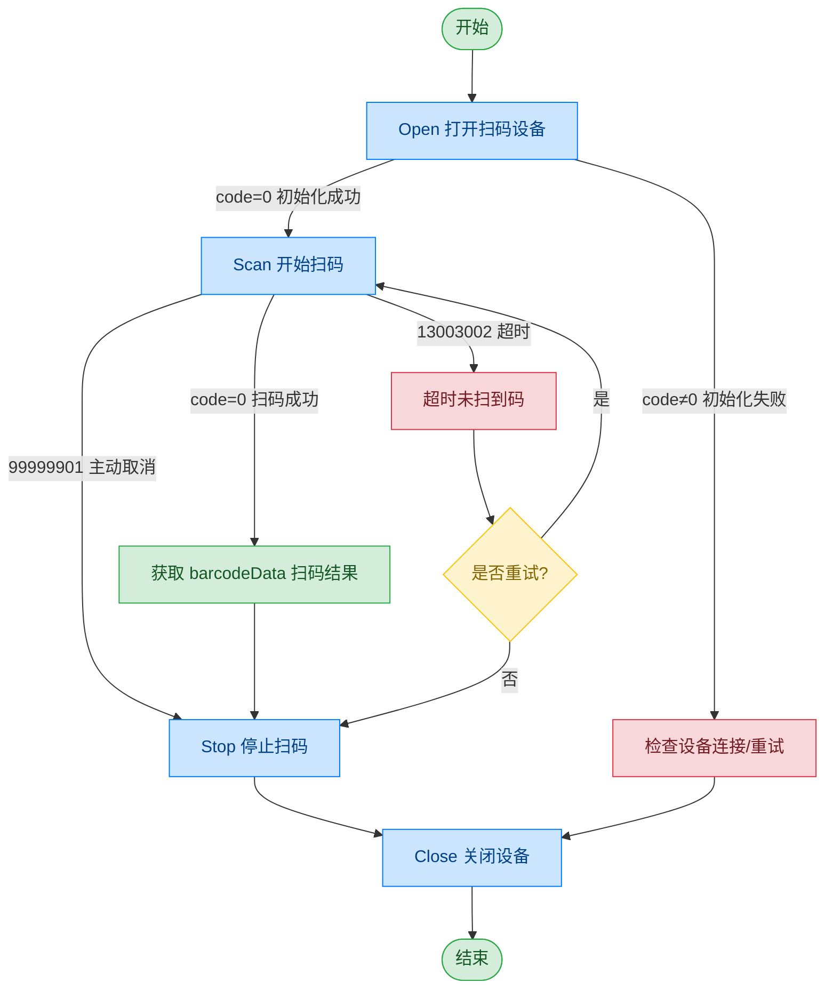

# 扫码枪 - 牛图 NT351G

## 文档版本

| 版本 | 日期 | 修改内容 |
|------|------|----------|
| V1.0 | 2026-06-16 | 初始版本，从原始文档拆分 |
| V1.1 | 2026-06-17 | 优化调用流程图，补充异常处理路径 |

## 设备信息

| 项目 | 内容 |
|------|------|
| 设备类型 | 扫码枪 |
| 品牌 | 牛图 |
| 型号 | NT351G |
| DIS 接口前缀 | DEV_QrScan |

## 调用流程



## 接口列表

### 1. 打开扫码设备（Open）

本指令用于打开并初始化扫码设备。设备初始化成功后，即进入就绪状态，可执行扫码操作。

#### 请求参数

请求示例：

```json
{
  "seq": "DEV_QrScan_Open_${uuid}",
  "cmd": "Open",
  "datetime": "20211201130101",
  "posidx": "00",
  "timeout": "30000",
  "async": "0"
}
```

参数说明：

| 参数名称 | 格式 | 是否必填 | 参数说明 |
|----------|------|----------|----------|
| seq | string | 是 | DEV_QrScan_Open_${uuid} |
| cmd | string | 是 | 固定为"Open" |
| datetime | string | 是 | 指令的下发时间，格式：YYYYMMddHHmmss |
| posidx | string | 是 | 多个同款设备的工位号；"00"~"99" |
| timeout | string | 是 | 超时时间(ms) |
| async | string | 是 | 是否异步（默认0:同步）；0：同步；1：异步 |

#### 返回参数

返回示例：

```json
{
  "seq": "DEV_QrScan_Open_${uuid}",
  "cmd": "Open",
  "datetime": "20211201130102",
  "code": "0",
  "msg": "Success",
  "posidx": "00"
}
```

参数说明：

| 参数名称 | 格式 | 是否必填 | 参数说明 |
|----------|------|----------|----------|
| seq | string | 是 | 同下发的 seq |
| cmd | string | 是 | 同下发的 cmd |
| datetime | string | 是 | 指令的下发时间，格式：YYYYMMddHHmmss |
| code | string | 是 | 参照通用返回码 / 扫码枪返回码 |
| msg | string | 否 | 参照通用返回码 / 扫码枪返回码 |
| posidx | string | 是 | 多个同款设备的工位号；"00"~"99" |

---

### 2. 扫描条码（Scan）

本指令用于触发扫码设备开始识别条码。扫码结果通过回调返回，可能出现以下情况：
- 扫码成功：返回 barcodeData（扫码结果数据）
- 扫码超时：返回 timeout（未在规定时间内识别到条码）

若发生超时，上层应用可根据业务需要再次发送扫码指令进行重试。

#### 请求参数

请求示例：

```json
{
  "seq": "DEV_QrScan_Scan_${uuid}",
  "cmd": "Scan",
  "datetime": "20211201130101",
  "timeout": "30000",
  "posidx": "00",
  "async": "0"
}
```

参数说明：

| 参数名称 | 格式 | 是否必填 | 参数说明 |
|----------|------|----------|----------|
| seq | string | 是 | DEV_QrScan_Scan_${uuid} |
| cmd | string | 是 | 固定为"Scan" |
| datetime | string | 是 | 指令的下发时间，格式：YYYYMMddHHmmss |
| posidx | string | 是 | 多个同款设备的工位号；"00"~"99" |
| timeout | string | 是 | 超时时间(ms) |
| async | string | 是 | 是否异步（默认0:同步）；0：同步；1：异步 |

#### 返回参数

返回示例：

```json
{
  "seq": "DEV_QrScan_Scan_${uuid}",
  "cmd": "Scan",
  "datetime": "20211201130102",
  "code": "0",
  "data": {
    "zzzptm": "123456789"
  },
  "msg": "Success",
  "posidx": "00"
}
```

参数说明：

| 参数名称 | 格式 | 是否必填 | 参数说明 |
|----------|------|----------|----------|
| seq | string | 是 | 同下发的 seq |
| cmd | string | 是 | 同下发的 cmd |
| datetime | string | 是 | 指令的下发时间，格式：YYYYMMddHHmmss |
| code | string | 是 | 参照通用返回码 / 扫码枪返回码 |
| msg | string | 否 | 参照通用返回码 / 扫码枪返回码 |
| posidx | string | 是 | 多个同款设备的工位号；"00"~"99" |
| data | object | 否 | 返回数据 |
| ↳ zzzptm | string | 是 | 条码或二维码数据 |

---

### 3. 停止扫码（Stop）

通过本条指令上层应用可以控制扫码枪停止扫码。

#### 请求参数

请求示例：

```json
{
  "seq": "DEV_QrScan_Stop_${uuid}",
  "cmd": "Stop",
  "datetime": "20211201130101",
  "timeout": "30000",
  "posidx": "00",
  "async": "1"
}
```

参数说明：

| 参数名称 | 格式 | 是否必填 | 参数说明 |
|----------|------|----------|----------|
| seq | string | 是 | DEV_QrScan_Stop_${uuid} |
| cmd | string | 是 | 固定为"Stop" |
| datetime | string | 是 | 指令的下发时间，格式：YYYYMMddHHmmss |
| posidx | string | 是 | 多个同款设备的工位号；"00"~"99" |
| timeout | string | 是 | 超时时间(ms) |
| async | string | 是 | 是否异步（建议为1）；0：同步；1：异步 |

#### 返回参数

返回示例：

```json
{
  "seq": "DEV_QrScan_Stop_${uuid}",
  "cmd": "Stop",
  "datetime": "20211201130102",
  "code": "0",
  "msg": "Success",
  "posidx": "00"
}
```

参数说明：

| 参数名称 | 格式 | 是否必填 | 参数说明 |
|----------|------|----------|----------|
| seq | string | 是 | 同下发的 seq |
| cmd | string | 是 | 同下发的 cmd |
| datetime | string | 是 | 指令的下发时间，格式：YYYYMMddHHmmss |
| code | string | 是 | 参照通用返回码 / 扫码枪返回码 |
| msg | string | 否 | 参照通用返回码 / 扫码枪返回码 |
| posidx | string | 是 | 多个同款设备的工位号；"00"~"99" |

---

### 4. 关闭扫码枪（Close）

扫码枪工作完成，通过本条指令上层应用可以关闭扫码设备并释放资源。

#### 请求参数

请求示例：

```json
{
  "seq": "DEV_QrScan_Close_${uuid}",
  "cmd": "Close",
  "datetime": "20211201130101",
  "timeout": "30000",
  "posidx": "00",
  "async": "0"
}
```

参数说明：

| 参数名称 | 格式 | 是否必填 | 参数说明 |
|----------|------|----------|----------|
| seq | string | 是 | DEV_QrScan_Close_${uuid} |
| cmd | string | 是 | 固定为"Close" |
| datetime | string | 是 | 指令的下发时间，格式：YYYYMMddHHmmss |
| posidx | string | 是 | 多个同款设备的工位号；"00"~"99" |
| timeout | string | 是 | 超时时间(ms) |
| async | string | 是 | 是否异步（默认0:同步）；0：同步；1：异步 |

#### 返回参数

返回示例：

```json
{
  "seq": "DEV_QrScan_Close_${uuid}",
  "cmd": "Close",
  "datetime": "20211201130102",
  "code": "0",
  "msg": "ok",
  "posidx": "00"
}
```

参数说明：

| 参数名称 | 格式 | 是否必填 | 参数说明 |
|----------|------|----------|----------|
| seq | string | 是 | 同下发的 seq |
| cmd | string | 是 | 同下发的 cmd |
| datetime | string | 是 | 指令的下发时间，格式：YYYYMMddHHmmss |
| code | string | 是 | 参照通用返回码 / 扫码枪返回码 |
| msg | string | 否 | 参照通用返回码 / 扫码枪返回码 |
| posidx | string | 是 | 多个同款设备的工位号；"00"~"99" |

## 错误码

| 序号 | 错误码 | 含义 |
|------|--------|------|
| 1 | 99999901 | 主动取消 |
| 2 | 13003001 | 设备未打开 |
| 3 | 13003002 | 超时未扫到码 |
| 4 | 13003003 | 指令接收或读取失败 |
| 5 | 13003004 | 硬件型号或类型不符 |
| 6 | 13003005 | 取消 |

> 通用返回码（0~1037）请参阅 [通用返回码](../00-通用协议层/06-通用返回码.md)
