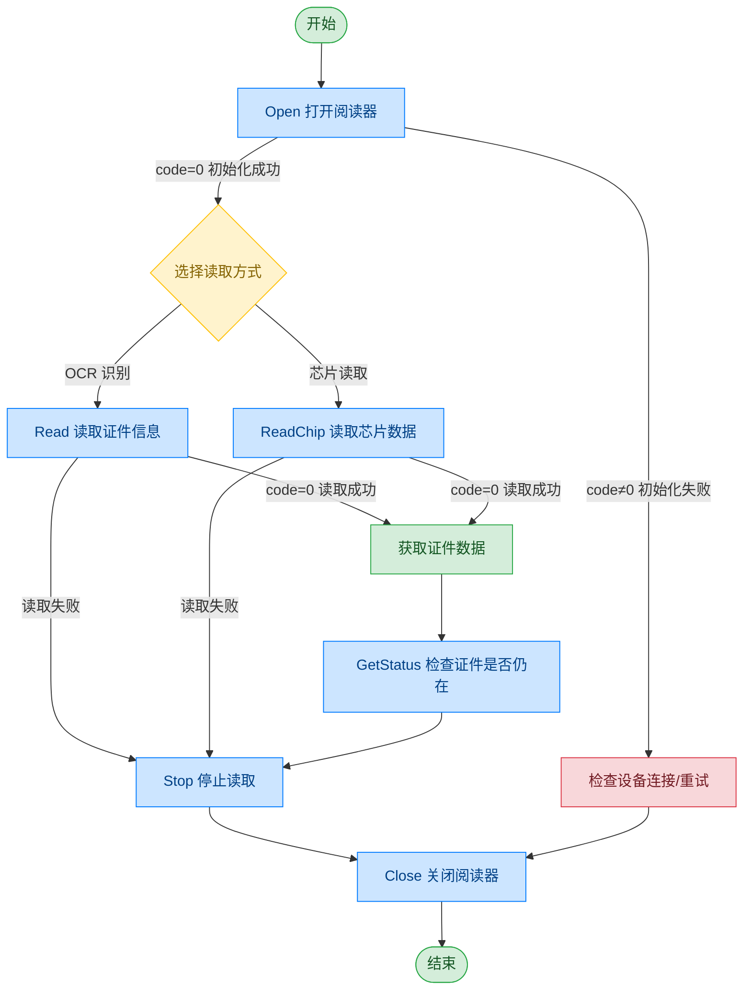

# 护照阅读器 - ARH

## 文档版本

| 版本 | 日期 | 修改内容 |
|------|------|----------|
| V1.0 | 2026-06-16 | 初始版本，从原始文档拆分 |
| V1.1 | 2026-06-17 | 优化调用流程图，补充异常处理路径 |

## 设备信息

| 项目 | 内容 |
|------|------|
| 设备类型 | 护照阅读器 |
| 品牌 | ARH |
| DIS 接口前缀 | DEV_Passport |

## 调用流程



## 接口列表

### 1. 打开护照阅读器（Open）

通过本条指令上层应用可以打开护照阅读器，用于读取护照信息。

#### 请求参数

请求示例：

```json
{
  "seq": "DEV_Passport_Open_${uuid}",
  "cmd": "Open",
  "datetime": "20211201130101",
  "posidx": "00",
  "timeout": "30000",
  "async": "0"
}
```

参数说明：

| 参数名称 | 格式 | 是否必填 | 参数说明 |
|----------|------|----------|----------|
| seq | string | 是 | 请求序列号：字段格式为业务标识头+下划线+唯一号 |
| cmd | string | 是 | 本指令下，固定为"Open" |
| datetime | string | 是 | 指令的下发时间，格式：YYYYMMddHHmmss |
| posidx | string | 是 | 多个同款设备的工位号；"00"~"99" |
| timeout | string | 是 | 超时时间(ms) |
| async | string | 是 | 是否异步（默认0:同步）；0：同步；1：异步 |

#### 返回参数

返回示例：

```json
{
  "seq": "DEV_Passport_Open_${uuid}",
  "cmd": "Open",
  "datetime": "20211201130101",
  "code": "0",
  "msg": "success",
  "posidx": "00",
  "async": "0"
}
```

参数说明：

| 参数名称 | 格式 | 是否必填 | 参数说明 |
|----------|------|----------|----------|
| seq | string | 是 | 同下发的 seq |
| cmd | string | 是 | 同下发的 cmd |
| datetime | string | 是 | 指令的下发时间，格式：YYYYMMddHHmmss |
| code | string | 是 | 参照通用返回码 / 护照阅读器返回码 |
| msg | string | 否 | 参照通用返回码 / 护照阅读器返回码 |
| posidx | string | 是 | 多个同款设备的工位号；"00"~"99" |

---

### 2. 读取证件表面信息（Read）

通过本条指令上层应用可以读取证件表面信息。

#### 请求参数

请求示例：

```json
{
  "seq": "DEV_Passport_Read_${uuid}",
  "cmd": "Read",
  "datetime": "20211201130101",
  "timeout": "30000",
  "posidx": "00",
  "async": "0"
}
```

参数说明：

| 参数名称 | 格式 | 是否必填 | 参数说明 |
|----------|------|----------|----------|
| seq | string | 是 | 请求序列号：字段格式为业务标识头+下划线+唯一号 |
| cmd | string | 是 | 本指令下固定为"Read" |
| datetime | string | 是 | 指令的下发时间，格式：YYYYMMddHHmmss |
| posidx | string | 是 | 多个同款设备的工位号；"00"~"99" |
| timeout | string | 是 | 超时时间(ms) |
| async | string | 是 | 是否异步（默认0:同步）；0：同步；1：异步 |

#### 返回参数

返回示例：

```json
{
  "seq": "DEV_Passport_Read_${uuid}",
  "cmd": "Read",
  "datetime": "20211201130101",
  "code": "0",
  "data": {
    "VizDocumentNumber": "KH082955(5)",
    "VizIssueDate": "2017-07-14",
    "DocCode": "3988",
    "DocType": "Hong Kong ID card - front, 2016P",
    "FullPage": "D:/FullPage.jpg",
    "PersoFace": "D:/PersoFace.jpg",
    "MRZXML": "D:/MRZ.xml",
    "ChineseNameByteArr": "",
    "Name": ""
  },
  "msg": "success",
  "posidx": "00"
}
```

参数说明：

| 参数名称 | 格式 | 是否必填 | 参数说明 |
|----------|------|----------|----------|
| seq | string | 是 | 同下发的 seq |
| cmd | string | 是 | 同下发的 cmd |
| datetime | string | 是 | 指令的下发时间，格式：YYYYMMddHHmmss |
| code | string | 是 | 参照通用返回码 / 护照阅读器返回码 |
| msg | string | 否 | 参照通用返回码 / 护照阅读器返回码 |
| posidx | string | 是 | 多个同款设备的工位号；"00"~"99" |
| data | object | 是 | 返回的数据对象 |
| ↳ VizDocumentNumber | string | 是 | 证件号码 |
| ↳ VizIssueDate | string | 是 | 证件有效期 |
| ↳ DocCode | string | 是 | 证件代码 |
| ↳ DocType | string | 是 | 证件类型 |
| ↳ FullPage | string | 是 | 完整页面 |
| ↳ PersoFace | string | 是 | 头像信息 |
| ↳ MRZXML | string | 是 | MRZ 信息 |
| ↳ ChineseNameByteArr | string | 是 | 中文姓名 |
| ↳ Name | string | 是 | 姓名 |

---

### 3. 读取证件芯片信息（ReadChip）

通过本条指令上层应用可以读取证件芯片信息。

#### 请求参数

请求示例：

```json
{
  "seq": "DEV_Passport_ReadChip_${uuid}",
  "cmd": "ReadChip",
  "datetime": "20211201130101",
  "timeout": "30000",
  "posidx": "00",
  "async": "0"
}
```

参数说明：

| 参数名称 | 格式 | 是否必填 | 参数说明 |
|----------|------|----------|----------|
| seq | string | 是 | 请求序列号：字段格式为业务标识头+下划线+唯一号 |
| cmd | string | 是 | 本指令下固定为"ReadChip" |
| datetime | string | 是 | 指令的下发时间，格式：YYYYMMddHHmmss |
| posidx | string | 是 | 多个同款设备的工位号；"00"~"99" |
| timeout | string | 是 | 超时时间(ms) |
| async | string | 是 | 是否异步（默认0:同步）；0：同步；1：异步 |

#### 返回参数

返回示例：

```json
{
  "data": {
    "Birth": "910101",
    "ChineseNameByteArr": "6d105c029f029f0209e9bd8ae6a882e682a0",
    "CountryCode": "CHN",
    "ECardBirthPlace": "HONG KONG",
    "ECardDocumentDescriptor": "1.8",
    "ECardExpiryDate": "2034-09-02 16:00:00.000",
    "ECardFace": "",
    "ECardIssueCountry": "CZE",
    "ECardIssueDate": "2023-09-28",
    "ECardIssueOrg": "IMMIGRATION DEPARTMENT, HONG KONG SPECIAL ADMINISTRATIVE REGION",
    "ECardName": "CHAI<<LOK<YAU",
    "ECardObservations": "Please refer to the observations page for any additional information of the bearer.",
    "Name": "CHAI LOK YAU",
    "Nationality": "CHN",
    "NotAfter": "330928",
    "PassportNo": "H91234903",
    "Reserved": "HK0000158",
    "Sex": "F",
    "Type": "P",
    "PersoFace": "D:/5.ENV/EmpDIS_V2_new/data/Passport/PersoFace.jpg"
  },
  "seq": "DEV_Passport_ReadChip_${uuid}",
  "cmd": "ReadChip",
  "code": "0",
  "datetime": "20260421163623.795",
  "msg": "Success",
  "suggest": "",
  "posidx": "0",
  "DllVersion": "V6.24.703.1"
}
```

参数说明：

| 参数名称 | 格式 | 是否必填 | 参数说明 |
|----------|------|----------|----------|
| seq | string | 是 | 同下发的 seq |
| cmd | string | 是 | 同下发的 cmd |
| datetime | string | 是 | 指令的下发时间，格式：YYYYMMddHHmmss |
| code | string | 是 | 参照通用返回码 / 护照阅读器返回码 |
| msg | string | 否 | 参照通用返回码 / 护照阅读器返回码 |
| posidx | string | 是 | 多个同款设备的工位号；"00"~"99" |
| DllVersion | string | 否 | 外设库版本 |
| data | object | 是 | 返回的数据对象 |
| ↳ Birth | string | 是 | 出生日期 |
| ↳ ChineseNameByteArr | string | 是 | 中文名 |
| ↳ CountryCode | string | 是 | 国家代码 |
| ↳ ECardBirthPlace | string | 是 | 出生地（芯片信息） |
| ↳ ECardDocumentDescriptor | string | 是 | 证件描述符（芯片信息） |
| ↳ ECardExpiryDate | string | 是 | 到期时间（芯片信息） |
| ↳ ECardFace | string | 否 | 人像（芯片信息） |
| ↳ ECardIssueCountry | string | 是 | 发行国家（芯片信息） |
| ↳ ECardIssueDate | string | 是 | 签发日期（芯片信息） |
| ↳ ECardIssueOrg | string | 是 | 签发机构（芯片信息） |
| ↳ ECardName | string | 是 | 卡片名称（芯片信息） |
| ↳ ECardObservations | string | 否 | 观察信息 |
| ↳ Name | string | 是 | 姓名 |
| ↳ Nationality | string | 是 | 国籍 |
| ↳ NotAfter | string | 是 | 有效期 |
| ↳ PassportNo | string | 是 | 护照号码 |
| ↳ Reserved | string | 否 | 身份证号 |
| ↳ Sex | string | 是 | 性别 |
| ↳ Type | string | 是 | 类别 |
| ↳ PersoFace | string | 是 | 人像图片路径 |

---

### 4. 查看读写器表面状态（GetStatus）

通过本条指令上层应用可以查看读写器表面是否留有证件。

#### 请求参数

请求示例：

```json
{
  "seq": "DEV_Passport_GetStatus_${uuid}",
  "cmd": "GetStatus",
  "datetime": "20211201130101",
  "timeout": "30000",
  "posidx": "00",
  "async": "0"
}
```

参数说明：

| 参数名称 | 格式 | 是否必填 | 参数说明 |
|----------|------|----------|----------|
| seq | string | 是 | 请求序列号：字段格式为业务标识头+下划线+唯一号 |
| cmd | string | 是 | 本指令下固定为"GetStatus" |
| datetime | string | 是 | 指令的下发时间，格式：YYYYMMddHHmmss |
| posidx | string | 是 | 多个同款设备的工位号；"00"~"99" |
| timeout | string | 是 | 超时时间(ms) |
| async | string | 是 | 是否异步（默认0:同步）；0：同步；1：异步 |

#### 返回参数

返回示例：

```json
{
  "seq": "DEV_Passport_GetStatus_${uuid}",
  "cmd": "GetStatus",
  "datetime": "20211201130102",
  "code": "0",
  "msg": "success",
  "posidx": "00",
  "async": "0",
  "data": {
    "CardInWindow": "0"
  }
}
```

参数说明：

| 参数名称 | 格式 | 是否必填 | 参数说明 |
|----------|------|----------|----------|
| seq | string | 是 | 同下发的 seq |
| cmd | string | 是 | 同下发的 cmd |
| datetime | string | 是 | 指令的下发时间，格式：YYYYMMddHHmmss |
| code | string | 是 | 参照通用返回码 / 护照阅读器返回码 |
| msg | string | 否 | 参照通用返回码 / 护照阅读器返回码 |
| posidx | string | 是 | 多个同款设备的工位号；"00"~"99" |
| data | object | 是 | 返回数据 |
| ↳ CardInWindow | string | 是 | 0：正常；1：存在证件 |

---

### 5. 关闭阅读器（Close）

通过本条指令上层应用可以关闭护照阅读器。

#### 请求参数

请求示例：

```json
{
  "seq": "DEV_Passport_Close_${uuid}",
  "cmd": "Close",
  "datetime": "20211201130101",
  "posidx": "00",
  "async": "0",
  "timeout": "30000"
}
```

参数说明：

| 参数名称 | 格式 | 是否必填 | 参数说明 |
|----------|------|----------|----------|
| seq | string | 是 | 请求序列号：字段格式为业务标识头+下划线+唯一号 |
| cmd | string | 是 | 本指令下固定为"Close" |
| datetime | string | 是 | 指令的下发时间，格式：YYYYMMddHHmmss |
| posidx | string | 是 | 多个同款设备的工位号；"00"~"99" |
| timeout | string | 是 | 超时时间(ms) |
| async | string | 是 | 是否异步（默认0:同步）；0：同步；1：异步 |

#### 返回参数

返回示例：

```json
{
  "seq": "DEV_Passport_Close_${uuid}",
  "cmd": "Close",
  "datetime": "20211201130102",
  "code": "0",
  "msg": "success",
  "posidx": "00",
  "async": "0"
}
```

参数说明：

| 参数名称 | 格式 | 是否必填 | 参数说明 |
|----------|------|----------|----------|
| seq | string | 是 | 同下发的 seq |
| cmd | string | 是 | 同下发的 cmd |
| datetime | string | 是 | 指令的下发时间，格式：YYYYMMddHHmmss |
| code | string | 是 | 参照通用返回码 / 护照阅读器返回码 |
| msg | string | 否 | 参照通用返回码 / 护照阅读器返回码 |
| posidx | string | 是 | 多个同款设备的工位号；"00"~"99" |

---

### 6. 停止读取（Stop）

通过本条指令上层应用可以停止护照阅读器的读取，取消本次读取。

#### 请求参数

请求示例：

```json
{
  "seq": "DEV_Passport_Stop_${uuid}",
  "cmd": "Stop",
  "datetime": "20211201130101",
  "timeout": "30000",
  "posidx": "00",
  "async": "0"
}
```

参数说明：

| 参数名称 | 格式 | 是否必填 | 参数说明 |
|----------|------|----------|----------|
| seq | string | 是 | 请求序列号：字段格式为业务标识头+下划线+唯一号 |
| cmd | string | 是 | 本指令下固定为"Stop" |
| datetime | string | 是 | 指令的下发时间，格式：YYYYMMddHHmmss |
| posidx | string | 是 | 多个同款设备的工位号；"00"~"99" |
| timeout | string | 是 | 超时时间(ms) |
| async | string | 是 | 是否异步（默认0:同步）；0：同步；1：异步 |

#### 返回参数

返回示例：

```json
{
  "seq": "DEV_Passport_Stop_${uuid}",
  "cmd": "Stop",
  "datetime": "20211201130102",
  "code": "0",
  "msg": "success",
  "posidx": "00",
  "async": "0"
}
```

参数说明：

| 参数名称 | 格式 | 是否必填 | 参数说明 |
|----------|------|----------|----------|
| seq | string | 是 | 同下发的 seq |
| cmd | string | 是 | 同下发的 cmd |
| datetime | string | 是 | 指令的下发时间，格式：YYYYMMddHHmmss |
| code | string | 是 | 参照通用返回码 / 护照阅读器返回码 |
| msg | string | 否 | 参照通用返回码 / 护照阅读器返回码 |
| posidx | string | 是 | 多个同款设备的工位号；"00"~"99" |

## 错误码

| 序号 | 错误码 | 含义 |
|------|--------|------|
| 1 | 16601102 | 未找到设备 |
| 2 | 16601103 | 初始化失败 |
| 3 | 16602101 | 未检测到芯片 |
| 4 | 16602201 | 未读取到信息 |

> 通用返回码（0~1037）请参阅 [通用返回码](../00-通用协议层/06-通用返回码.md)