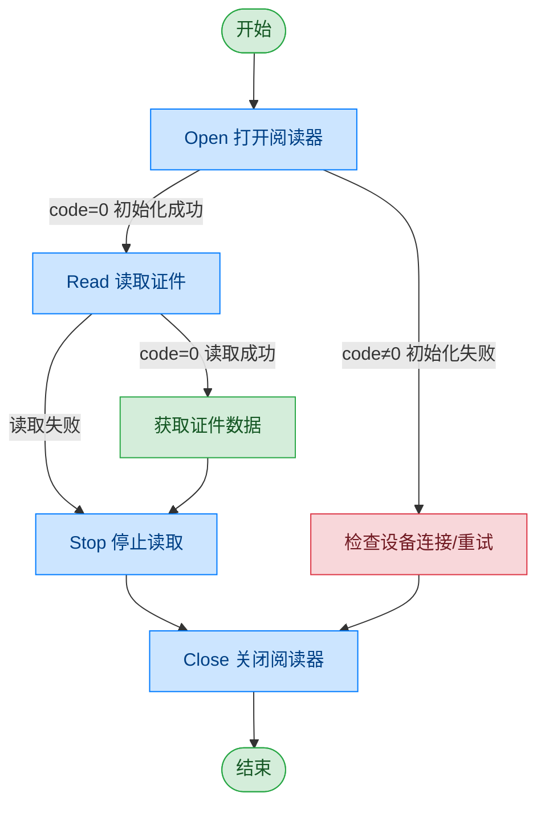

# 护照阅读器 - DESKO

## 文档版本

| 版本 | 日期 | 修改内容 |
|------|------|----------|
| V1.0 | 2026-06-16 | 初始版本，从原始文档拆分 |
| V1.1 | 2026-06-17 | 优化调用流程图，补充异常处理路径 |

## 设备信息

| 项目 | 内容 |
|------|------|
| 设备类型 | 护照阅读器 |
| 品牌 | DESKO |
| DIS 接口前缀 | DEV_Passport |

## 调用流程



## 接口列表

### 1. 打开护照阅读器（Open）

本指令用于打开并初始化护照阅读器。设备初始化成功后，即进入就绪状态，可执行护照信息读取操作。

#### 请求参数

请求示例：

```json
{
  "seq": "DEV_Passport_Open_${uuid}",
  "cmd": "Open",
  "datetime": "20211201130101",
  "posidx": "00",
  "timeout": "30000",
  "async": "0"
}
```

参数说明：

| 参数名称 | 格式 | 是否必填 | 参数说明 |
|----------|------|----------|----------|
| seq | string | 是 | DEV_Passport_Open_${uuid} |
| cmd | string | 是 | 固定为"Open" |
| datetime | string | 是 | 指令的下发时间，格式：YYYYMMddHHmmss |
| posidx | string | 是 | 多个同款设备的工位号；"00"~"99" |
| timeout | string | 是 | 超时时间(ms) |
| async | string | 是 | 是否异步（默认0:同步）；0：同步；1：异步 |

#### 返回参数

返回示例：

```json
{
  "seq": "DEV_Passport_Open_${uuid}",
  "cmd": "Open",
  "datetime": "20211201130102",
  "code": "0",
  "msg": "Success",
  "suggest": "",
  "posidx": "00"
}
```

参数说明：

| 参数名称 | 格式 | 是否必填 | 参数说明 |
|----------|------|----------|----------|
| seq | string | 是 | 同下发的 seq |
| cmd | string | 是 | 同下发的 cmd |
| datetime | string | 是 | 指令的下发时间，格式：YYYYMMddHHmmss |
| code | string | 是 | 参照通用返回码 / 护照阅读器返回码 |
| msg | string | 否 | 提示信息 |
| suggest | string | 否 | 建议 |
| posidx | string | 是 | 多个同款设备的工位号；"00"~"99" |

---

### 2. 读取证件（Read）

通过本条指令上层应用可以读取证件信息。

#### 请求参数

请求示例：

```json
{
  "seq": "DEV_Passport_Read_${uuid}",
  "cmd": "Read",
  "datetime": "20211201130101",
  "posidx": "00",
  "timeout": "30000",
  "async": "0"
}
```

参数说明：

| 参数名称 | 格式 | 是否必填 | 参数说明 |
|----------|------|----------|----------|
| seq | string | 是 | DEV_Passport_Read_${uuid} |
| cmd | string | 是 | 固定为"Read" |
| datetime | string | 是 | 指令的下发时间，格式：YYYYMMddHHmmss |
| posidx | string | 是 | 多个同款设备的工位号；"00"~"99" |
| timeout | string | 是 | 超时时间(ms) |
| async | string | 是 | 是否异步（建议为1）；0：同步；1：异步 |

#### 返回参数

返回示例：

```json
{
  "seq": "DEV_Passport_Read_${uuid}",
  "cmd": "Read",
  "datetime": "20211201130102",
  "code": "0",
  "msg": "Success",
  "suggest": "",
  "posidx": "00",
  "data": {
    "IsChip": "1",
    "zjhm": "E16353007",
    "zjlx": "PASSPORT",
    "ywxm": "ZENG<<LEI",
    "PersoFace": "D:/data/Passport/PersoFace.jpg"
  }
}
```

参数说明：

| 参数名称 | 格式 | 是否必填 | 参数说明 |
|----------|------|----------|----------|
| seq | string | 是 | 同下发的 seq |
| cmd | string | 是 | 同下发的 cmd |
| datetime | string | 是 | 指令的下发时间，格式：YYYYMMddHHmmss |
| code | string | 是 | 参照通用返回码 / 护照阅读器返回码 |
| msg | string | 否 | 提示信息 |
| suggest | string | 否 | 建议 |
| posidx | string | 是 | 多个同款设备的工位号；"00"~"99" |
| data | object | 否 | 返回数据 |
| ↳ IsChip | string | 是 | 是否有芯片；"1"：有芯片 |
| ↳ zjhm | string | 是 | 证件号码 |
| ↳ zjlx | string | 是 | 证件类型 |
| ↳ ywxm | string | 是 | 英文姓名 |
| ↳ PersoFace | string | 是 | 证件图片路径 |

---

### 3. 停止读取（Stop）

通过本条指令上层应用可以停止护照阅读器的读取，取消本次读取。

#### 请求参数

请求示例：

```json
{
  "seq": "DEV_Passport_Stop_${uuid}",
  "cmd": "Stop",
  "datetime": "20211201130101",
  "posidx": "00",
  "timeout": "30000",
  "async": "1"
}
```

参数说明：

| 参数名称 | 格式 | 是否必填 | 参数说明 |
|----------|------|----------|----------|
| seq | string | 是 | DEV_Passport_Stop_${uuid} |
| cmd | string | 是 | 固定为"Stop" |
| datetime | string | 是 | 指令的下发时间，格式：YYYYMMddHHmmss |
| posidx | string | 是 | 多个同款设备的工位号；"00"~"99" |
| timeout | string | 是 | 超时时间(ms) |
| async | string | 是 | 是否异步（建议为1）；0：同步；1：异步 |

#### 返回参数

返回示例：

```json
{
  "seq": "DEV_Passport_Stop_${uuid}",
  "cmd": "Stop",
  "datetime": "20211201130102",
  "code": "0",
  "msg": "Success",
  "suggest": "",
  "posidx": "00"
}
```

参数说明：

| 参数名称 | 格式 | 是否必填 | 参数说明 |
|----------|------|----------|----------|
| seq | string | 是 | 同下发的 seq |
| cmd | string | 是 | 同下发的 cmd |
| datetime | string | 是 | 指令的下发时间，格式：YYYYMMddHHmmss |
| code | string | 是 | 参照通用返回码 / 护照阅读器返回码 |
| msg | string | 否 | 提示信息 |
| suggest | string | 否 | 建议 |
| posidx | string | 是 | 多个同款设备的工位号；"00"~"99" |

---

### 4. 关闭阅读器（Close）

本指令用于关闭护照阅读器并释放相关资源。调用成功后，设备停止工作，无法继续执行读取操作。

#### 请求参数

请求示例：

```json
{
  "seq": "DEV_Passport_Close_${uuid}",
  "cmd": "Close",
  "datetime": "20211201130101",
  "posidx": "00",
  "timeout": "30000",
  "async": "0"
}
```

参数说明：

| 参数名称 | 格式 | 是否必填 | 参数说明 |
|----------|------|----------|----------|
| seq | string | 是 | DEV_Passport_Close_${uuid} |
| cmd | string | 是 | 固定为"Close" |
| datetime | string | 是 | 指令的下发时间，格式：YYYYMMddHHmmss |
| posidx | string | 是 | 多个同款设备的工位号；"00"~"99" |
| timeout | string | 是 | 超时时间(ms) |
| async | string | 是 | 是否异步（默认0:同步）；0：同步；1：异步 |

#### 返回参数

返回示例：

```json
{
  "seq": "DEV_Passport_Close_${uuid}",
  "cmd": "Close",
  "datetime": "20211201130102",
  "code": "0",
  "msg": "Success",
  "suggest": "",
  "posidx": "00"
}
```

参数说明：

| 参数名称 | 格式 | 是否必填 | 参数说明 |
|----------|------|----------|----------|
| seq | string | 是 | 同下发的 seq |
| cmd | string | 是 | 同下发的 cmd |
| datetime | string | 是 | 指令的下发时间，格式：YYYYMMddHHmmss |
| code | string | 是 | 参照通用返回码 / 护照阅读器返回码 |
| msg | string | 否 | 提示信息 |
| suggest | string | 否 | 建议 |
| posidx | string | 是 | 多个同款设备的工位号；"00"~"99" |

## 错误码

| 序号 | 错误码 | 含义 |
|------|--------|------|
| 1 | 12603001 | 未知错误 |
| 2 | 12603002 | 此特定功能 SDK 尚未启用 |
| 3 | 12603003 | 此特定功能 SDK 不支持 |
| 4 | 12603004 | SDK 未初始化 |
| 5 | 12603005 | SDK 已经初始化，无需重复初始化 |

> 通用返回码（0~1037）请参阅 [通用返回码](../00-通用协议层/06-通用返回码.md)
