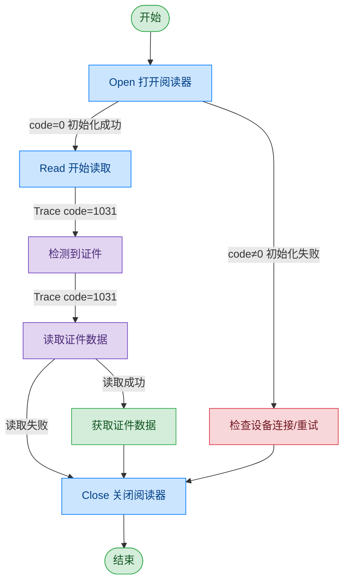

# 护照阅读器 - THALES

## 文档版本

| 版本 | 日期 | 修改内容 |
|------|------|----------|
| V1.0 | 2026-06-16 | 初始版本，从原始文档拆分 |
| V1.1 | 2026-06-17 | 优化调用流程图，补充异常处理路径 |

## 设备信息

| 项目 | 内容 |
|------|------|
| 设备类型 | 护照阅读器 |
| 品牌 | THALES |
| DIS 接口前缀 | DEV_Passport |

## 调用流程



> THALES 护照阅读器的 Read 指令通过 Trace 消息（code=1031）返回检测和读取结果，而非直接在指令返回中携带数据。

## 接口列表

### 1. 打开护照阅读器（Open）

通过本条指令上层应用可以打开护照阅读器，用于读取护照信息。

#### 请求参数

请求示例：

```json
{
  "seq": "DEV_Passport_Open_${uuid}",
  "cmd": "Open",
  "datetime": "20211201130101",
  "posidx": "00",
  "Timeout": "30000",
  "ASYNC": "0"
}
```

参数说明：

| 参数名称 | 格式 | 是否必填 | 参数说明 |
|----------|------|----------|----------|
| seq | string | 是 | DEV_Passport_Open_${uuid} |
| cmd | string | 是 | 固定为"Open" |
| datetime | string | 是 | 指令的下发时间，格式：YYYYMMddHHmmss |
| posidx | string | 是 | 多个同款设备的工位号；"00"~"99" |
| Timeout | string | 是 | 超时时间(ms) |
| ASYNC | string | 是 | 是否异步（默认0:同步）；0：同步；1：异步 |

#### 返回参数

返回示例：

```json
{
  "seq": "DEV_Passport_Open_${uuid}",
  "cmd": "Open",
  "datetime": "20211201130101",
  "code": "0",
  "msg": "Success",
  "suggest": "",
  "posidx": "00",
  "ASYNC": "0"
}
```

参数说明：

| 参数名称 | 格式 | 是否必填 | 参数说明 |
|----------|------|----------|----------|
| seq | string | 是 | 同下发的 seq |
| cmd | string | 是 | 同下发的 cmd |
| datetime | string | 是 | 指令的下发时间，格式：YYYYMMddHHmmss |
| code | string | 是 | 参照通用返回码 / 护照阅读器返回码 |
| msg | string | 否 | 提示信息 |
| suggest | string | 否 | 处理建议 |
| posidx | string | 是 | 多个同款设备的工位号；"00"~"99" |
| ASYNC | string | 是 | 是否异步；0：同步；1：异步 |

---

### 2. 读取证件（Read）

通过本条指令上层应用可以读取证件信息。THALES 护照阅读器通过 Trace 消息返回检测和读取结果。

#### 请求参数

请求示例：

```json
{
  "seq": "DEV_Passport_Read_${uuid}",
  "cmd": "Read",
  "datetime": "20211201130101",
  "posidx": "00",
  "Timeout": "30000",
  "ASYNC": "0"
}
```

参数说明：

| 参数名称 | 格式 | 是否必填 | 参数说明 |
|----------|------|----------|----------|
| seq | string | 是 | DEV_Passport_Read_${uuid} |
| cmd | string | 是 | 固定为"Read" |
| datetime | string | 是 | 指令的下发时间，格式：YYYYMMddHHmmss |
| posidx | string | 是 | 多个同款设备的工位号；"00"~"99" |
| Timeout | string | 是 | 超时时间(ms) |
| ASYNC | string | 是 | 是否异步（建议为1）；0：同步；1：异步 |

#### Trace 消息：检测到证件

当设备检测到证件放置时，返回 Trace 消息：

返回示例：

```json
{
  "cmd": "Read",
  "code": "1031",
  "data": {
    "event_type": "1000",
    "tips": "{\"cmd\":\"Read\",\"code\":\"1\",\"DllVersion\":\"\",\"data\":\"\",\"datetime\":\"\",\"msg\":\"Success\",\"posidx\":\"0\",\"seq\":\"\",\"suggest\":\"\"}"
  },
  "datetime": "20260602183327.426",
  "msg": "trace message",
  "posidx": "0",
  "seq": "DEV_Passport_Read_${uuid}"
}
```

Trace 消息参数说明：

| 参数名称 | 格式 | 是否必填 | 参数说明 |
|----------|------|----------|----------|
| seq | string | 是 | 同正在执行的指令的 seq |
| cmd | string | 是 | 同正在执行的指令的 cmd |
| code | string | 是 | 固定值："1031"（Trace 消息） |
| msg | string | 是 | trace message |
| data | object | 是 | Trace 数据 |
| ↳ event_type | string | 是 | 事件类型；"1000"：护照阅读器事件 |
| ↳ tips | string | 是 | JSON 格式的详细信息，其中 code="1" 表示检测中 |

#### Trace 消息：读取证件结果

当证件读取完成时，返回 Trace 消息：

返回示例：

```json
{
  "cmd": "Read",
  "code": "1031",
  "data": {
    "event_type": "1000",
    "tips": "{\"cmd\":\"Read\",\"code\":\"0\",\"DllVersion\":\"\",\"data\":{\"IsChip\":\"1\",\"zjhm\":\"E16353007\",\"zjlx\":\"PASSPORT\",\"ywxm\":\"***\",\"PersoFace\":\"******\"},\"datetime\":\"\",\"msg\":\"Success\",\"posidx\":\"0\",\"seq\":\"\",\"suggest\":\"\"}"
  },
  "datetime": "20260602183330.761",
  "msg": "trace message",
  "posidx": "0",
  "seq": "DEV_Passport_Read_${uuid}"
}
```

Trace 消息参数说明：

| 参数名称 | 格式 | 是否必填 | 参数说明 |
|----------|------|----------|----------|
| seq | string | 是 | 同正在执行的指令的 seq |
| cmd | string | 是 | 同正在执行的指令的 cmd |
| code | string | 是 | 固定值："1031"（Trace 消息） |
| msg | string | 是 | trace message |
| data | object | 是 | Trace 数据 |
| ↳ event_type | string | 是 | 事件类型；"1000"：护照阅读器事件 |
| ↳ tips | string | 是 | JSON 格式的详细数据，其中 code="0" 表示读取成功，data 包含证件信息 |
| ↳↳ tips 内 data | object | 是 | 证件数据 |
| ↳↳↳ IsChip | string | 是 | 是否有芯片；"1"：有芯片 |
| ↳↳↳ zjhm | string | 是 | 证件号码 |
| ↳↳↳ zjlx | string | 是 | 证件类型 |
| ↳↳↳ ywxm | string | 是 | 证件姓名 |
| ↳↳↳ PersoFace | string | 是 | 证件图片路径 |

---

### 3. 关闭阅读器（Close）

本指令用于关闭护照阅读器并释放相关资源。调用成功后，设备停止工作，无法继续执行读取操作。

#### 请求参数

请求示例：

```json
{
  "seq": "DEV_Passport_Close_${uuid}",
  "cmd": "Close",
  "datetime": "20211201130101",
  "posidx": "00",
  "ASYNC": "0",
  "Timeout": "30000"
}
```

参数说明：

| 参数名称 | 格式 | 是否必填 | 参数说明 |
|----------|------|----------|----------|
| seq | string | 是 | DEV_Passport_Close_${uuid} |
| cmd | string | 是 | 固定为"Close" |
| datetime | string | 是 | 指令的下发时间，格式：YYYYMMddHHmmss |
| posidx | string | 是 | 多个同款设备的工位号；"00"~"99" |
| Timeout | string | 是 | 超时时间(ms) |
| ASYNC | string | 是 | 是否异步（默认0:同步）；0：同步；1：异步 |

#### 返回参数

返回示例：

```json
{
  "seq": "DEV_Passport_Close_${uuid}",
  "cmd": "Close",
  "datetime": "20211201130102",
  "code": "0",
  "msg": "Success",
  "suggest": "",
  "DllVersion": "V6.24.703.1",
  "posidx": "00",
  "ASYNC": "0"
}
```

参数说明：

| 参数名称 | 格式 | 是否必填 | 参数说明 |
|----------|------|----------|----------|
| seq | string | 是 | 同下发的 seq |
| cmd | string | 是 | 同下发的 cmd |
| datetime | string | 是 | 指令的下发时间，格式：YYYYMMddHHmmss |
| code | string | 是 | 参照通用返回码 / 护照阅读器返回码 |
| msg | string | 否 | 提示信息 |
| suggest | string | 否 | 建议 |
| DllVersion | string | 否 | 外设库版本号 |
| posidx | string | 是 | 多个同款设备的工位号；"00"~"99" |
| ASYNC | string | 是 | 是否异步；0：同步；1：异步 |

## 错误码

| 序号 | 错误码 | 含义 |
|------|--------|------|
| 1 | 12700701 | 初始化或加载配置文件非法 |
| 2 | 12700702 | 缺少必备字段或参数 |
| 3 | 12700703 | 字段或参数非法 |
| 4 | 12703001 | 未知错误 |
| 5 | 12703002 | 此特定功能 SDK 尚未启用 |
| 6 | 12703003 | 此特定功能 SDK 不支持 |
| 7 | 12703004 | SDK 未初始化 |
| 8 | 12703005 | SDK 已经初始化，无需重复初始化 |
| 9 | 12703006 | SDK 初始化发生错误 |
| 10 | 12703007 | 设备已挂起，无法执行操作 |
| 11 | 12703008 | 由于该操作已被其他事务正在使用，所以无法执行 |
| 12 | 12703009 | 设备未连接 |
| 13 | 12703030 | 操作已超时 |
| 14 | 12703032 | 操作已被主动取消 |

> 通用返回码（0~1037）请参阅 [通用返回码](../00-通用协议层/06-通用返回码.md)
