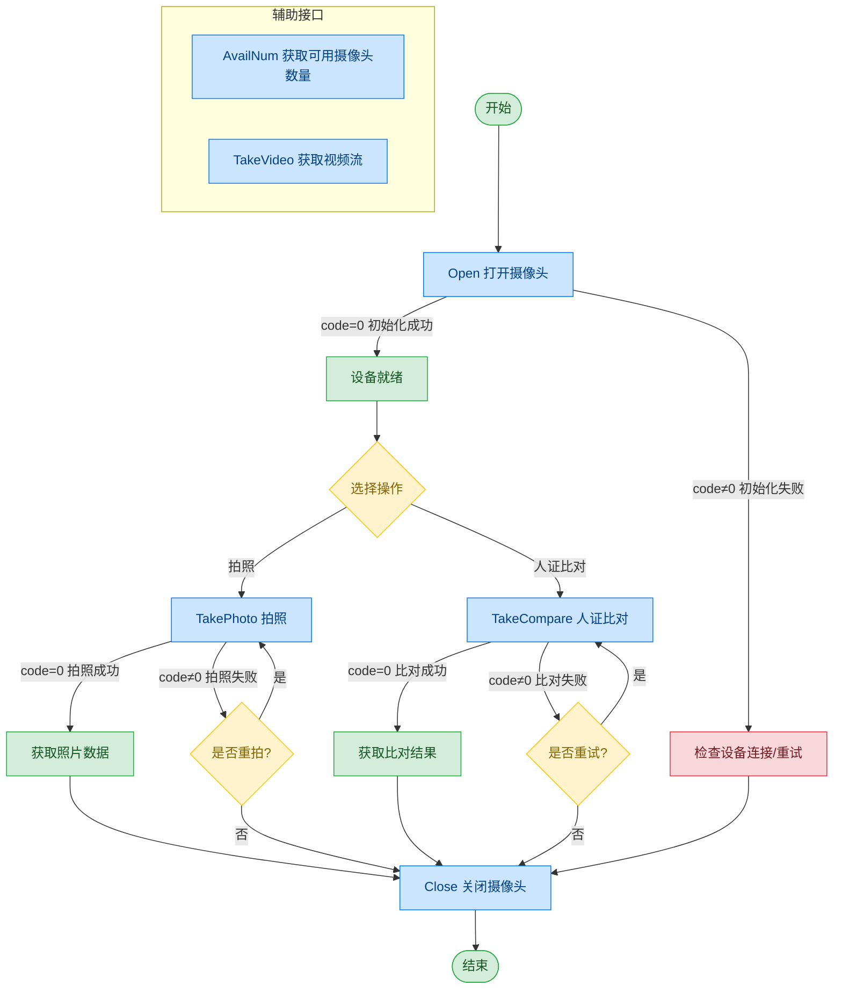

# 摄像头 - DH DH4053S305AD

## 文档版本

| 版本 | 日期 | 修改内容 |
|------|------|----------|
| V1.0 | 2026-06-16 | 初始版本，从原始文档拆分 |
| V1.1 | 2026-06-17 | 优化调用流程图，补充异常处理路径 |

## 设备信息

| 项目 | 内容 |
|------|------|
| 设备类型 | 摄像头 |
| 品牌 | DH |
| 型号 | DH4053S305AD |
| DIS 接口前缀 | DEV_Camera |
| 接口模式 | 传统摄像头 |

## 调用流程



> TakeVideo 视频流获取详见 [通用协议层-视频流获取](../00-通用协议层/04-视频流获取.md)

## posidx 编号说明

| posidx 编号 | 对应的功能 |
|-------------|-----------|
| "00" | 00 摄像头视频图像地址：ws://127.0.0.1:26034/dis/hi_video |
| "01" | 01 摄像头视频图像地址：ws://127.0.0.1:27034/dis/hi_video |
| "02" | 02 摄像头视频图像地址：ws://127.0.0.1:28034/dis/hi_video |
| "03" | 03 摄像头视频图像地址：ws://127.0.0.1:29034/dis/hi_video |
| "04" | 04 摄像头视频图像地址：ws://127.0.0.1:30034/dis/hi_video |

## 接口列表

### 1. 打开摄像头（Open）

通过本条指令上层应用可以打开摄像头，准备拍摄或拍视频。获取视频流流程请参阅通用协议层-视频流获取。

#### 请求参数

请求示例：

```json
{
  "seq": "DEV_Camera_Open_${uuid}",
  "cmd": "Open",
  "datetime": "20211201130101",
  "timeout": "10000",
  "param": {
    "Angel": "0",
    "Name": ""
  },
  "posidx": "00",
  "async": "0"
}
```

参数说明：

| 参数名称 | 格式 | 是否必填 | 参数说明 |
|----------|------|----------|----------|
| seq | string | 是 | 请求序列号：字段格式为业务标识头+下划线+唯一号 |
| cmd | string | 是 | 本指令下，固定为"Open" |
| datetime | string | 是 | 指令的下发时间，格式：YYYYMMddHHmmss |
| posidx | string | 是 | 多个同款设备的工位号；"00"~"99" |
| timeout | string | 是 | 超时时间(ms) |
| async | string | 是 | 是否异步（默认0:同步）；0：同步；1：异步 |
| param | string | 否 | 参数对象 |
| ↳ Angel | string | 否 | 当摄像头安装角度有差异时，需要使用此参数，正常安装无需使用此参数；0：不旋转；90：旋转90°；180：旋转180°；270：旋转270° |
| ↳ Name | string | 否 | 当摄像头需要人工选择时，使用此参数，一般自助机无需此参数，已提前在配置文件中设置完成 |

#### 返回参数

返回示例：

```json
{
  "seq": "DEV_Camera_Open_${uuid}",
  "cmd": "Open",
  "datetime": "20211201130102",
  "code": "0",
  "msg": "Success",
  "suggest": "",
  "data": {
    "video_url": [
      {
        "00": "ws://127.0.0.1:26034/dis/hi_video"
      }
    ]
  }
}
```

参数说明：

| 参数名称 | 格式 | 是否必填 | 参数说明 |
|----------|------|----------|----------|
| seq | string | 是 | 同下发的 seq |
| cmd | string | 是 | 同下发的 cmd |
| datetime | string | 是 | 指令的下发时间，格式：YYYYMMddHHmmss |
| code | string | 是 | 参照通用返回码 / 摄像头返回码 |
| msg | string | 否 | 参照通用返回码 / 摄像头返回码 |
| posidx | string | 是 | 多个同款设备的工位号；"00"~"99" |
| data | string | 是 | 返回对象 |
| ↳ video_url | 数组 | 是 | 打开的摄像头的数据流地址，里面包含各摄像头的视频流地址 |

---

### 2. 获取可用摄像头数量（AvailNum）

通过本条指令上层应用可以获取设备上可用的摄像头数量。

#### 请求参数

请求示例：

```json
{
  "seq": "DEV_Camera_AvailNum_${uuid}",
  "cmd": "AvailNum",
  "datetime": "20211201130101",
  "timeout": "10000",
  "posidx": "00",
  "async": "0"
}
```

参数说明：

| 参数名称 | 格式 | 是否必填 | 参数说明 |
|----------|------|----------|----------|
| seq | string | 是 | 请求序列号：字段格式为业务标识头+下划线+唯一号 |
| cmd | string | 是 | 本指令下，固定为"AvailNum" |
| datetime | string | 是 | 指令的下发时间，格式：YYYYMMddHHmmss |
| posidx | string | 是 | 多个同款设备的工位号；"00"~"99" |
| timeout | string | 是 | 超时时间(ms) |
| async | string | 是 | 是否异步（默认0:同步）；0：同步；1：异步 |

#### 返回参数

返回示例：

```json
{
  "seq": "DEV_Camera_AvailNum_${uuid}",
  "cmd": "AvailNum",
  "datetime": "20211201130102",
  "code": "0",
  "msg": "success",
  "async": "0",
  "data": {
    "cameras": [
      {
        "name": "camera01"
      },
      {
        "name": "camera02"
      }
    ]
  }
}
```

参数说明：

| 参数名称 | 格式 | 是否必填 | 参数说明 |
|----------|------|----------|----------|
| seq | string | 是 | 同下发的 seq |
| cmd | string | 是 | 同下发的 cmd |
| datetime | string | 是 | 指令的下发时间，格式：YYYYMMddHHmmss |
| code | string | 是 | 参照通用返回码 / 摄像头返回码 |
| msg | string | 否 | 参照通用返回码 / 摄像头返回码 |
| posidx | string | 是 | 多个同款设备的工位号；"00"~"99" |
| data | object | 是 | 返回对象 |
| ↳ cameras | 数组 | 是 | 可用摄像头名称数组，里面的数据字段如下："name":"camera01" |

---

### 3. 单纯抓拍（TakePhoto）

通过本条指令上层应用可以打开摄像头抓拍。

#### 请求参数

请求示例：

```json
{
  "seq": "DEV_Camera_TakePhoto_${uuid}",
  "cmd": "TakePhoto",
  "datetime": "20211201130101",
  "timeout": "30000",
  "param": {
    "PersoFace": "",
    "PhotoW": "",
    "PhotoH": "",
    "Angel": "90",
    "cut_type": "",
    "NoBase64Enable": "1"
  },
  "posidx": "00",
  "async": "0"
}
```

参数说明：

| 参数名称 | 格式 | 是否必填 | 参数说明 |
|----------|------|----------|----------|
| seq | string | 是 | 请求序列号：字段格式为业务标识头+下划线+唯一号 |
| cmd | string | 是 | 本指令下，固定为"TakePhoto" |
| datetime | string | 是 | 指令的下发时间，格式：YYYYMMddHHmmss |
| posidx | string | 是 | 多个同款设备的工位号；"00"~"99" |
| timeout | string | 是 | 超时时间(ms) |
| async | string | 是 | 是否异步（默认0:同步）；0：同步；1：异步 |
| param | string | 否 | 参数对象 |
| ↳ Angel | string | 否 | 照片旋转角度，必须以 90 度的整数倍旋转 |
| ↳ PersoFace | string | 否 | 照片保存本地的路径，如果没填，则由外设库自行决定 |
| ↳ NoBase64Enable | string | 否 | 是否返回图片的 Base64 数据，默认返回 |
| ↳ PhotoW | string | 否 | 照片的像素宽度，如果没有指定，外设库直接按 xdpi 和 ydpi 保存即可 |
| ↳ PhotoH | string | 否 | 照片的像素高度，如果没有指定，外设库直接按 xdpi 和 ydpi 保存即可 |
| ↳ cut_type | string | 否 | 切边保存方式：0 不切边保存；1 自动切边保存；2 自定义切边保存；3 书刊展平；4 人脸保存全图；5 人脸切边（人像小图）；6 人脸切边（人像大图） |

#### 返回参数

返回示例：

```json
{
  "seq": "DEV_Camera_TakePhoto_${uuid}",
  "cmd": "TakePhoto",
  "datetime": "20211201130102",
  "code": "0",
  "msg": "Success",
  "data": {
    "PersoFace": "",
    "FaceData": ""
  }
}
```

参数说明：

| 参数名称 | 格式 | 是否必填 | 参数说明 |
|----------|------|----------|----------|
| seq | string | 是 | 同下发的 seq |
| cmd | string | 是 | 同下发的 cmd |
| datetime | string | 是 | 指令的下发时间，格式：YYYYMMddHHmmss |
| code | string | 是 | 参照通用返回码 / 摄像头返回码 |
| msg | string | 否 | 参照通用返回码 / 摄像头返回码 |
| posidx | string | 是 | 多个同款设备的工位号；"00"~"99" |
| data | object | 是 | 返回对象 |
| ↳ PersoFace | string | 是 | 照片保存的路径，与请求下发的 PersoFace 一致 |
| ↳ FaceData | string | 否 | 照片二进制内容的 Base64 值 |

---

### 4. 比对抓拍（TakeCompare）

通过本条指令上层应用可以打开摄像头比对抓拍。

#### 请求参数

请求示例：

```json
{
  "seq": "DEV_Camera_TakeCompare_${uuid}",
  "cmd": "TakeCompare",
  "datetime": "20211201130101",
  "timeout": "30000",
  "param": {
    "PersoFace": "",
    "SFZFace": "",
    "SFZFaceData": "",
    "NoBase64Enable": "",
    "LocalCompareEnable": "",
    "LiveCheckEnable": "",
    "FaceCompareEnable": "",
    "SetScore": ""
  },
  "posidx": "",
  "async": "0"
}
```

参数说明：

| 参数名称 | 格式 | 是否必填 | 参数说明 |
|----------|------|----------|----------|
| seq | string | 是 | 请求序列号：字段格式为业务标识头+下划线+唯一号 |
| cmd | string | 是 | 本指令下，固定为"TakeCompare" |
| datetime | string | 是 | 指令的下发时间，格式：YYYYMMddHHmmss |
| posidx | string | 是 | 多个同款设备的工位号；"00"~"99" |
| timeout | string | 是 | 超时时间(ms) |
| async | string | 是 | 是否异步（默认0:同步）；0：同步；1：异步 |
| param | object | 是 | 参数对象 |
| ↳ SFZFace | string | 是 | 参考照片在本地的路径，源自身份证 |
| ↳ PersoFace | string | 否 | 照片保存本地的路径，如果没填，则由外设库自行决定 |
| ↳ SFZFacFeature | string | 否 | 参考照片的特征值数据 |
| ↳ SFZFaceData | string | 否 | 参考照片的 Base64 数据，源自手动输入身份证件号时从接口获取的 Base64 数据（当 SFZFace 与 SFZFaceData 均存在时 SFZFaceData 参数为有效参数） |
| ↳ NoBase64Enable | string | 否 | 是否返回图片的 Base64 数据，默认返回 |
| ↳ LocalCompareEnable | string | 否 | 本地比对使能，默认为1使能 |
| ↳ LiveCheckEnable | string | 否 | 活体检测使能，设为1则进行活体检测 |
| ↳ FaceCompareEnable | string | 否 | 人像比对使能，设为1则进行人像比对 |
| ↳ SetScore | string | 否 | 设置比对的分数，默认60分 |
| ↳ FeatureEnable | string | 否 | 设置是否特征值比对 |

#### 返回参数

返回示例：

```json
{
  "seq": "DEV_Camera_TakeCompare_${uuid}",
  "cmd": "TakeCompare",
  "datetime": "20211201130102",
  "code": "0",
  "msg": "success",
  "data": {
    "SFZFace": "",
    "FaceData": "",
    "Score": ""
  },
  "async": ""
}
```

参数说明：

| 参数名称 | 格式 | 是否必填 | 参数说明 |
|----------|------|----------|----------|
| seq | string | 是 | 同下发的 seq |
| cmd | string | 是 | 同下发的 cmd |
| datetime | string | 是 | 指令的下发时间，格式：YYYYMMddHHmmss |
| code | string | 是 | 参照通用返回码 / 摄像头返回码 |
| msg | string | 否 | 参照通用返回码 / 摄像头返回码 |
| posidx | string | 是 | 多个同款设备的工位号；"00"~"99" |
| data | object | 是 | 返回对象 |
| ↳ SFZFace | string | 是 | 参考照片在本地的路径，源自身份证 |
| ↳ FaceData | string | 否 | 照片二进制内容的 Base64 值 |
| ↳ Score | string | 是 | 返回比对的分数 |

---

### 5. 关闭摄像头（Close）

通过本条指令上层应用可以关闭摄像头，结束拍摄。

#### 请求参数

请求示例：

```json
{
  "seq": "DEV_Camera_Close_${uuid}",
  "cmd": "Close",
  "datetime": "20211201130101",
  "posidx": "",
  "timeout": "30000",
  "async": "0"
}
```

参数说明：

| 参数名称 | 格式 | 是否必填 | 参数说明 |
|----------|------|----------|----------|
| seq | string | 是 | 请求序列号：字段格式为业务标识头+下划线+唯一号 |
| cmd | string | 是 | 本指令下，固定为"Close" |
| datetime | string | 是 | 指令的下发时间，格式：YYYYMMddHHmmss |
| posidx | string | 是 | 多个同款设备的工位号；"00"~"99" |
| timeout | string | 是 | 超时时间(ms) |
| async | string | 是 | 是否异步（默认0:同步）；0：同步；1：异步 |

#### 返回参数

返回示例：

```json
{
  "seq": "DEV_Camera_Close_${uuid}",
  "cmd": "Close",
  "datetime": "20211201130102",
  "code": "0",
  "msg": "ok",
  "posidx": "",
  "async": "0"
}
```

参数说明：

| 参数名称 | 格式 | 是否必填 | 参数说明 |
|----------|------|----------|----------|
| seq | string | 是 | 同下发的 seq |
| cmd | string | 是 | 同下发的 cmd |
| datetime | string | 是 | 指令的下发时间，格式：YYYYMMddHHmmss |
| code | string | 是 | 参照通用返回码 / 摄像头返回码 |
| msg | string | 否 | 参照通用返回码 / 摄像头返回码 |
| posidx | string | 是 | 多个同款设备的工位号；"00"~"99" |

## 错误码

| 序号 | 错误码 | 含义 |
|------|--------|------|
| 1 | 15100001 | 超时 |
| 2 | 15100003 | 指针无效 |
| 3 | 15100004 | 此服务功能暂不支持 |
| 4 | 15100005 | 内存不足 |
| 5 | 15100006 | 线程恢复失败 |
| 6 | 15100007 | 线程创建失败 |
| 7 | 15100008 | Event 创建失败 |
| 8 | 15100009 | 命令执行失败 |
| 9 | 15100010 | 命令执行超时 |
| 10 | 99999999 | 未知错误 |
| 11 | 15100101 | 设备未打开 |
| 12 | 15100107 | 设备繁忙 |
| 13 | 15100109 | 已经打开设备，已初始 |
| 14 | 15100110 | 设备不存在 |
| 15 | 15100113 | 设备通讯失败 |
| 16 | 15100114 | 设备操作失败 |
| 17 | 15100115 | 设备不支持 |
| 18 | 15100116 | 设备句柄无效 |
| 19 | 15100117 | 初始化失败 |
| 20 | 15100201 | 文件打开失败 |
| 21 | 15100203 | 文件不存在 |

> 通用返回码（0~1037）请参阅 [通用返回码](../00-通用协议层/06-通用返回码.md)
