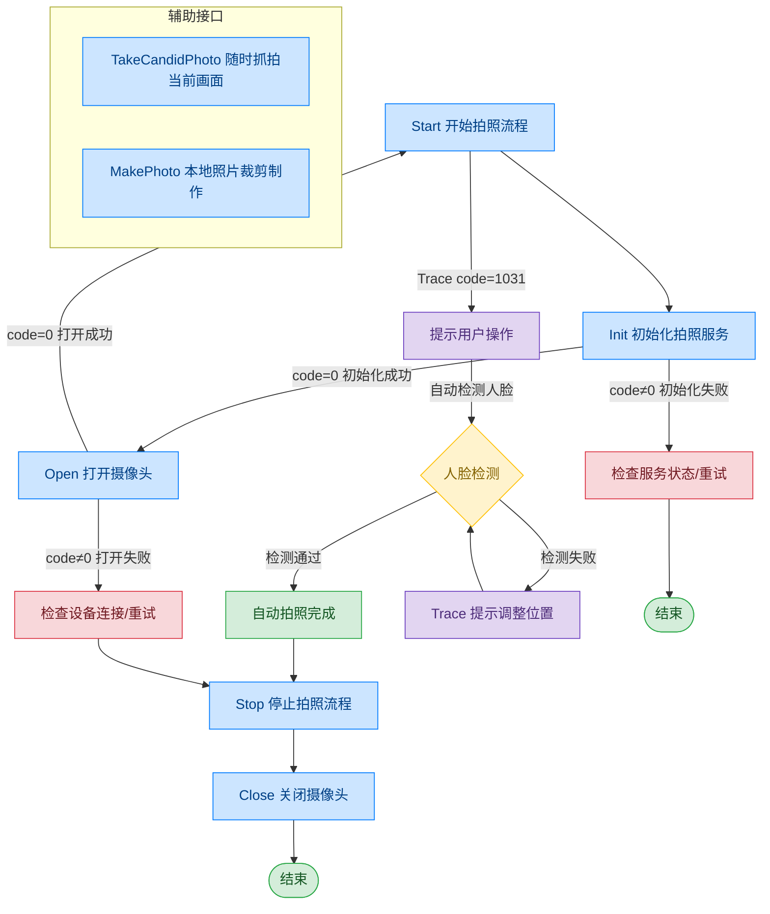

# 摄像头 - 自助拍照服务（TRSRT PhotoCapturer）

## 文档版本

| 版本 | 日期 | 修改内容 |
|------|------|----------|
| V1.0 | 2026-06-16 | 初始版本，从原始文档拆分 |
| V1.1 | 2026-06-17 | 优化调用流程图，补充异常处理路径 |

## 设备信息

| 项目 | 内容 |
|------|------|
| 设备类型 | 摄像头（自助拍照服务） |
| DIS 接口前缀 | TRSRT_PhotoCapturer |
| 接口模式 | 自助拍照服务 |

## 概述

与传统摄像头（DEV_Camera）不同，自助拍照服务提供高封装的拍照流程：自动人脸检测、眼部定位、合规性校验、自动拍照。上层应用无需手动控制拍照时机，服务会自动完成整个拍照流程。

## 调用流程



## 接口列表

### 1. 初始化拍照服务（Init）

#### 请求参数

请求示例：

```json
{
  "seq": "TRSRT_PhotoCapturer_Init_${uuid}",
  "cmd": "Init",
  "datetime": "20211201130101",
  "posidx": "00",
  "timeout": "30000",
  "async": "0"
}
```

参数说明：

| 参数名称 | 格式 | 是否必填 | 参数说明 |
|----------|------|----------|----------|
| seq | string | 是 | TRSRT_PhotoCapturer_Init_${uuid} |
| cmd | string | 是 | 固定为"Init" |
| datetime | string | 是 | 指令的下发时间，格式：YYYYMMddHHmmss |
| posidx | string | 是 | 多个同款设备的工位号；"00"~"99" |
| timeout | string | 是 | 超时时间(ms) |
| async | string | 是 | 是否异步（默认0:同步）；0：同步；1：异步 |

#### 返回参数

返回示例：

```json
{
  "seq": "TRSRT_PhotoCapturer_Init_${uuid}",
  "cmd": "Init",
  "datetime": "20211201130102",
  "code": "0",
  "msg": "Success",
  "posidx": "00",
  "async": "0"
}
```

参数说明：

| 参数名称 | 格式 | 是否必填 | 参数说明 |
|----------|------|----------|----------|
| seq | string | 是 | 同下发的 seq |
| cmd | string | 是 | 同下发的 cmd |
| datetime | string | 是 | 指令的下发时间，格式：YYYYMMddHHmmss |
| code | string | 是 | 参照通用返回码 / 摄像头返回码 |
| msg | string | 否 | 提示信息 |
| posidx | string | 是 | 多个同款设备的工位号；"00"~"99" |

---

### 2. 打开照相服务（Open）

每次拍照前调用，用于启动视频流服务。获取视频流流程请参阅通用协议层-视频流获取。

#### 请求参数

请求示例：

```json
{
  "seq": "TRSRT_PhotoCapturer_Open_${uuid}",
  "cmd": "Open",
  "datetime": "20211201130101",
  "posidx": "00",
  "timeout": "30000",
  "async": "0"
}
```

参数说明：

| 参数名称 | 格式 | 是否必填 | 参数说明 |
|----------|------|----------|----------|
| seq | string | 是 | TRSRT_PhotoCapturer_Open_${uuid} |
| cmd | string | 是 | 固定为"Open" |
| datetime | string | 是 | 指令的下发时间，格式：YYYYMMddHHmmss |
| posidx | string | 是 | 多个同款设备的工位号；"00"~"99" |
| timeout | string | 是 | 超时时间(ms) |
| async | string | 是 | 是否异步（默认0:同步）；0：同步；1：异步 |

#### 返回参数

返回示例：

```json
{
  "seq": "TRSRT_PhotoCapturer_Open_${uuid}",
  "cmd": "Open",
  "datetime": "20211201130102",
  "code": "0",
  "msg": "success",
  "posidx": "00",
  "async": "0",
  "data": {
    "video_url": [
      {
        "00": ""
      }
    ]
  }
}
```

参数说明：

| 参数名称 | 格式 | 是否必填 | 参数说明 |
|----------|------|----------|----------|
| seq | string | 是 | 同下发的 seq |
| cmd | string | 是 | 同下发的 cmd |
| datetime | string | 是 | 指令的下发时间，格式：YYYYMMddHHmmss |
| code | string | 是 | 参照通用返回码 / 摄像头返回码 |
| msg | string | 否 | 提示信息 |
| posidx | string | 是 | 多个同款设备的工位号；"00"~"99" |
| data | object | 否 | 返回数据 |
| ↳ video_url | 数组 | 是 | 摄像头视频流地址 |

---

### 3. 开始拍照（Start）

通过本指令，上层应用可启动相机并执行人脸定位与拍照流程。具体流程如下：启动相机视频流，循环采集画面帧并执行人脸检测；未识别人脸则持续轮询。检测到人脸后，抓取眼部关键点，校验眼位居中合规性；符合阈值要求则自动拍照并终止流程，不符合则持续循环检测。

#### 请求参数

请求示例：

```json
{
  "seq": "TRSRT_PhotoCapturer_Start_${uuid}",
  "cmd": "Start",
  "datetime": "20211201130101",
  "timeout": "30000",
  "param": {
    "photoType": "",
    "language": ""
  },
  "posidx": "00",
  "async": "0"
}
```

参数说明：

| 参数名称 | 格式 | 是否必填 | 参数说明 |
|----------|------|----------|----------|
| seq | string | 是 | TRSRT_PhotoCapturer_Start_${uuid} |
| cmd | string | 是 | 固定为"Start" |
| datetime | string | 是 | 指令的下发时间，格式：YYYYMMddHHmmss |
| posidx | string | 是 | 多个同款设备的工位号；"00"~"99" |
| timeout | string | 是 | 超时时间(ms) |
| async | string | 是 | 是否异步（默认0:同步）；0：同步；1：异步 |
| param | object | 否 | 参数对象 |
| ↳ photoType | string | 否 | 照片类型 |
| ↳ language | string | 否 | 语言设置 |

#### 返回参数

返回示例：

```json
{
  "seq": "TRSRT_PhotoCapturer_Start_${uuid}",
  "cmd": "Start",
  "datetime": "20211201130102",
  "code": "0",
  "msg": "Success",
  "suggest": "",
  "data": {
    "type": "CaptureFinish",
    "Result": "true",
    "msg": "",
    "photos": [
      {
        "passed": "true",
        "photoPath_Org": "D:\\1.jpg",
        "photoPath": "D:\\2.jpg",
        "nopassReason": "The head is relatively wide",
        "needChangeClothes": "false"
      }
    ]
  }
}
```

参数说明：

| 参数名称 | 格式 | 是否必填 | 参数说明 |
|----------|------|----------|----------|
| seq | string | 是 | 同下发的 seq |
| cmd | string | 是 | 同下发的 cmd |
| datetime | string | 是 | 指令的下发时间，格式：YYYYMMddHHmmss |
| code | string | 是 | 参照通用返回码 / 摄像头返回码 |
| msg | string | 否 | 提示信息 |
| suggest | string | 否 | 建议 |
| posidx | string | 是 | 多个同款设备的工位号；"00"~"99" |
| data | object | 否 | 返回数据 |
| ↳ type | string | 是 | 结果类型；"CaptureFinish"：拍照完成 |
| ↳ Result | string | 是 | 拍照结果；"true"：成功；"false"：失败 |
| ↳ photos | 数组 | 是 | 照片结果数组 |
| ↳↳ passed | string | 是 | 是否合格；"true"：合格；"false"：不合格 |
| ↳↳ photoPath_Org | string | 是 | 原始照片路径 |
| ↳↳ photoPath | string | 是 | 裁剪后照片路径 |
| ↳↳ nopassReason | string | 否 | 不合格原因 |
| ↳↳ needChangeClothes | string | 否 | 是否需要换衣服；"true"：需要；"false"：不需要 |

---

### 4. 拍照 Trace 消息

自助拍照的过程中，有交互的 Trace 返回，用于提醒用户进行对应的操作。

返回示例：

```json
{
  "seq": "TRSRT_PhotoCapturer_Start_xxxxxxxxxxx",
  "cmd": "Start",
  "datetime": "20211201130102",
  "code": "1031",
  "msg": "trace message",
  "data": {
    "type": "NotifyMessage",
    "msg": "Please take off your glasses",
    "imgPath": "d:/1.jpg"
  }
}
```

Trace 消息参数说明：

| 参数名称 | 格式 | 是否必填 | 参数说明 |
|----------|------|----------|----------|
| seq | string | 是 | 同正在执行的指令的 seq |
| cmd | string | 是 | 同正在执行的指令的 cmd |
| code | string | 是 | 固定值："1031"（Trace 消息） |
| msg | string | 是 | trace message |
| data | object | 是 | Trace 数据 |
| ↳ type | string | 是 | 消息类型；"NotifyMessage"：通知消息 |
| ↳ msg | string | 是 | 提示信息（如"Please take off your glasses"） |
| ↳ imgPath | string | 否 | 当前画面截图路径 |

---

### 5. 中止拍照（Stop）

可在拍照过程中主动中止。

#### 请求参数

请求示例：

```json
{
  "seq": "TRSRT_PhotoCapturer_Stop_${uuid}",
  "cmd": "Stop",
  "datetime": "20211201130101",
  "posidx": "00",
  "timeout": "30000",
  "async": "0"
}
```

参数说明：

| 参数名称 | 格式 | 是否必填 | 参数说明 |
|----------|------|----------|----------|
| seq | string | 是 | TRSRT_PhotoCapturer_Stop_${uuid} |
| cmd | string | 是 | 固定为"Stop" |
| datetime | string | 是 | 指令的下发时间，格式：YYYYMMddHHmmss |
| posidx | string | 是 | 多个同款设备的工位号；"00"~"99" |
| timeout | string | 是 | 超时时间(ms) |
| async | string | 是 | 是否异步（默认0:同步）；0：同步；1：异步 |

#### 返回参数

返回示例：

```json
{
  "seq": "TRSRT_PhotoCapturer_Stop_${uuid}",
  "cmd": "Stop",
  "datetime": "20211201130102",
  "code": "0",
  "msg": "Success",
  "suggest": "",
  "posidx": "00"
}
```

参数说明：

| 参数名称 | 格式 | 是否必填 | 参数说明 |
|----------|------|----------|----------|
| seq | string | 是 | 同下发的 seq |
| cmd | string | 是 | 同下发的 cmd |
| datetime | string | 是 | 指令的下发时间，格式：YYYYMMddHHmmss |
| code | string | 是 | 参照通用返回码 / 摄像头返回码 |
| msg | string | 否 | 提示信息 |
| suggest | string | 否 | 建议 |
| posidx | string | 是 | 多个同款设备的工位号；"00"~"99" |

---

### 6. 抓拍（TakeCandidPhoto）

在拍照过程中，可随时获取当前画面。

#### 请求参数

请求示例：

```json
{
  "seq": "TRSRT_PhotoCapturer_TakeCandidPhoto_${uuid}",
  "cmd": "TakeCandidPhoto",
  "datetime": "20211201130101",
  "posidx": "00",
  "timeout": "30000",
  "async": "0"
}
```

参数说明：

| 参数名称 | 格式 | 是否必填 | 参数说明 |
|----------|------|----------|----------|
| seq | string | 是 | TRSRT_PhotoCapturer_TakeCandidPhoto_${uuid} |
| cmd | string | 是 | 固定为"TakeCandidPhoto" |
| datetime | string | 是 | 指令的下发时间，格式：YYYYMMddHHmmss |
| posidx | string | 是 | 多个同款设备的工位号；"00"~"99" |
| timeout | string | 是 | 超时时间(ms) |
| async | string | 是 | 是否异步（默认0:同步）；0：同步；1：异步 |

#### 返回参数

返回示例：

```json
{
  "seq": "DEV_PhotoCapturer_TakeCandidPhoto_${uuid}",
  "cmd": "TakeCandidPhoto",
  "datetime": "20211201130102",
  "code": "0",
  "msg": "Success",
  "suggest": "",
  "posidx": "00"
}
```

参数说明：

| 参数名称 | 格式 | 是否必填 | 参数说明 |
|----------|------|----------|----------|
| seq | string | 是 | 同下发的 seq |
| cmd | string | 是 | 同下发的 cmd |
| datetime | string | 是 | 指令的下发时间，格式：YYYYMMddHHmmss |
| code | string | 是 | 参照通用返回码 / 摄像头返回码 |
| msg | string | 否 | 提示信息 |
| suggest | string | 否 | 建议 |
| posidx | string | 是 | 多个同款设备的工位号；"00"~"99" |

---

### 7. 本地照片裁剪制作（MakePhoto）

对单独的照片进行图像处理。

#### 请求参数

请求示例：

```json
{
  "seq": "TRSRT_PhotoCapturer_MakePhoto_${uuid}",
  "cmd": "MakePhoto",
  "datetime": "20211201130101",
  "param": {
    "photoType": "IDCard",
    "photoPath": "D:\\xxxxxxxxx.jpg"
  },
  "posidx": "00",
  "timeout": "30000",
  "async": "0"
}
```

参数说明：

| 参数名称 | 格式 | 是否必填 | 参数说明 |
|----------|------|----------|----------|
| seq | string | 是 | TRSRT_PhotoCapturer_MakePhoto_${uuid} |
| cmd | string | 是 | 固定为"MakePhoto" |
| datetime | string | 是 | 指令的下发时间，格式：YYYYMMddHHmmss |
| posidx | string | 是 | 多个同款设备的工位号；"00"~"99" |
| timeout | string | 是 | 超时时间(ms) |
| async | string | 是 | 是否异步（默认0:同步）；0：同步；1：异步 |
| param | object | 是 | 参数对象 |
| ↳ photoType | string | 是 | 照片类型；如"IDCard" |
| ↳ photoPath | string | 是 | 待处理的照片路径 |

#### 返回参数

返回示例：

```json
{
  "seq": "TRSRT_PhotoCapturer_MakePhoto_${uuid}",
  "cmd": "MakePhoto",
  "datetime": "20211201130102",
  "code": "0",
  "msg": "Success",
  "suggest": "",
  "data": {
    "type": "MakePhotoResult",
    "photos": [
      {
        "passed": "true",
        "photoPath_Org": "D:\\1.jpg",
        "photoPath": "D:\\2.jpg",
        "nopassReason": "The head is relatively wide",
        "needChangeClothes": "false"
      }
    ]
  }
}
```

参数说明：

| 参数名称 | 格式 | 是否必填 | 参数说明 |
|----------|------|----------|----------|
| seq | string | 是 | 同下发的 seq |
| cmd | string | 是 | 同下发的 cmd |
| datetime | string | 是 | 指令的下发时间，格式：YYYYMMddHHmmss |
| code | string | 是 | 参照通用返回码 / 摄像头返回码 |
| msg | string | 否 | 提示信息 |
| suggest | string | 否 | 建议 |
| data | object | 否 | 返回数据 |
| ↳ type | string | 是 | 结果类型；"MakePhotoResult"：制作结果 |
| ↳ photos | 数组 | 是 | 照片结果数组（同 Start 返回的 photos 结构） |

## 错误码

| 序号 | 错误码 | 含义 |
|------|--------|------|
| 1 | 15100001 | 超时 |
| 2 | 15100003 | 指针无效 |
| 3 | 15100004 | 此服务功能暂不支持 |
| 4 | 15100005 | 内存不足 |
| 5 | 15100006 | 线程恢复失败 |
| 6 | 15100007 | 线程创建失败 |
| 7 | 15100008 | Event 创建失败 |
| 8 | 15100009 | 命令执行失败 |
| 9 | 15100010 | 命令执行超时 |
| 10 | 99999999 | 未知错误 |
| 11 | 15100101 | 设备未打开 |
| 12 | 15100107 | 设备繁忙 |
| 13 | 15100109 | 已经打开设备，已初始化 |
| 14 | 15100110 | 设备不存在 |
| 15 | 15100113 | 设备通讯失败 |
| 16 | 15100114 | 设备操作失败 |
| 17 | 15100115 | 设备不支持 |
| 18 | 15100116 | 设备句柄无效 |
| 19 | 15100117 | 初始化失败 |
| 20 | 15100201 | 文件打开失败 |
| 21 | 15100203 | 文件不存在 |
| 22 | 15100206 | 文件写错误 |
| 23 | 15100207 | 文件读错误 |
| 24 | 15100208 | 文件保存错误 |
| 25 | 15100210 | 目录不存在 |
| 26 | 15100211 | 目录创建失败 |
| 27 | 15100302 | SDK API 执行失败 |
| 28 | 15100303 | SDK 接口初始化失败 |
| 29 | 15100304 | SDK 文件不存在 |
| 30 | 15100308 | SDK 当前使用的函数返回错误 |
| 31 | 15100309 | SDK 当前使用的与硬件不匹配 |
| 32 | 15100701 | 初始化或加载配置文件非法 |
| 33 | 15100702 | 缺少必备字段或参数 |
| 34 | 15100703 | 字段或参数非法 |
| 35 | 15103001 | 人像比对文件不存在 |
| 36 | 15103002 | 人像比对 HTTP 地址非法 |
| 37 | 15103003 | 活体检测失败 |
| 38 | 15103004 | 人像比对失败 |
| 39 | 15103005 | 获取特征值失败 |

> 通用返回码（0~1037）请参阅 [通用返回码](../00-通用协议层/06-通用返回码.md)