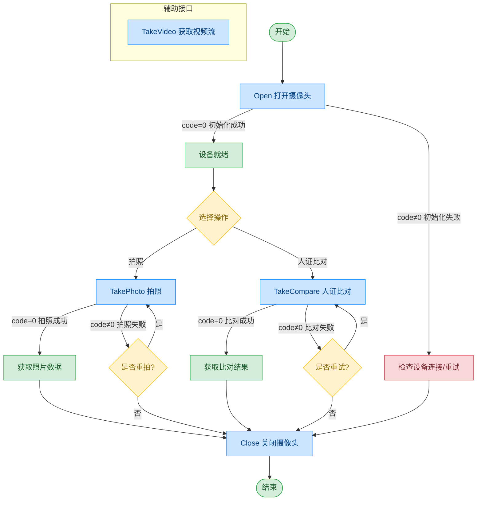

# 摄像头 - 奥尼 USB 摄像头

## 文档版本

| 版本 | 日期 | 修改内容 |
|------|------|----------|
| V1.0 | 2026-06-16 | 初始版本，从原始文档拆分 |
| V1.1 | 2026-06-17 | 优化调用流程图，补充异常处理路径 |

## 设备信息

| 项目 | 内容 |
|------|------|
| 设备类型 | 摄像头 |
| 品牌 | 奥尼 |
| 型号 | USB 摄像头 |
| DIS 接口前缀 | DEV_Camera |
| 接口模式 | 传统摄像头 |

## 调用流程



> TakeVideo 视频流获取详见 [通用协议层-视频流获取](../00-通用协议层/04-视频流获取.md)

## posidx 编号说明

| posidx 编号 | 对应的功能 |
|-------------|-----------|
| "00" | 00 号摄像头，视频地址：ws://127.0.0.1:26034/dis/hi_video |
| "01" | 01 号摄像头，视频地址：ws://127.0.0.1:27034/dis/hi_video |
| "02" | 02 号摄像头，视频地址：ws://127.0.0.1:28034/dis/hi_video |
| "03" | 03 号摄像头，视频地址：ws://127.0.0.1:29034/dis/hi_video |
| "04" | 04 号摄像头，视频地址：ws://127.0.0.1:30034/dis/hi_video |

## 接口列表

### 1. 打开摄像头（Open）

通过本条指令上层应用可以打开摄像头，准备拍摄或拍视频。获取视频流流程请参阅通用协议层-视频流获取。

#### 请求参数

请求示例：

```json
{
  "seq": "DEV_Camera_Open_${uuid}",
  "cmd": "Open",
  "datetime": "20211201130101",
  "Timeout": "10000",
  "param": {
    "Angel": "",
    "Name": ""
  },
  "posidx": "00",
  "ASYNC": "0"
}
```

参数说明：

| 参数名称 | 格式 | 是否必填 | 参数说明 |
|----------|------|----------|----------|
| seq | string | 是 | DEV_Camera_Open_${uuid} |
| cmd | string | 是 | 固定为"Open" |
| datetime | string | 是 | 指令的下发时间，格式：YYYYMMddHHmmss |
| posidx | string | 是 | 多个同款设备的工位号；"00"~"99" |
| Timeout | string | 是 | 超时时间(ms) |
| ASYNC | string | 是 | 是否异步（默认0:同步）；0：同步；1：异步 |
| param | object | 是 | 请求参数对象 |
| ↳ Angel | string | 否 | 图像旋转角度；0：不旋转；90：旋转90°；180：旋转180°；270：旋转270° |
| ↳ Name | string | 否 | 需要打开的摄像头名称 |

#### 返回参数

返回示例：

```json
{
  "seq": "DEV_Camera_Open_${uuid}",
  "cmd": "Open",
  "datetime": "20211201130102",
  "code": "0",
  "msg": "Success",
  "suggest": "",
  "data": {
    "video_url": [
      {
        "00": "ws://127.0.0.1:26034/dis/hi_video"
      }
    ]
  }
}
```

参数说明：

| 参数名称 | 格式 | 是否必填 | 参数说明 |
|----------|------|----------|----------|
| seq | string | 是 | 同下发的 seq |
| cmd | string | 是 | 同下发的 cmd |
| datetime | string | 是 | 指令的下发时间，格式：YYYYMMddHHmmss |
| code | string | 是 | 参照通用返回码 / 摄像头返回码 |
| msg | string | 否 | 提示信息 |
| suggest | string | 否 | 建议 |
| posidx | string | 是 | 多个同款设备的工位号；"00"~"99" |
| data | object | 是 | 返回数据 |
| ↳ video_url | 数组 | 是 | 打开的摄像头的数据流地址，里面包含各摄像头的视频流地址 |

---

### 2. 单纯抓拍（TakePhoto）

通过本条指令上层应用可以打开摄像头抓拍。

#### 请求参数

请求示例：

```json
{
  "seq": "DEV_Camera_TakePhoto_${uuid}",
  "cmd": "TakePhoto",
  "datetime": "20211201130101",
  "Timeout": "30000",
  "param": {
    "PersoFace": "D:/data/Camera/TakePhoto.jpg",
    "Angel": "90",
    "cut_type": "0",
    "NoBase64Enable": "1"
  },
  "posidx": "00",
  "ASYNC": "0"
}
```

参数说明：

| 参数名称 | 格式 | 是否必填 | 参数说明 |
|----------|------|----------|----------|
| seq | string | 是 | DEV_Camera_TakePhoto_${uuid} |
| cmd | string | 是 | 固定为"TakePhoto" |
| datetime | string | 是 | 指令的下发时间，格式：YYYYMMddHHmmss |
| posidx | string | 是 | 多个同款设备的工位号；"00"~"99" |
| Timeout | string | 是 | 超时时间(ms) |
| ASYNC | string | 是 | 是否异步（默认0:同步）；0：同步；1：异步 |
| param | object | 是 | 请求参数的数据对象 |
| ↳ Angel | string | 否 | 照片旋转角度；0：不旋转；90：顺时针旋转90°；180：顺时针旋转180°；270：顺时针旋转270° |
| ↳ PersoFace | string | 否 | 照片保存本地的路径，如果没填，则由外设库自行决定 |
| ↳ NoBase64Enable | string | 否 | 是否返回图片的 Base64 数据，默认为0；0：返回；1：不返回 |
| ↳ cut_type | string | 否 | 切边保存方式；"0"不切边保存；"1"自动切边保存；"2"自定义切边保存；"4"人脸保存全图；"5"人脸切边（人像小图）；"6"人脸切边（人像大图） |

#### 返回参数

返回示例：

```json
{
  "seq": "DEV_Camera_TakePhoto_${uuid}",
  "cmd": "TakePhoto",
  "datetime": "20211201130102",
  "code": "0",
  "msg": "Success",
  "data": {
    "PersoFace": "D:/data/Camera/TakePhoto.jpg",
    "FaceData": "data:image/png;base64,iVBORw0KGgoAAAANSUhEUgAAAbMAAAGrCAY"
  },
  "ASYNC": "0"
}
```

参数说明：

| 参数名称 | 格式 | 是否必填 | 参数说明 |
|----------|------|----------|----------|
| seq | string | 是 | 同下发的 seq |
| cmd | string | 是 | 同下发的 cmd |
| datetime | string | 是 | 指令的下发时间，格式：YYYYMMddHHmmss |
| code | string | 是 | 参照通用返回码 / 摄像头返回码 |
| msg | string | 否 | 提示信息 |
| posidx | string | 是 | 多个同款设备的工位号；"00"~"99" |
| data | object | 是 | 返回数据 |
| ↳ PersoFace | string | 是 | 照片保存的路径，与请求下发的 PersoFace 一致 |
| ↳ FaceData | string | 否 | 照片二进制内容的 Base64 值 |

---

### 3. 比对抓拍（TakeCompare）

通过本条指令上层应用可以打开摄像头比对抓拍。

#### 请求参数

请求示例：

```json
{
  "seq": "DEV_Camera_TakeCompare_${uuid}",
  "cmd": "TakeCompare",
  "datetime": "20211201130101",
  "Timeout": "30000",
  "param": {
    "PersoFace": "D:/data/Camera/TakePhoto.jpg",
    "SFZFace": "D:/data/Camera/sfz.jpg",
    "SFZFaceData": "data:image/png;base64,iVBORw0KGgoAAAANSUhEUgAAAbMAAAGrCAY",
    "LiveCheckEnable": "1",
    "FaceCompareEnable": "1"
  },
  "posidx": "",
  "ASYNC": "0"
}
```

参数说明：

| 参数名称 | 格式 | 是否必填 | 参数说明 |
|----------|------|----------|----------|
| seq | string | 是 | DEV_Camera_TakeCompare_${uuid} |
| cmd | string | 是 | 固定为"TakeCompare" |
| datetime | string | 是 | 指令的下发时间，格式：YYYYMMddHHmmss |
| posidx | string | 是 | 多个同款设备的工位号；"00"~"99" |
| Timeout | string | 是 | 超时时间(ms) |
| ASYNC | string | 是 | 是否异步（默认0:同步）；0：同步；1：异步 |
| param | object | 是 | 请求参数 |
| ↳ SFZFace | string | 否 | 比对照片的图片路径 |
| ↳ PersoFace | string | 否 | 照片保存本地的路径，如果没填，则由外设库自行决定 |
| ↳ SFZFaceData | string | 否 | 比对照片的 Base64 数据，当 SFZFace 与 SFZFaceData 同时存在时 SFZFaceData 为有效参数 |
| ↳ NoBase64Enable | string | 否 | 是否返回图片的 Base64 数据，默认返回 |
| ↳ LocalCompareEnable | string | 否 | 本地比对使能，默认为1使能 |
| ↳ LiveCheckEnable | string | 否 | 活体检测使能；0：不进行活体检测；1：进行活体检测 |
| ↳ FaceCompareEnable | string | 否 | 人像比对使能；0：不进行人像比对；1：进行人像比对 |
| ↳ SetScore | string | 否 | 设置比对的分数，默认60分，仅当 FaceCompareEnable 为1时有效 |

#### 返回参数

返回示例：

```json
{
  "seq": "DEV_Camera_TakeCompare_${uuid}",
  "cmd": "TakeCompare",
  "datetime": "20211201130102",
  "code": "0",
  "msg": "Success",
  "data": {
    "PersoFace": "D:/data/Camera/TakePhoto.jpg",
    "FaceData": "data:image/png;base64,iVBORw0KGgoAAAANSUhEUgAAAbMAAAGrCAY",
    "Score": "60"
  }
}
```

参数说明：

| 参数名称 | 格式 | 是否必填 | 参数说明 |
|----------|------|----------|----------|
| seq | string | 是 | 同下发的 seq |
| cmd | string | 是 | 同下发的 cmd |
| datetime | string | 是 | 指令的下发时间，格式：YYYYMMddHHmmss |
| code | string | 是 | 参照通用返回码 / 摄像头返回码 |
| msg | string | 否 | 提示信息 |
| posidx | string | 是 | 多个同款设备的工位号；"00"~"99" |
| data | object | 是 | 返回数据 |
| ↳ PersoFace | string | 是 | 照片保存的路径，与请求下发的 PersoFace 一致 |
| ↳ FaceData | string | 否 | 照片二进制内容的 Base64 值 |
| ↳ Score | string | 是 | 返回比对的分数 |

---

### 4. 关闭摄像头（Close）

通过本条指令上层应用可以关闭摄像头，结束拍摄。

#### 请求参数

请求示例：

```json
{
  "seq": "DEV_Camera_Close_${uuid}",
  "cmd": "Close",
  "datetime": "20211201130101",
  "posidx": "",
  "Timeout": "30000",
  "ASYNC": "0"
}
```

参数说明：

| 参数名称 | 格式 | 是否必填 | 参数说明 |
|----------|------|----------|----------|
| seq | string | 是 | DEV_Camera_Close_${uuid} |
| cmd | string | 是 | 固定为"Close" |
| datetime | string | 是 | 指令的下发时间，格式：YYYYMMddHHmmss |
| posidx | string | 是 | 多个同款设备的工位号；"00"~"99" |
| Timeout | string | 是 | 超时时间(ms) |
| ASYNC | string | 是 | 是否异步（默认0:同步）；0：同步；1：异步 |

#### 返回参数

返回示例：

```json
{
  "seq": "DEV_Camera_Close_${uuid}",
  "cmd": "Close",
  "datetime": "20211201130102",
  "code": "0",
  "msg": "Success",
  "suggest": "",
  "posidx": "00"
}
```

参数说明：

| 参数名称 | 格式 | 是否必填 | 参数说明 |
|----------|------|----------|----------|
| seq | string | 是 | 同下发的 seq |
| cmd | string | 是 | 同下发的 cmd |
| datetime | string | 是 | 指令的下发时间，格式：YYYYMMddHHmmss |
| code | string | 是 | 参照通用返回码 / 摄像头返回码 |
| msg | string | 否 | 提示信息 |
| suggest | string | 否 | 建议 |
| posidx | string | 是 | 多个同款设备的工位号；"00"~"99" |

## 错误码

| 序号 | 错误码 | 含义 |
|------|--------|------|
| 1 | 15100001 | 超时 |
| 2 | 15100003 | 指针无效 |
| 3 | 15100004 | 此服务功能暂不支持 |
| 4 | 15100005 | 内存不足 |
| 5 | 15100006 | 线程恢复失败 |
| 6 | 15100007 | 线程创建失败 |
| 7 | 15100008 | Event 创建失败 |
| 8 | 15100009 | 命令执行失败 |
| 9 | 15100010 | 命令执行超时 |
| 10 | 99999999 | 未知错误 |
| 11 | 15100101 | 设备未打开 |
| 12 | 15100107 | 设备繁忙 |
| 13 | 15100109 | 已经打开设备，已初始化 |
| 14 | 15100110 | 设备不存在 |
| 15 | 15100113 | 设备通讯失败 |
| 16 | 15100114 | 设备操作失败 |
| 17 | 15100115 | 设备不支持 |
| 18 | 15100116 | 设备句柄无效 |
| 19 | 15100117 | 初始化失败 |
| 20 | 15100201 | 文件打开失败 |
| 21 | 15100203 | 文件不存在 |
| 22 | 15100206 | 文件写错误 |
| 23 | 15100207 | 文件读错误 |
| 24 | 15100208 | 文件保存错误 |
| 25 | 15100210 | 目录不存在 |
| 26 | 15100211 | 目录创建失败 |
| 27 | 15100302 | SDK API 执行失败 |
| 28 | 15100303 | SDK 接口初始化失败 |
| 29 | 15100304 | SDK 文件不存在 |
| 30 | 15100308 | SDK 当前使用的函数返回错误 |
| 31 | 15100309 | SDK 当前使用的与硬件不匹配 |
| 32 | 15100701 | 初始化或加载配置文件非法 |
| 33 | 15100702 | 缺少必备字段或参数 |
| 34 | 15100703 | 字段或参数非法 |
| 35 | 15103001 | 人像比对文件不存在 |
| 36 | 15103002 | 人像比对 HTTP 地址非法 |
| 37 | 15103003 | 活体检测失败 |
| 38 | 15103004 | 人像比对失败 |
| 39 | 15103005 | 获取特征值失败 |

> 通用返回码（0~1037）请参阅 [通用返回码](../00-通用协议层/06-通用返回码.md)
