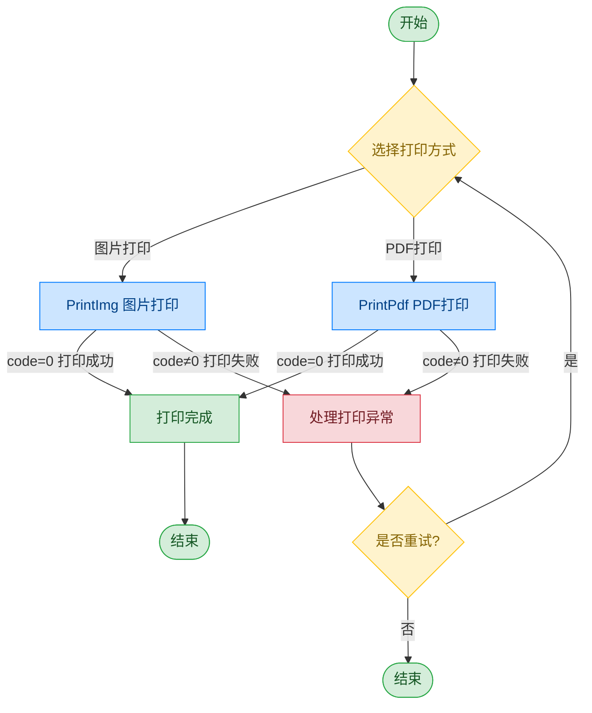

# 凭条打印机 - 美松 MS-FPT301

## 文档版本

| 版本 | 日期 | 修改内容 |
|------|------|----------|
| V1.0 | 2026-06-16 | 初始版本，从原始文档拆分 |
| V1.1 | 2026-06-17 | 优化调用流程图，补充异常处理路径 |

## 设备信息

| 项目 | 内容 |
|------|------|
| 设备类型 | 凭条打印机 |
| 品牌 | 美松 |
| 型号 | MS-FPT301 |
| DIS 接口前缀 | DEV_SlipPrinter |

## 调用流程



> 打印模块采用直接调用方式，不涉及设备打开与关闭操作。

## 接口列表

### 1. 图片打印（PrintImg）

通过本条指令上层应用可以使用凭条打印机进行图片打印。

#### 请求参数

请求示例：

```json
{
  "seq": "DEV_SlipPrinter_PrintImg_${uuid}",
  "cmd": "PrintImg",
  "datetime": "20211201130101",
  "timeout": "30000",
  "posidx": "00",
  "async": "0",
  "param": {
    "ImagePath": "D:/data/SlipPrinter/test.bmp"
  }
}
```

参数说明：

| 参数名称 | 格式 | 是否必填 | 参数说明 |
|----------|------|----------|----------|
| seq | string | 是 | DEV_SlipPrinter_PrintImg_${uuid} |
| cmd | string | 是 | 固定为"PrintImg" |
| datetime | string | 是 | 指令的下发时间，格式：YYYYMMddHHmmss |
| posidx | string | 是 | 多个同款设备的工位号；"00"~"99" |
| timeout | string | 是 | 超时时间(ms) |
| async | string | 是 | 是否异步（默认0:同步）；0：同步；1：异步 |
| param | Object | 是 | 参数对象 |
| ↳ ImagePath | string | 是 | 图片路径 |

#### 返回参数

返回示例：

```json
{
  "seq": "DEV_SlipPrinter_PrintImg_${uuid}",
  "cmd": "PrintImg",
  "datetime": "20211201130102",
  "code": "0",
  "msg": "success",
  "posidx": "00"
}
```

参数说明：

| 参数名称 | 格式 | 是否必填 | 参数说明 |
|----------|------|----------|----------|
| seq | string | 是 | 同下发的 seq |
| cmd | string | 是 | 同下发的 cmd |
| datetime | string | 是 | 指令的下发时间，格式：YYYYMMddHHmmss |
| code | string | 是 | 参照通用返回码 / 凭条打印机错误码说明 |
| msg | string | 否 | 参照通用返回码 / 凭条打印机错误码说明 |
| posidx | string | 是 | 同请求的 posidx |

---

### 2. PDF打印（PrintPdf）

通过本条指令上层应用可以使用凭条打印机进行 PDF 打印。

#### 请求参数

请求示例：

```json
{
  "seq": "DEV_SlipPrinter_PrintPdf_${uuid}",
  "cmd": "PrintPdf",
  "datetime": "20211201130101",
  "timeout": "30000",
  "posidx": "00",
  "param": {
    "PdfPath": "D:/data/SlipPrinter/xxx.pdf",
    "Width": "80",
    "Height": "0"
  }
}
```

参数说明：

| 参数名称 | 格式 | 是否必填 | 参数说明 |
|----------|------|----------|----------|
| seq | string | 是 | DEV_SlipPrinter_PrintPdf_${uuid} |
| cmd | string | 是 | 固定为"PrintPdf" |
| datetime | string | 是 | 指令的下发时间，格式：YYYYMMddHHmmss |
| posidx | string | 是 | 多个同款设备的工位号；"00"~"99" |
| timeout | string | 是 | 超时时间(ms) |
| async | string | 是 | 是否异步（默认0:同步）；0：同步；1：异步 |
| param | Object | 是 | 参数对象 |
| ↳ PdfPath | string | 是 | 文件路径 |
| ↳ Width | string | 否 | 默认80，单位：mm |
| ↳ Height | string | 否 | 默认参数0，SDK 进行自适应 |

#### 返回参数

返回示例：

```json
{
  "seq": "DEV_SlipPrinter_PrintPdf_${uuid}",
  "cmd": "PrintPdf",
  "datetime": "20211201130102",
  "code": "0",
  "msg": "success",
  "suggest": "",
  "posidx": "00"
}
```

参数说明：

| 参数名称 | 格式 | 是否必填 | 参数说明 |
|----------|------|----------|----------|
| seq | string | 是 | 同下发的 seq |
| cmd | string | 是 | 同下发的 cmd |
| datetime | string | 是 | 指令的下发时间，格式：YYYYMMddHHmmss |
| code | string | 是 | 参照通用返回码 / 凭条打印机错误码说明 |
| msg | string | 否 | 参照通用返回码 / 凭条打印机错误码说明 |
| suggest | string | 否 | 建议 |
| posidx | string | 是 | 同请求的 posidx |

## 错误码

| 序号 | 错误码 | 含义 |
|------|--------|------|
| 1 | 99999901 | 主动取消 |
| 2 | 14203001 | 设备未打开 |
| 3 | 14203002 | 下发参数错误 |
| 4 | 14203003 | ECL 模板转图片失败 |
| 5 | 14203004 | 加载图片失败 |
| 6 | 14203005 | 不支持的指令 |
| 7 | 14203006 | 获取打印机状态失败 |
| 8 | 14203007 | SDK 返回失败 |
| 9 | 14203008 | 加载 SDK 失败 |
| 10 | 14203009 | 打印机状态异常 |
| 11 | 14299601 | 打印机脱机 |
| 12 | 14299602 | 打印机堵纸 |
| 13 | 14299603 | 打印机缺纸 |
| 14 | 14299604 | 纸将尽 |
| 15 | 14299605 | 未知错误 |
| 16 | 14299606 | 打印机盖被打开 |
| 17 | 14299607 | 打印机过温 |
| 18 | 14299608 | 切刀错误 |

> 通用返回码（0~1037）请参阅 [通用返回码](../00-通用协议层/06-通用返回码.md)
