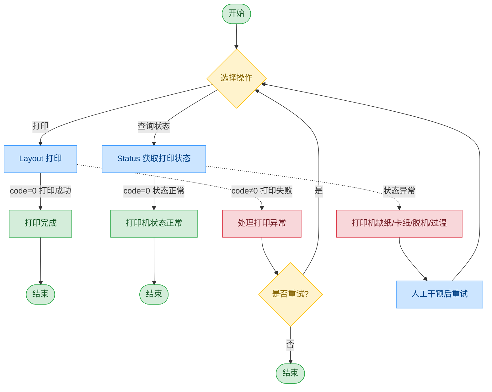

# A4 打印机 - HP LaserJet Pro 4004

## 文档版本

| 版本 | 日期 | 修改内容 |
|------|------|----------|
| V1.0 | 2026-06-16 | 初始版本，从原始文档拆分 |

## 设备信息

| 项目 | 内容 |
|------|------|
| 设备类型 | A4 打印机 |
| 品牌 | HP |
| 型号 | LaserJet Pro 4004 |
| DIS 接口前缀 | DEV_Printer |

## 调用流程



> 打印过程中会实时监控打印状态，如果返回异常结果如卡纸缺纸等，需要进行人工干预；也可在使用前查询打印机的状态是否处在正常工作状态。

## 接口列表

### 1. 打印（Layout）

通过本条指令上层应用可以使用 A4 打印机进行打印。

#### 请求参数

请求示例：

```json
{
  "seq": "DEV_Printer_Layout_${uuid}",
  "timeout": "60000",
  "cmd": "Layout",
  "datetime": "20230320092608",
  "posidx": "00",
  "async": "0",
  "param": {
    "Source": "2",
    "PrintName": "Microsoft Print to PDF",
    "Url1": "XXXX",
    "Url2": "XXXX",
    "DocType": "2",
    "Copy": "1",
    "Orientation": "Landscape",
    "PageSize": "A4",
    "PageMargins": "6,6,6,6",
    "Sided": "DuplexLongSide"
  }
}
```

参数说明：

| 参数名称 | 格式 | 是否必填 | 参数说明 |
|----------|------|----------|----------|
| seq | string | 是 | DEV_Printer_Layout_${uuid} |
| cmd | string | 是 | 固定为"Layout" |
| datetime | string | 是 | 指令的下发时间，格式：YYYYMMddHHmmss |
| posidx | string | 是 | 多个同款设备的工位号；"00"~"99" |
| timeout | string | 是 | 超时时间(ms) |
| async | string | 是 | 是否异步（默认0:同步）；0：同步；1：异步 |
| param | object | 是 | 参数对象 |
| ↳ Source | string | 是 | 打印内容来源 |
| ↳ PrintName | string | 否 | 打印机名称 |
| ↳ Url1 | string | 否 | 打印地址1 |
| ↳ Url2 | string | 否 | 打印地址2 |
| ↳ DocType | string | 否 | 文档类型 |
| ↳ Copy | string | 否 | 打印份数 |
| ↳ Orientation | string | 否 | 打印方向；Landscape：横向；Portrait：纵向 |
| ↳ PageSize | string | 否 | 纸张大小；如 A4 |
| ↳ PageMargins | string | 否 | 页边距；格式："上,下,左,右" |
| ↳ Sided | string | 否 | 单双面打印；DuplexLongSide：双面长边；Simplex：单面 |

#### 返回参数

返回示例：

```json
{
  "seq": "DEV_Printer_Layout_${uuid}",
  "cmd": "Layout",
  "datetime": "20211201130102",
  "code": "0",
  "msg": "Success",
  "posidx": "00",
  "Copy": "1"
}
```

参数说明：

| 参数名称 | 格式 | 是否必填 | 参数说明 |
|----------|------|----------|----------|
| seq | string | 是 | 同下发的 seq |
| cmd | string | 是 | 同下发的 cmd |
| datetime | string | 是 | 指令的下发时间，格式：YYYYMMddHHmmss |
| code | string | 是 | 参照通用返回码 / A4 打印机错误码 |
| msg | string | 否 | 参照通用返回码 / A4 打印机错误码 |
| posidx | string | 是 | 多个同款设备的工位号；"00"~"99" |
| Copy | string | 否 | 打印份数 |

---

### 2. 获取打印状态（Status）

通过本条指令上层应用可以使用 A4 打印机的打印状态。

#### 请求参数

请求示例：

```json
{
  "seq": "DEV_Printer_Status_${uuid}",
  "cmd": "Status",
  "datetime": "20211201130101",
  "posidx": "00",
  "async": "0",
  "timeout": "30000"
}
```

参数说明：

| 参数名称 | 格式 | 是否必填 | 参数说明 |
|----------|------|----------|----------|
| seq | string | 是 | DEV_Printer_Status_${uuid} |
| cmd | string | 是 | 固定为"Status" |
| datetime | string | 是 | 指令的下发时间，格式：YYYYMMddHHmmss |
| posidx | string | 是 | 多个同款设备的工位号；"00"~"99" |
| timeout | string | 是 | 超时时间(ms) |
| async | string | 是 | 是否异步（默认0:同步）；0：同步；1：异步 |

#### 返回参数

返回示例：

```json
{
  "cmd": "Status",
  "code": "0",
  "data": [
    {
      "HP LaserJet Pro 4004": {
        "PrinterStatus": "3",
        "TonerStatus": "1",
        "PaperStatus": "1",
        "Toner": "80",
        "Life": "90",
        "Black": "80",
        "Color": "0"
      }
    }
  ]
}
```

参数说明：

| 参数名称 | 格式 | 是否必填 | 参数说明 |
|----------|------|----------|----------|
| seq | string | 是 | 同下发的 seq |
| cmd | string | 是 | 同下发的 cmd |
| datetime | string | 是 | 指令的下发时间，格式：YYYYMMddHHmmss |
| code | string | 是 | 参照通用返回码 / A4 打印机错误码 |
| data | 数组 | 否 | 打印机状态列表 |
| ↳ [0].PrinterStatus | string | 否 | 打印机状态；0：空闲；3：空闲（无任务）；4：打印中；5：缺纸；6：卡纸；7：纸将尽 |
| ↳ [0].TonerStatus | string | 否 | 碳粉状态 |
| ↳ [0].PaperStatus | string | 否 | 纸张状态 |
| ↳ [0].Toner | string | 否 | 碳粉余量 |
| ↳ [0].Life | string | 否 | 寿命 |
| ↳ [0].Black | string | 否 | 黑色碳粉 |
| ↳ [0].Color | string | 否 | 彩色碳粉 |

## 错误码

| 序号 | 错误码 | 含义 |
|------|--------|------|
| 1 | 14731002 | 设备自身故障 |
| 2 | 14731203 | 打开文件标识符失败 |
| 3 | 14734001 | 缺少必备参数 |
| 4 | 14734002 | 字段或者参数非法 |
| 5 | 14734004 | JSON 格式非法 |
| 6 | 14734202 | 文件无法访问 |
| 7 | 14739003 | 当前任务失败 |
| 8 | 14739006 | 加载图片失败 |
| 9 | 14739007 | 打印图片失败 |
| 10 | 14739008 | 打印机缺纸 |

> 通用返回码（0~1037）请参阅 [通用返回码](../00-通用协议层/06-通用返回码.md)
