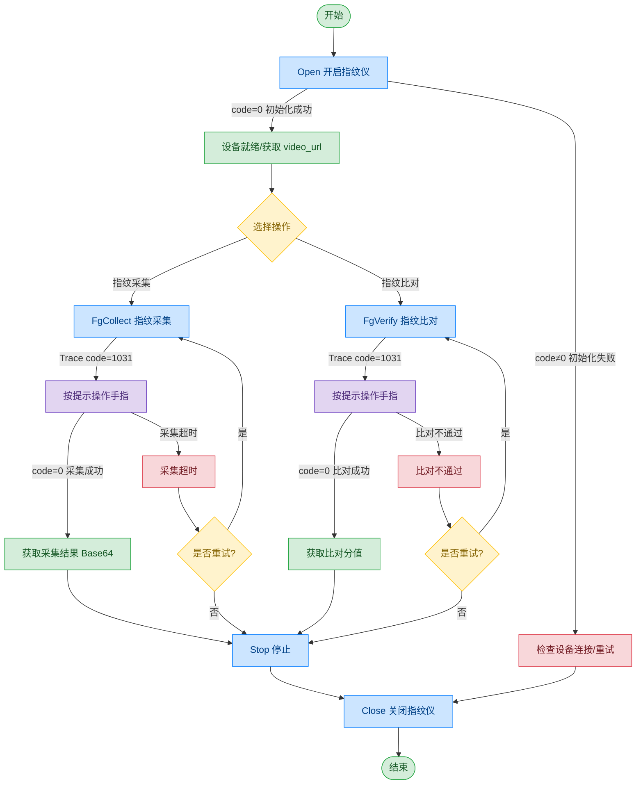

# 指纹仪 - IDEMIA CB4

## 文档版本

| 版本 | 日期 | 修改内容 |
|------|------|----------|
| V1.0 | 2026-06-16 | 初始版本，从原始文档拆分 |
| V1.1 | 2026-06-17 | 优化调用流程图，补充异常处理路径 |

## 设备信息

| 项目 | 内容 |
|------|------|
| 设备类型 | 指纹仪 |
| 品牌 | IDEMIA |
| 型号 | CB4 |
| DIS 接口前缀 | DEV_FPrint |
| 数据传输模式 | Base64 |

## 调用流程



> Open 时返回 video_url，可获取指纹仪预览视频流，流程请参阅 [通用协议层-视频流获取](../00-通用协议层/04-视频流获取.md)

## 与文件路径模式的差异

本设备与 IB Kojak / 北京眼神指纹仪的主要差异：
- **数据传输方式**：本设备使用 Base64 编码传输指纹数据和图片，而非文件路径
- **Fingercode**：本设备仅支持单个指位代码，不支持组合码
- **FgVerify**：本设备支持指纹比对功能

## 指位代码说明

| 代码 | 含义 |
|------|------|
| 11 | 右手大拇指 |
| 12 | 右手食指 |
| 13 | 右手中指 |
| 14 | 右手无名指 |
| 15 | 右手小拇指 |
| 16 | 左手大拇指 |
| 17 | 左手食指 |
| 18 | 左手中指 |
| 19 | 左手无名指 |
| 20 | 左手小拇指 |

> IDEMIA CB4 仅支持单个指位代码，不支持组合码（如"12+13+14+15"）。

## 接口列表

### 1. 开启指纹仪（Open）

通过本条指令上层应用打开指纹仪，同时获取视频流。

#### 请求参数

请求示例：

```json
{
  "seq": "DEV_FPrint_Open_${uuid}",
  "cmd": "Open",
  "datetime": "20211201130101",
  "posidx": "00",
  "timeout": "30000",
  "async": "0"
}
```

参数说明：

| 参数名称 | 格式 | 是否必填 | 参数说明 |
|----------|------|----------|----------|
| seq | string | 是 | DEV_FPrint_Open_${uuid} |
| cmd | string | 是 | 固定为"Open" |
| datetime | string | 是 | 指令的下发时间，格式：YYYYMMddHHmmss |
| posidx | string | 是 | 多个同款设备的工位号；"00"~"99" |
| timeout | string | 是 | 超时时间(ms) |
| async | string | 是 | 是否异步（默认0:同步）；0：同步；1：异步 |

#### 返回参数

返回示例：

```json
{
  "seq": "DEV_FPrint_Open_${uuid}",
  "cmd": "Open",
  "datetime": "20211201130102",
  "code": "0",
  "msg": "Success",
  "suggest": "",
  "posidx": "00",
  "DllVersion": "V6.24.703.1",
  "data": {
    "video_url": [
      {
        "00": "ws://127.0.0.1:62383/dis/hi_video"
      }
    ]
  }
}
```

参数说明：

| 参数名称 | 格式 | 是否必填 | 参数说明 |
|----------|------|----------|----------|
| seq | string | 是 | 同下发的 seq |
| cmd | string | 是 | 同下发的 cmd |
| datetime | string | 是 | 指令的下发时间，格式：YYYYMMddHHmmss |
| code | string | 是 | 参照通用返回码 / 指纹仪返回码 |
| msg | string | 否 | 提示信息 |
| suggest | string | 否 | 建议 |
| posidx | string | 是 | 多个同款设备的工位号；"00"~"99" |
| DllVersion | string | 否 | 外设库版本号 |
| data | object | 否 | 返回数据 |
| ↳ video_url | 数组 | 是 | 指纹仪预览视频的数据流地址 |

---

### 2. 指纹采集（FgCollect）

通过本条指令上层应用可以使用指纹仪开始采集指纹，返回指纹采集结果。

#### 请求参数

请求示例：

```json
{
  "seq": "DEV_FPrint_FgCollect_${uuid}",
  "cmd": "FgCollect",
  "datetime": "20211201130101",
  "param": {
    "ScoreLimits": "60",
    "collection": [
      {
        "Fingercode": "11",
        "FingerPic": "base64-image-data",
        "ZWFile": "base64-file-data"
      }
    ]
  },
  "timeout": "50000",
  "posidx": "00",
  "async": "0"
}
```

参数说明：

| 参数名称 | 格式 | 是否必填 | 参数说明 |
|----------|------|----------|----------|
| seq | string | 是 | DEV_FPrint_FgCollect_${uuid} |
| cmd | string | 是 | 固定为"FgCollect" |
| datetime | string | 是 | 指令的下发时间，格式：YYYYMMddHHmmss |
| posidx | string | 是 | 多个同款设备的工位号；"00"~"99" |
| timeout | string | 是 | 超时时间(ms) |
| async | string | 是 | 是否异步（默认0:同步）；0：同步；1：异步 |
| param | object | 是 | 请求参数 |
| ↳ ScoreLimits | string | 否 | 指纹采集分值阈值 |
| ↳ collection | 数组 | 是 | 指纹采集请求参数数组 |
| ↳↳ Fingercode | string | 是 | 单个指位代码（如"11"、"12"等） |
| ↳↳ FingerPic | string | 否 | 指纹图片的 Base64 数据 |
| ↳↳ ZWFile | string | 否 | 指纹特征数据的 Base64 编码 |

#### 返回参数

返回示例：

```json
{
  "seq": "DEV_FPrint_FgCollect_${uuid}",
  "cmd": "FgCollect",
  "code": "0",
  "datetime": "20260413162832.101",
  "msg": "Success",
  "suggest": "",
  "posidx": "00",
  "DllVersion": "V6.24.703.1",
  "data": {
    "collection": [
      {
        "Score": "61",
        "FingerCode": "11",
        "FingerPic": "base64-image-data",
        "ZWFile": "base64-file-data"
      }
    ]
  }
}
```

参数说明：

| 参数名称 | 格式 | 是否必填 | 参数说明 |
|----------|------|----------|----------|
| seq | string | 是 | 同下发的 seq |
| cmd | string | 是 | 同下发的 cmd |
| datetime | string | 是 | 指令的下发时间，格式：YYYYMMddHHmmss |
| code | string | 是 | 参照通用返回码 / 指纹仪返回码 |
| msg | string | 否 | 提示信息 |
| suggest | string | 否 | 建议 |
| posidx | string | 是 | 多个同款设备的工位号；"00"~"99" |
| DllVersion | string | 是 | DLL 版本号 |
| data | object | 否 | 返回数据 |
| ↳ collection | 数组 | 是 | 指纹采集结果数组 |
| ↳↳ Score | string | 是 | 指纹分值，0~100 |
| ↳↳ FingerCode | string | 是 | 指位代码 |
| ↳↳ FingerPic | string | 是 | 指纹图片的 Base64 数据 |
| ↳↳ ZWFile | string | 是 | 指纹特征数据的 Base64 编码 |

---

### 3. 指纹比对（FgVerify）

通过本条指令上层应用可以使用指纹仪采集指纹，然后和原始指纹的指纹特征值进行比对，返回指纹比对结果。

#### 请求参数

请求示例：

```json
{
  "seq": "DEV_FPrint_FgVerify_${uuid}",
  "cmd": "FgVerify",
  "datetime": "20211201130101",
  "param": {
    "ZWFile": "base64-file-data"
  },
  "timeout": "50000",
  "posidx": "00",
  "async": "0"
}
```

参数说明：

| 参数名称 | 格式 | 是否必填 | 参数说明 |
|----------|------|----------|----------|
| seq | string | 是 | DEV_FPrint_FgVerify_${uuid} |
| cmd | string | 是 | 固定为"FgVerify" |
| datetime | string | 是 | 指令的下发时间，格式：YYYYMMddHHmmss |
| posidx | string | 是 | 多个同款设备的工位号；"00"~"99" |
| timeout | string | 是 | 超时时间(ms) |
| async | string | 是 | 是否异步（默认0:同步）；0：同步；1：异步 |
| param | object | 是 | 请求参数 |
| ↳ ZWFile | string | 是 | 原始指纹特征数据的 Base64 编码 |

#### 返回参数

返回示例：

```json
{
  "seq": "DEV_FPrint_FgVerify_${uuid}",
  "cmd": "FgVerify",
  "code": "0",
  "datetime": "20260413162832.101",
  "msg": "Success",
  "suggest": "",
  "posidx": "00",
  "DllVersion": "V6.24.703.1",
  "data": {
    "Score": "22"
  }
}
```

参数说明：

| 参数名称 | 格式 | 是否必填 | 参数说明 |
|----------|------|----------|----------|
| seq | string | 是 | 同下发的 seq |
| cmd | string | 是 | 同下发的 cmd |
| datetime | string | 是 | 指令的下发时间，格式：YYYYMMddHHmmss |
| code | string | 是 | 参照通用返回码 / 指纹仪返回码 |
| msg | string | 否 | 提示信息 |
| suggest | string | 否 | 建议 |
| posidx | string | 是 | 多个同款设备的工位号；"00"~"99" |
| DllVersion | string | 是 | DLL 版本号 |
| data | object | 否 | 返回数据 |
| ↳ Score | string | 是 | 比对分值 |

---

### 4. 指纹 Trace 消息

指纹仪采集和比对的过程中，有交互的 Trace 返回，用于提醒用户进行对应的操作。

返回示例：

```json
{
  "seq": "DEV_FPrint_FgVerify_${uuid}",
  "cmd": "FgVerify",
  "datetime": "20211201130102",
  "code": "1031",
  "msg": "trace message",
  "data": {
    "event_type": "2",
    "tip_code": "9",
    "tips": "Please place finger"
  }
}
```

Trace 消息参数说明：

| 参数名称 | 格式 | 是否必填 | 参数说明 |
|----------|------|----------|----------|
| seq | string | 是 | 同正在执行的指令的 seq |
| cmd | string | 是 | 同正在执行的指令的 cmd |
| code | string | 是 | 固定值："1031"（Trace 消息） |
| msg | string | 是 | trace message |
| data | object | 是 | Trace 数据 |
| ↳ event_type | string | 是 | 事件类型；"1"：指纹分值消息；"2"：指纹操作消息；"3"：实时指纹图片和分值 |
| ↳ tip_code | string | 是 | 提示代码 |
| ↳ tips | string | 是 | 提示信息 |

tip_code 说明：

| tip_code | 含义 |
|---------|------|
| 0 | 没有按压手指 |
| 1 | 向上移动手指 |
| 2 | 向下移动手指 |
| 3 | 向左移动手指 |
| 4 | 向右移动手指 |
| 5 | 用力按压 |
| 6 | 移开手指 |
| 7 | 采集完成 |
| 8 | 检测到手指 |
| 9 | 手指位置不正确 |
| 10 | 指纹采集中 |

---

### 5. 停止指纹采集（Stop）

通过本条指令上层应用可以终止正在进行的指纹比对和采集任务。

#### 请求参数

请求示例：

```json
{
  "seq": "DEV_FPrint_Stop_${uuid}",
  "cmd": "Stop",
  "datetime": "20211201130101",
  "async": "1",
  "timeout": "30000",
  "posidx": "00"
}
```

参数说明：

| 参数名称 | 格式 | 是否必填 | 参数说明 |
|----------|------|----------|----------|
| seq | string | 是 | DEV_FPrint_Stop_${uuid} |
| cmd | string | 是 | 固定为"Stop" |
| datetime | string | 是 | 指令的下发时间，格式：YYYYMMddHHmmss |
| posidx | string | 是 | 多个同款设备的工位号；"00"~"99" |
| timeout | string | 是 | 超时时间(ms) |
| async | string | 是 | 是否异步（建议为1）；0：同步；1：异步 |

#### 返回参数

返回示例：

```json
{
  "seq": "DEV_FPrint_Stop_${uuid}",
  "cmd": "Stop",
  "datetime": "20211201130102",
  "code": "0",
  "msg": "Success",
  "suggest": "",
  "posidx": "00",
  "DllVersion": "V6.24.703.1"
}
```

参数说明：

| 参数名称 | 格式 | 是否必填 | 参数说明 |
|----------|------|----------|----------|
| seq | string | 是 | 同下发的 seq |
| cmd | string | 是 | 同下发的 cmd |
| datetime | string | 是 | 指令的下发时间，格式：YYYYMMddHHmmss |
| code | string | 是 | 参照通用返回码 / 指纹仪返回码 |
| msg | string | 否 | 提示信息 |
| suggest | string | 否 | 建议 |
| posidx | string | 是 | 多个同款设备的工位号；"00"~"99" |
| DllVersion | string | 是 | DLL 版本号 |

---

### 6. 关闭指纹仪（Close）

通过本条指令上层应用可以关闭指纹仪外设。

#### 请求参数

请求示例：

```json
{
  "seq": "DEV_FPrint_Close_${uuid}",
  "cmd": "Close",
  "datetime": "20211201130101",
  "posidx": "00",
  "async": "1",
  "timeout": "30000"
}
```

参数说明：

| 参数名称 | 格式 | 是否必填 | 参数说明 |
|----------|------|----------|----------|
| seq | string | 是 | DEV_FPrint_Close_${uuid} |
| cmd | string | 是 | 固定为"Close" |
| datetime | string | 是 | 指令的下发时间，格式：YYYYMMddHHmmss |
| posidx | string | 是 | 多个同款设备的工位号；"00"~"99" |
| timeout | string | 是 | 超时时间(ms) |
| async | string | 是 | 是否异步（建议为1）；0：同步；1：异步 |

#### 返回参数

返回示例：

```json
{
  "seq": "DEV_FPrint_Close_${uuid}",
  "cmd": "Close",
  "datetime": "20211201130102",
  "code": "0",
  "msg": "Success",
  "suggest": "",
  "posidx": "00",
  "DllVersion": "V6.24.703.1"
}
```

参数说明：

| 参数名称 | 格式 | 是否必填 | 参数说明 |
|----------|------|----------|----------|
| seq | string | 是 | 同下发的 seq |
| cmd | string | 是 | 同下发的 cmd |
| datetime | string | 是 | 指令的下发时间，格式：YYYYMMddHHmmss |
| code | string | 是 | 参照通用返回码 / 指纹仪返回码 |
| msg | string | 否 | 提示信息 |
| suggest | string | 否 | 建议 |
| posidx | string | 是 | 多个同款设备的工位号；"00"~"99" |
| DllVersion | string | 是 | DLL 版本号 |

## 错误码

| 序号 | 错误码 | 含义 |
|------|--------|------|
| 1 | 15303001 | 未知错误 |
| 2 | 15303002 | 此特定功能 SDK 尚未启用 |
| 3 | 15303003 | 此特定功能 SDK 不支持 |
| 4 | 15303004 | SDK 未初始化 |
| 5 | 15303005 | SDK 已经初始化，无需重复初始化 |
| 6 | 15303006 | SDK 初始化发生错误 |

> 通用返回码（0~1037）请参阅 [通用返回码](../00-通用协议层/06-通用返回码.md)
