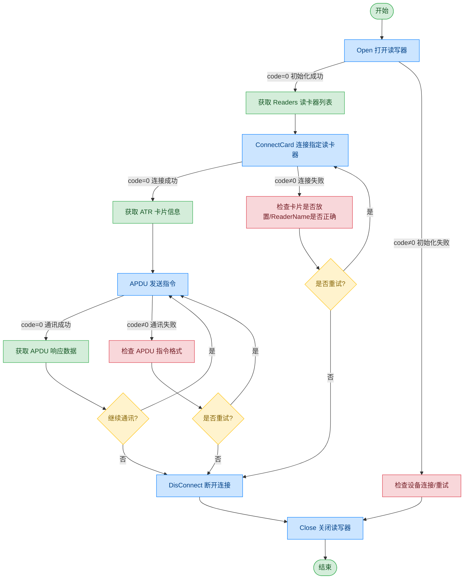

# PCSC 读卡器 - HID Omnikey 3121

## 文档版本

| 版本 | 日期 | 修改内容 |
|------|------|----------|
| V1.0 | 2026-06-16 | 初始版本，从原始文档拆分 |
| V1.1 | 2026-06-17 | 优化调用流程图，补充异常处理路径 |

## 设备信息

| 项目 | 内容 |
|------|------|
| 设备类型 | PCSC 读卡器 |
| 品牌 | HID |
| 型号 | Omnikey 3121 |
| DIS 接口前缀 | DEV_PCSCReader |

## 概述

本模块提供符合 PC/SC 标准的设备连接及 APDU 通信能力，并在 Windows 系统下基于 WinSCard 接口实现。与 EMP5650C 读卡器不同，本设备提供更底层的 APDU 通讯能力，支持直接发送 APDU 指令与卡片交互。

## 调用流程



## 接口列表

### 1. 打开读写器（Open）

#### 请求参数

请求示例：

```json
{
  "seq": "DEV_PCSCReader_Open_${uuid}",
  "cmd": "Open",
  "datetime": "20211201130101",
  "posidx": "00",
  "timeout": "30000",
  "async": "0"
}
```

参数说明：

| 参数名称 | 格式 | 是否必填 | 参数说明 |
|----------|------|----------|----------|
| seq | string | 是 | DEV_PCSCReader_Open_${uuid} |
| cmd | string | 是 | 固定为"Open" |
| datetime | string | 是 | 指令的下发时间，格式：YYYYMMddHHmmss |
| posidx | string | 是 | 多个同款设备的工位号；"00"~"99" |
| timeout | string | 是 | 超时时间(ms) |
| async | string | 是 | 是否异步（建议为1）；0：同步；1：异步 |

#### 返回参数

返回示例：

```json
{
  "seq": "DEV_PCSCReader_Open_${uuid}",
  "cmd": "Open",
  "code": "0",
  "data": {
    "Readers": [
      "HID Global OMNIKEY 3121 0"
    ]
  },
  "datetime": "20260416165203.050",
  "msg": "Success",
  "suggest": "",
  "posidx": "10000",
  "DllVersion": "V6.24.703.1"
}
```

参数说明：

| 参数名称 | 格式 | 是否必填 | 参数说明 |
|----------|------|----------|----------|
| seq | string | 是 | 同下发的 seq |
| cmd | string | 是 | 同下发的 cmd |
| datetime | string | 是 | 指令的下发时间，格式：YYYYMMddHHmmss |
| code | string | 是 | 参照通用返回码 / 读卡器返回码 |
| msg | string | 否 | 提示信息 |
| suggest | string | 否 | 建议 |
| posidx | string | 是 | 多个同款设备的工位号 |
| DllVersion | string | 否 | 外设库版本号 |
| data | object | 否 | 返回数据 |
| ↳ Readers | 数组 | 是 | 可用读卡器名称列表 |

---

### 2. 连接读写器（ConnectCard）

本指令用于连接指定的 PC/SC 读卡器，并建立通信会话。

#### 请求参数

请求示例：

```json
{
  "seq": "DEV_PCSCReader_ConnectCard_${uuid}",
  "cmd": "ConnectCard",
  "datetime": "20211201130101",
  "posidx": "",
  "timeout": "30000",
  "async": "0",
  "param": {
    "ReaderName": "Identiv uTrust 4701 F CL Reader 1"
  }
}
```

参数说明：

| 参数名称 | 格式 | 是否必填 | 参数说明 |
|----------|------|----------|----------|
| seq | string | 是 | DEV_PCSCReader_ConnectCard_${uuid} |
| cmd | string | 是 | 固定为"ConnectCard" |
| datetime | string | 是 | 指令的下发时间，格式：YYYYMMddHHmmss |
| posidx | string | 是 | 多个同款设备的工位号 |
| timeout | string | 是 | 超时时间(ms) |
| async | string | 是 | 是否异步（建议为1）；0：同步；1：异步 |
| param | object | 是 | 参数对象 |
| ↳ ReaderName | string | 是 | 读卡器名称，从 Open 返回的 Readers 列表中获取 |

#### 返回参数

返回示例：

```json
{
  "seq": "DEV_PCSCReader_ConnectCard_${uuid}",
  "cmd": "ConnectCard",
  "code": "0",
  "data": {
    "ATR": "3B8580018073C821100E"
  },
  "datetime": "20260416170914.765",
  "msg": "Success",
  "suggest": "",
  "posidx": "00",
  "DllVersion": "V6.24.703.1"
}
```

参数说明：

| 参数名称 | 格式 | 是否必填 | 参数说明 |
|----------|------|----------|----------|
| seq | string | 是 | 同下发的 seq |
| cmd | string | 是 | 同下发的 cmd |
| datetime | string | 是 | 指令的下发时间，格式：YYYYMMddHHmmss |
| code | string | 是 | 参照通用返回码 / 读卡器返回码 |
| msg | string | 否 | 提示信息 |
| suggest | string | 否 | 建议 |
| posidx | string | 是 | 多个同款设备的工位号 |
| DllVersion | string | 否 | 外设库版本号 |
| data | object | 否 | 返回数据 |
| ↳ ATR | string | 是 | 卡片 ATR（Answer To Reset）信息 |

---

### 3. APDU 通讯（APDU）

#### 请求参数

请求示例：

```json
{
  "seq": "DEV_PCSCReader_APDU_${uuid}",
  "cmd": "APDU",
  "datetime": "20211201130101",
  "posidx": "00",
  "timeout": "30000",
  "async": "0",
  "param": {
    "Send": "00 84 00 00 10"
  }
}
```

参数说明：

| 参数名称 | 格式 | 是否必填 | 参数说明 |
|----------|------|----------|----------|
| seq | string | 是 | DEV_PCSCReader_APDU_${uuid} |
| cmd | string | 是 | 固定为"APDU" |
| datetime | string | 是 | 指令的下发时间，格式：YYYYMMddHHmmss |
| posidx | string | 是 | 多个同款设备的工位号 |
| timeout | string | 是 | 超时时间(ms) |
| async | string | 是 | 是否异步（建议为1）；0：同步；1：异步 |
| param | object | 是 | 参数对象 |
| ↳ Send | string | 是 | 发送的 APDU 指令，十六进制字符串，空格分隔 |

#### 返回参数

返回示例：

```json
{
  "seq": "DEV_PCSCReader_APDU_${uuid}",
  "cmd": "APDU",
  "code": "0",
  "data": {
    "apdu_code": "****",
    "Recv": "447BCD3189D94EBB9000"
  },
  "datetime": "20260416171543.868",
  "msg": "Success",
  "suggest": "",
  "posidx": "10000",
  "DllVersion": "V6.24.703.1"
}
```

参数说明：

| 参数名称 | 格式 | 是否必填 | 参数说明 |
|----------|------|----------|----------|
| seq | string | 是 | 同下发的 seq |
| cmd | string | 是 | 同下发的 cmd |
| datetime | string | 是 | 指令的下发时间，格式：YYYYMMddHHmmss |
| code | string | 是 | 参照通用返回码 / 读卡器返回码 |
| msg | string | 否 | 提示信息 |
| suggest | string | 否 | 建议 |
| posidx | string | 是 | 多个同款设备的工位号 |
| DllVersion | string | 否 | 外设库版本号 |
| data | object | 否 | 返回数据 |
| ↳ apdu_code | string | 是 | APDU 状态码 |
| ↳ Recv | string | 是 | APDU 响应数据，十六进制字符串 |

---

### 4. 断开连接（DisConnect）

断开读写器与卡片的通讯连接。

#### 请求参数

请求示例：

```json
{
  "seq": "DEV_PCSCReader_DisConnect_${uuid}",
  "cmd": "DisConnect",
  "datetime": "20211201130101",
  "posidx": "00",
  "timeout": "30000",
  "async": "0"
}
```

参数说明：

| 参数名称 | 格式 | 是否必填 | 参数说明 |
|----------|------|----------|----------|
| seq | string | 是 | DEV_PCSCReader_DisConnect_${uuid} |
| cmd | string | 是 | 固定为"DisConnect" |
| datetime | string | 是 | 指令的下发时间，格式：YYYYMMddHHmmss |
| posidx | string | 是 | 多个同款设备的工位号 |
| timeout | string | 是 | 超时时间(ms) |
| async | string | 是 | 是否异步（建议为1）；0：同步；1：异步 |

#### 返回参数

返回示例：

```json
{
  "seq": "DEV_PCSCReader_DisConnect_${uuid}",
  "cmd": "DisConnect",
  "code": "0",
  "datetime": "20260416171543.868",
  "msg": "Success",
  "suggest": "",
  "posidx": "10000",
  "DllVersion": "V6.24.703.1"
}
```

参数说明：

| 参数名称 | 格式 | 是否必填 | 参数说明 |
|----------|------|----------|----------|
| seq | string | 是 | 同下发的 seq |
| cmd | string | 是 | 同下发的 cmd |
| datetime | string | 是 | 指令的下发时间，格式：YYYYMMddHHmmss |
| code | string | 是 | 参照通用返回码 / 读卡器返回码 |
| msg | string | 否 | 提示信息 |
| suggest | string | 否 | 建议 |
| posidx | string | 是 | 多个同款设备的工位号 |
| DllVersion | string | 否 | 外设库版本号 |

## 错误码

| 序号 | 错误码 | 含义 |
|------|--------|------|
| 1 | 12666100 | BAC 验证失败 |
| 2 | 12667001 | 对象为空 |
| 3 | 12617001 | 参数对象为空 |
| 4 | 12651203 | 打开文件失败 |
| 5 | 12651001 | 设备未打开 |
| 6 | 12662101 | 选择卡或应用失败 |

> 通用返回码（0~1037）请参阅 [通用返回码](../00-通用协议层/06-通用返回码.md)
