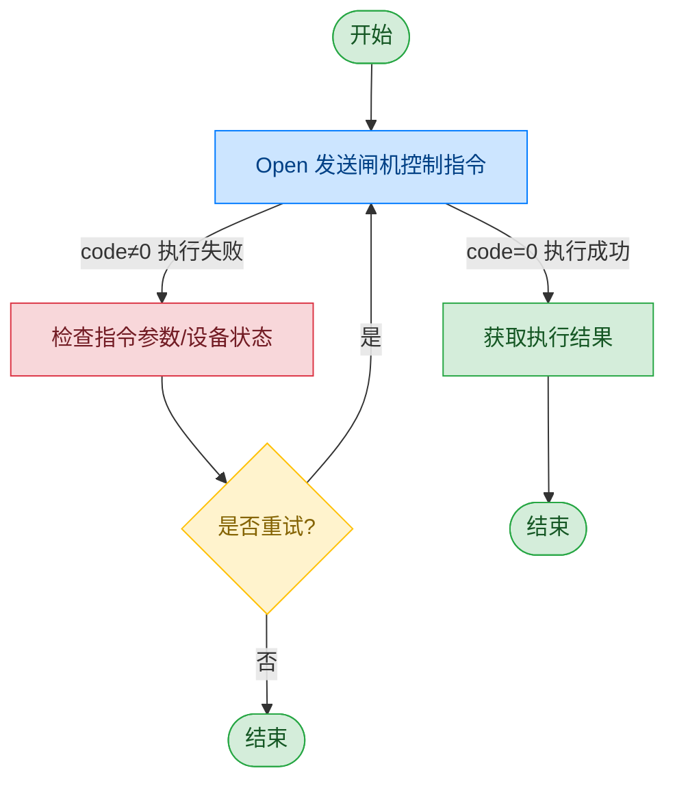

# 闸机底控板

## 文档版本

| 版本 | 日期 | 修改内容 |
|------|------|----------|
| V1.0 | 2026-06-16 | 初始版本，从原始文档拆分 |

## 设备信息

| 项目 | 内容 |
|------|------|
| 设备类型 | 闸机底控板 |
| DIS 接口前缀 | DEV_Gate |

## 调用流程



## cmd 指令说明

闸机底控板通过 cmd 字段指定不同的操作命令：

| cmd 值 | 含义 |
|--------|------|
| InitPassageway | 初始化闸机 |
| Open | 打开闸机 |
| PassengerEnter | 旅客进入（开前门等待旅客进入） |
| PassengerLeave | 旅客出闸（开后门等待旅客离开） |
| OpenRearDoor | 开后门 |
| CloseRearDoor | 关后门 |
| OpenFrontDoor | 开前门 |
| CloseFrontDoor | 关前门 |
| FirmwareVersion | 读取固件版本 |
| OpenFingerLamp | 开启指纹补光灯 |
| CloseFingerLamp | 关闭指纹补光灯 |
| OpenAlarmHighLamp | 开启高位告警灯 |
| OpenAlarmLowLamp | 开启低位告警灯 |
| OpenAlarmBlueLamp | 开启蓝色告警灯 |
| OpenAlarmGreenLamp | 开启绿色告警灯 |
| CloseAlarmLamp | 关闭全部告警灯 |
| Close | 关闭闸机 |

## 接口列表

### 1. 闸机控制（Open）

通过本条指令上层应用可以控制闸机执行指定操作。具体操作由 cmd 字段决定。

#### 请求参数

请求示例：

```json
{
  "seq": "DEV_Gate_Open_${uuid}",
  "cmd": "Open",
  "datetime": "20211201130101",
  "posidx": "00",
  "Timeout": "30000",
  "ASYNC": "0"
}
```

参数说明：

| 参数名称 | 格式 | 是否必填 | 参数说明 |
|----------|------|----------|----------|
| seq | string | 是 | DEV_Gate_{cmd}_${uuid}，其中 {cmd} 与 cmd 字段保持一致 |
| cmd | string | 是 | 闸机操作命令，参见 cmd 指令说明表 |
| datetime | string | 是 | 指令的下发时间，格式：YYYYMMddHHmmss |
| posidx | string | 是 | 多个同款设备的工位号；"00"~"99" |
| Timeout | string | 是 | 超时时间(ms) |
| ASYNC | string | 是 | 是否异步（默认0:同步）；0：同步；1：异步 |

#### 返回参数

返回示例：

```json
{
  "seq": "DEV_Gate_Open_${uuid}",
  "cmd": "Open",
  "datetime": "20211201130101",
  "code": "0",
  "msg": "success",
  "posidx": "00",
  "ASYNC": "0"
}
```

参数说明：

| 参数名称 | 格式 | 是否必填 | 参数说明 |
|----------|------|----------|----------|
| seq | string | 是 | 同下发的 seq |
| cmd | string | 是 | 同下发的 cmd |
| datetime | string | 是 | 指令的下发时间，格式：YYYYMMddHHmmss |
| code | string | 是 | 参照通用返回码 / 底控板返回码 |
| msg | string | 否 | 提示信息 |
| posidx | string | 是 | 多个同款设备的工位号；"00"~"99" |

## 错误码

| 序号 | 错误码 | 含义 |
|------|--------|------|
| 1 | 17603301 | 动态库未初始化 |
| 2 | 17603302 | API 执行失败 |
| 3 | 17603303 | SDK 初始化失败 |
| 4 | 17603308 | SDK 调用失败 |
| 5 | 17603402 | 执行超时 |

> 通用返回码（0~1037）请参阅 [通用返回码](../00-通用协议层/06-通用返回码.md)
