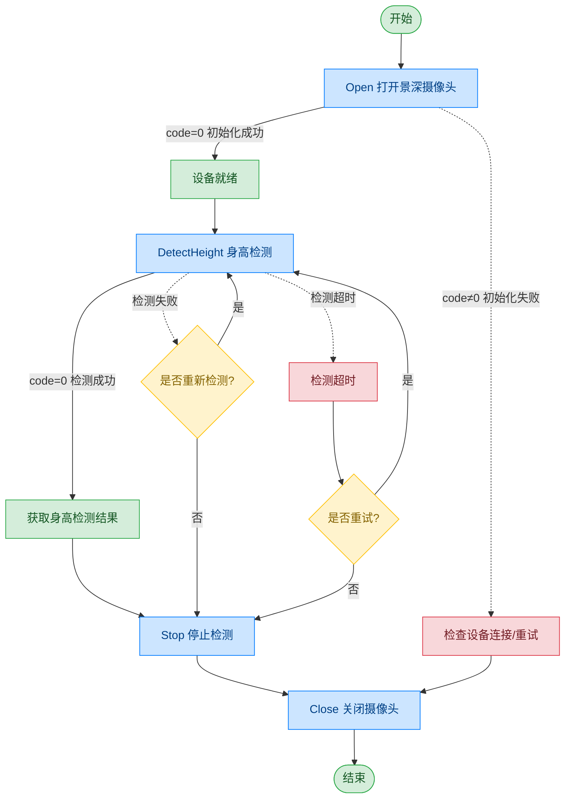

# 景深摄像头 - Intel D415

## 文档版本

| 版本 | 日期 | 修改内容 |
|------|------|----------|
| V1.0 | 2026-06-16 | 初始版本，从原始文档拆分 |

## 设备信息

| 项目 | 内容 |
|------|------|
| 设备类型 | 景深摄像头 |
| 品牌 | Intel |
| 型号 | D415 |
| DIS 接口前缀 | DEV_Realsense |

## 调用流程



## 接口列表

### 1. 打开景深摄像头（Open）

通过本条指令上层应用可以打开景深摄像头。

#### 请求参数

请求示例：

```json
{
  "seq": "DEV_Realsense_Open_${uuid}",
  "cmd": "Open",
  "datetime": "20211201130101",
  "posidx": "00",
  "timeout": "30000",
  "async": "0"
}
```

参数说明：

| 参数名称 | 格式 | 是否必填 | 参数说明 |
|----------|------|----------|----------|
| seq | string | 是 | DEV_Realsense_Open_${uuid} |
| cmd | string | 是 | 固定为"Open" |
| datetime | string | 是 | 指令的下发时间，格式：YYYYMMddHHmmss |
| posidx | string | 是 | 多个同款设备的工位号；"00"~"99" |
| timeout | string | 是 | 超时时间(ms) |
| async | string | 是 | 是否异步（默认0:同步）；0：同步；1：异步 |

#### 返回参数

返回示例：

```json
{
  "seq": "DEV_Realsense_Open_${uuid}",
  "cmd": "Open",
  "datetime": "20211201130102",
  "code": "0",
  "msg": "Success",
  "suggest": "",
  "posidx": "00"
}
```

参数说明：

| 参数名称 | 格式 | 是否必填 | 参数说明 |
|----------|------|----------|----------|
| seq | string | 是 | 同下发的 seq |
| cmd | string | 是 | 同下发的 cmd |
| datetime | string | 是 | 指令的下发时间，格式：YYYYMMddHHmmss |
| code | string | 是 | 参照通用返回码 / 景深摄像头返回码 |
| msg | string | 否 | 提示信息 |
| suggest | string | 否 | 建议 |
| posidx | string | 是 | 多个同款设备的工位号；"00"~"99" |

---

### 2. 检测身高（DetectHeight）

通过本条指令上层应用可以使用景深摄像头检测人体身高。

#### 请求参数

请求示例：

```json
{
  "seq": "DEV_Realsense_DetectHeight_${uuid}",
  "cmd": "DetectHeight",
  "datetime": "20211201130101",
  "posidx": "00",
  "timeout": "30000",
  "async": "0"
}
```

参数说明：

| 参数名称 | 格式 | 是否必填 | 参数说明 |
|----------|------|----------|----------|
| seq | string | 是 | DEV_Realsense_DetectHeight_${uuid} |
| cmd | string | 是 | 固定为"DetectHeight" |
| datetime | string | 是 | 指令的下发时间，格式：YYYYMMddHHmmss |
| posidx | string | 是 | 多个同款设备的工位号；"00"~"99" |
| timeout | string | 是 | 超时时间(ms) |
| async | string | 是 | 是否异步（默认0:同步）；0：同步；1：异步 |

#### 返回参数

返回示例：

```json
{
  "seq": "DEV_Realsense_DetectHeight_${uuid}",
  "cmd": "DetectHeight",
  "datetime": "20211201130102",
  "code": "0",
  "msg": "Success",
  "suggest": "",
  "posidx": "00",
  "data": {
    "CameraHeight_mm": "1650",
    "EyeHeight_mm": "1580",
    "Distance_mm": "800"
  }
}
```

参数说明：

| 参数名称 | 格式 | 是否必填 | 参数说明 |
|----------|------|----------|----------|
| seq | string | 是 | 同下发的 seq |
| cmd | string | 是 | 同下发的 cmd |
| datetime | string | 是 | 指令的下发时间，格式：YYYYMMddHHmmss |
| code | string | 是 | 参照通用返回码 / 景深摄像头返回码 |
| msg | string | 否 | 提示信息 |
| suggest | string | 否 | 建议 |
| posidx | string | 是 | 多个同款设备的工位号；"00"~"99" |
| data | object | 否 | 返回数据 |
| ↳ CameraHeight_mm | string | 是 | 摄像头安装高度（单位：mm） |
| ↳ EyeHeight_mm | string | 是 | 检测到的人眼高度（单位：mm） |
| ↳ Distance_mm | string | 是 | 检测到的人体距离（单位：mm） |

---

### 3. 停止检测（Stop）

通过本条指令上层应用可以停止景深摄像头的检测。

#### 请求参数

请求示例：

```json
{
  "seq": "DEV_Realsense_Stop_${uuid}",
  "cmd": "Stop",
  "datetime": "20211201130101",
  "posidx": "00",
  "timeout": "30000",
  "async": "1"
}
```

参数说明：

| 参数名称 | 格式 | 是否必填 | 参数说明 |
|----------|------|----------|----------|
| seq | string | 是 | DEV_Realsense_Stop_${uuid} |
| cmd | string | 是 | 固定为"Stop" |
| datetime | string | 是 | 指令的下发时间，格式：YYYYMMddHHmmss |
| posidx | string | 是 | 多个同款设备的工位号；"00"~"99" |
| timeout | string | 是 | 超时时间(ms) |
| async | string | 是 | 是否异步（建议为1）；0：同步；1：异步 |

#### 返回参数

返回示例：

```json
{
  "seq": "DEV_Realsense_Stop_${uuid}",
  "cmd": "Stop",
  "datetime": "20211201130102",
  "code": "0",
  "msg": "Success",
  "suggest": "",
  "posidx": "00"
}
```

参数说明：

| 参数名称 | 格式 | 是否必填 | 参数说明 |
|----------|------|----------|----------|
| seq | string | 是 | 同下发的 seq |
| cmd | string | 是 | 同下发的 cmd |
| datetime | string | 是 | 指令的下发时间，格式：YYYYMMddHHmmss |
| code | string | 是 | 参照通用返回码 / 景深摄像头返回码 |
| msg | string | 否 | 提示信息 |
| suggest | string | 否 | 建议 |
| posidx | string | 是 | 多个同款设备的工位号；"00"~"99" |

---

### 4. 关闭景深摄像头（Close）

通过本条指令上层应用可以关闭景深摄像头。

#### 请求参数

请求示例：

```json
{
  "seq": "DEV_Realsense_Close_${uuid}",
  "cmd": "Close",
  "datetime": "20211201130101",
  "posidx": "00",
  "timeout": "30000",
  "async": "0"
}
```

参数说明：

| 参数名称 | 格式 | 是否必填 | 参数说明 |
|----------|------|----------|----------|
| seq | string | 是 | DEV_Realsense_Close_${uuid} |
| cmd | string | 是 | 固定为"Close" |
| datetime | string | 是 | 指令的下发时间，格式：YYYYMMddHHmmss |
| posidx | string | 是 | 多个同款设备的工位号；"00"~"99" |
| timeout | string | 是 | 超时时间(ms) |
| async | string | 是 | 是否异步（默认0:同步）；0：同步；1：异步 |

#### 返回参数

返回示例：

```json
{
  "seq": "DEV_Realsense_Close_${uuid}",
  "cmd": "Close",
  "datetime": "20211201130102",
  "code": "0",
  "msg": "Success",
  "suggest": "",
  "posidx": "00"
}
```

参数说明：

| 参数名称 | 格式 | 是否必填 | 参数说明 |
|----------|------|----------|----------|
| seq | string | 是 | 同下发的 seq |
| cmd | string | 是 | 同下发的 cmd |
| datetime | string | 是 | 指令的下发时间，格式：YYYYMMddHHmmss |
| code | string | 是 | 参照通用返回码 / 景深摄像头返回码 |
| msg | string | 否 | 提示信息 |
| suggest | string | 否 | 建议 |
| posidx | string | 是 | 多个同款设备的工位号；"00"~"99" |

## 错误码

| 序号 | 错误码 | 含义 |
|------|--------|------|
| 1 | 19300001 | 超时 |
| 2 | 19300003 | 指针无效 |
| 3 | 19300004 | 此服务功能暂不支持 |
| 4 | 19300005 | 内存不足 |
| 5 | 19300006 | 线程恢复失败 |
| 6 | 19300007 | 线程创建失败 |
| 7 | 19300008 | Event 创建失败 |
| 8 | 19300009 | 命令执行失败 |
| 9 | 19300010 | 命令执行超时 |
| 10 | 99999999 | 未知错误 |
| 11 | 19300101 | 设备未打开 |
| 12 | 19300107 | 设备繁忙 |
| 13 | 19300109 | 已经打开设备，已初始化 |
| 14 | 19300110 | 设备不存在 |
| 15 | 19300113 | 设备通讯失败 |

> 通用返回码（0~1037）请参阅 [通用返回码](../00-通用协议层/06-通用返回码.md)