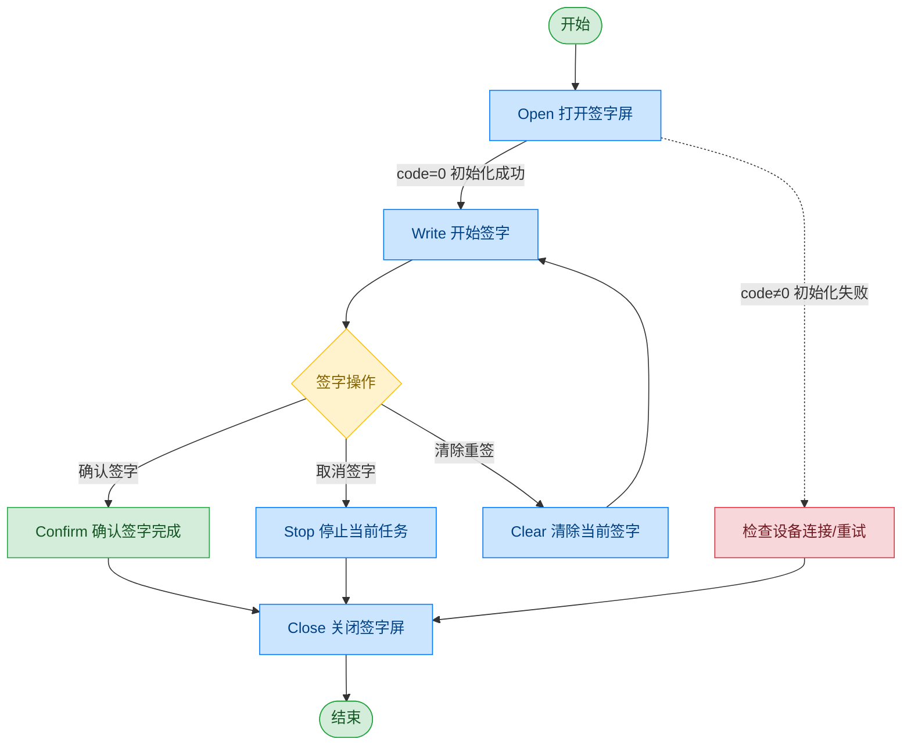

# 签字屏

## 文档版本

| 版本 | 日期 | 修改内容 |
|------|------|----------|
| V1.0 | 2026-06-16 | 初始版本，从原始文档拆分 |
| V1.1 | 2026-06-17 | 优化调用流程图，补充异常处理路径 |

## 设备信息

| 项目 | 内容 |
|------|------|
| 设备类型 | 签字屏 |
| DIS 接口前缀 | DEV_SignScreen |

## 调用流程



## 接口列表

### 1. 打开签字屏（Open）

本指令用于打开并初始化签字设备。调用成功后，设备进入就绪状态，可进行签字操作。

#### 请求参数

请求示例：

```json
{
  "seq": "DEV_SignScreen_Open_${uuid}",
  "cmd": "Open",
  "datetime": "20211201130101",
  "async": "0",
  "posidx": "00",
  "timeout": "30000"
}
```

参数说明：

| 参数名称 | 格式 | 是否必填 | 参数说明 |
|----------|------|----------|----------|
| seq | string | 是 | DEV_SignScreen_Open_${uuid} |
| cmd | string | 是 | 固定为"Open" |
| datetime | string | 是 | 指令的下发时间，格式：YYYYMMddHHmmss |
| posidx | string | 是 | 多个同款设备的工位号；"00"~"99" |
| timeout | string | 是 | 超时时间(ms) |
| async | string | 是 | 是否异步（默认0:同步）；0：同步；1：异步 |

#### 返回参数

返回示例：

```json
{
  "seq": "DEV_SignScreen_Open_${uuid}",
  "cmd": "Open",
  "datetime": "20211201130102",
  "code": "0",
  "msg": "Success",
  "suggest": "",
  "posidx": "00"
}
```

参数说明：

| 参数名称 | 格式 | 是否必填 | 参数说明 |
|----------|------|----------|----------|
| seq | string | 是 | 同下发的 seq |
| cmd | string | 是 | 同下发的 cmd |
| datetime | string | 是 | 指令的下发时间，格式：YYYYMMddHHmmss |
| code | string | 是 | 参照通用返回码 / 签字屏返回码 |
| msg | string | 否 | 提示信息 |
| suggest | string | 否 | 建议 |
| posidx | string | 是 | 多个同款设备的工位号；"00"~"99" |

---

### 2. 开始签字（Write）

本指令用于启动签字流程。设备进入签字状态，等待用户在签字屏上完成签名操作。该指令为阻塞式调用，在此阶段不会返回签字数据。

#### 请求参数

请求示例：

```json
{
  "seq": "DEV_SignScreen_Write_${uuid}",
  "cmd": "Write",
  "datetime": "20211201130101",
  "param": {
    "posX": "0",
    "posY": "0",
    "posW": "360",
    "posH": "256"
  },
  "async": "0",
  "timeout": "50000",
  "posidx": "00"
}
```

参数说明：

| 参数名称 | 格式 | 是否必填 | 参数说明 |
|----------|------|----------|----------|
| seq | string | 是 | DEV_SignScreen_Write_${uuid} |
| cmd | string | 是 | 固定为"Write" |
| datetime | string | 是 | 指令的下发时间，格式：YYYYMMddHHmmss |
| posidx | string | 是 | 多个同款设备的工位号；"00"~"99" |
| timeout | string | 是 | 超时时间(ms) |
| async | string | 是 | 是否异步（默认0:同步）；0：同步；1：异步 |
| param | object | 是 | 参数对象 |
| ↳ posX | string | 是 | 签字区域 X 坐标 |
| ↳ posY | string | 是 | 签字区域 Y 坐标 |
| ↳ posW | string | 是 | 签字区域宽度 |
| ↳ posH | string | 是 | 签字区域高度 |

---

### 3. 确认签字完成（Confirm）

本指令用于确认用户已完成签字操作。调用后系统将获取当前签字内容，并返回签字结果。

#### 请求参数

请求示例：

```json
{
  "seq": "DEV_SignScreen_Confirm_${uuid}",
  "cmd": "Confirm",
  "datetime": "20211201130101",
  "posidx": "00",
  "timeout": "30000",
  "async": "1"
}
```

参数说明：

| 参数名称 | 格式 | 是否必填 | 参数说明 |
|----------|------|----------|----------|
| seq | string | 是 | DEV_SignScreen_Confirm_${uuid} |
| cmd | string | 是 | 固定为"Confirm" |
| datetime | string | 是 | 指令的下发时间，格式：YYYYMMddHHmmss |
| posidx | string | 是 | 多个同款设备的工位号；"00"~"99" |
| timeout | string | 是 | 超时时间(ms) |
| async | string | 是 | 是否异步（建议为1）；0：同步；1：异步 |

#### 返回参数

返回示例：

```json
{
  "seq": "DEV_Signature_Confirm_${uuid}",
  "cmd": "GetStatus",
  "code": "0",
  "msg": "Success",
  "data": {
    "code": "0",
    "msg": "success",
    "pic": "pic-base64"
  }
}
```

参数说明：

| 参数名称 | 格式 | 是否必填 | 参数说明 |
|----------|------|----------|----------|
| seq | string | 是 | 同下发的 seq |
| cmd | string | 是 | 同下发的 cmd |
| code | string | 是 | 参照通用返回码 / 签字屏返回码 |
| msg | string | 否 | 提示信息 |
| data | object | 否 | 返回数据 |
| ↳ code | string | 是 | 签字结果代码；"0"：成功 |
| ↳ msg | string | 否 | 签字结果消息 |
| ↳ pic | string | 是 | 签字图片的 Base64 数据 |

---

### 4. 清除当前签字状态（Clear）

本指令用于清除当前签字内容，并重置签字状态。通常用于用户需要重新签字的场景。

#### 请求参数

请求示例：

```json
{
  "seq": "DEV_SignScreen_Clear_${uuid}",
  "cmd": "Clear",
  "datetime": "20211201130101",
  "posidx": "00",
  "timeout": "30000",
  "async": "1"
}
```

参数说明：

| 参数名称 | 格式 | 是否必填 | 参数说明 |
|----------|------|----------|----------|
| seq | string | 是 | DEV_SignScreen_Clear_${uuid} |
| cmd | string | 是 | 固定为"Clear" |
| datetime | string | 是 | 指令的下发时间，格式：YYYYMMddHHmmss |
| posidx | string | 是 | 多个同款设备的工位号；"00"~"99" |
| timeout | string | 是 | 超时时间(ms) |
| async | string | 是 | 是否异步（建议为1）；0：同步；1：异步 |

#### 返回参数

返回示例：

```json
{
  "seq": "DEV_SignScreen_Clear_${uuid}",
  "cmd": "Clear",
  "datetime": "20211201130101",
  "code": "0",
  "msg": "Success",
  "suggest": "",
  "posidx": "00"
}
```

参数说明：

| 参数名称 | 格式 | 是否必填 | 参数说明 |
|----------|------|----------|----------|
| seq | string | 是 | 同下发的 seq |
| cmd | string | 是 | 同下发的 cmd |
| datetime | string | 是 | 指令的下发时间，格式：YYYYMMddHHmmss |
| code | string | 是 | 参照通用返回码 / 签字屏返回码 |
| msg | string | 否 | 提示信息 |
| suggest | string | 否 | 建议 |
| posidx | string | 是 | 多个同款设备的工位号；"00"~"99" |

---

### 5. 停止当前任务（Stop）

通过本条指令上层应用可以停止签字。

#### 请求参数

请求示例：

```json
{
  "seq": "DEV_SignScreen_Stop_${uuid}",
  "cmd": "Stop",
  "datetime": "20211201130101",
  "posidx": "",
  "timeout": "30000",
  "async": "1"
}
```

参数说明：

| 参数名称 | 格式 | 是否必填 | 参数说明 |
|----------|------|----------|----------|
| seq | string | 是 | DEV_SignScreen_Stop_${uuid} |
| cmd | string | 是 | 固定为"Stop" |
| datetime | string | 是 | 指令的下发时间，格式：YYYYMMddHHmmss |
| posidx | string | 是 | 多个同款设备的工位号 |
| timeout | string | 是 | 超时时间(ms) |
| async | string | 是 | 是否异步（建议为1）；0：同步；1：异步 |

#### 返回参数

返回示例：

```json
{
  "seq": "DEV_SignScreen_Stop_${uuid}",
  "cmd": "Stop",
  "datetime": "20211201130101",
  "code": "0",
  "msg": "Success",
  "posidx": "00",
  "suggest": ""
}
```

参数说明：

| 参数名称 | 格式 | 是否必填 | 参数说明 |
|----------|------|----------|----------|
| seq | string | 是 | 同下发的 seq |
| cmd | string | 是 | 同下发的 cmd |
| datetime | string | 是 | 指令的下发时间，格式：YYYYMMddHHmmss |
| code | string | 是 | 参照通用返回码 / 签字屏返回码 |
| msg | string | 否 | 提示信息 |
| suggest | string | 否 | 建议 |
| posidx | string | 是 | 多个同款设备的工位号；"00"~"99" |

---

### 6. 关闭签字屏（Close）

本指令用于关闭签字设备并释放相关资源。调用成功后，设备停止工作，无法继续进行签字操作。

#### 请求参数

请求示例：

```json
{
  "seq": "DEV_SignScreen_Close_${uuid}",
  "cmd": "Close",
  "datetime": "20211201130101",
  "posidx": "00",
  "timeout": "30000",
  "async": "0"
}
```

参数说明：

| 参数名称 | 格式 | 是否必填 | 参数说明 |
|----------|------|----------|----------|
| seq | string | 是 | DEV_SignScreen_Close_${uuid} |
| cmd | string | 是 | 固定为"Close" |
| datetime | string | 是 | 指令的下发时间，格式：YYYYMMddHHmmss |
| posidx | string | 是 | 多个同款设备的工位号；"00"~"99" |
| timeout | string | 是 | 超时时间(ms) |
| async | string | 是 | 是否异步（默认0:同步）；0：同步；1：异步 |

#### 返回参数

返回示例：

```json
{
  "seq": "DEV_SignScreen_Close_${uuid}",
  "cmd": "Close",
  "datetime": "20211201130101",
  "posidx": "00",
  "code": "0",
  "msg": "success",
  "suggest": ""
}
```

参数说明：

| 参数名称 | 格式 | 是否必填 | 参数说明 |
|----------|------|----------|----------|
| seq | string | 是 | 同下发的 seq |
| cmd | string | 是 | 同下发的 cmd |
| datetime | string | 是 | 指令的下发时间，格式：YYYYMMddHHmmss |
| code | string | 是 | 参照通用返回码 / 签字屏返回码 |
| msg | string | 否 | 提示信息 |
| suggest | string | 否 | 建议 |
| posidx | string | 是 | 多个同款设备的工位号；"00"~"99" |

## 错误码

| 序号 | 错误码 | 含义 |
|------|--------|------|
| 1 | 18403001 | 设备未打开 |
| 2 | 18403002 | 下发参数错误 |
| 3 | 18403003 | 不支持的指令 |
| 4 | 18403004 | 设备操作失败 |
| 5 | 18403005 | 设备不支持 |

> 通用返回码（0~1037）请参阅 [通用返回码](../00-通用协议层/06-通用返回码.md)