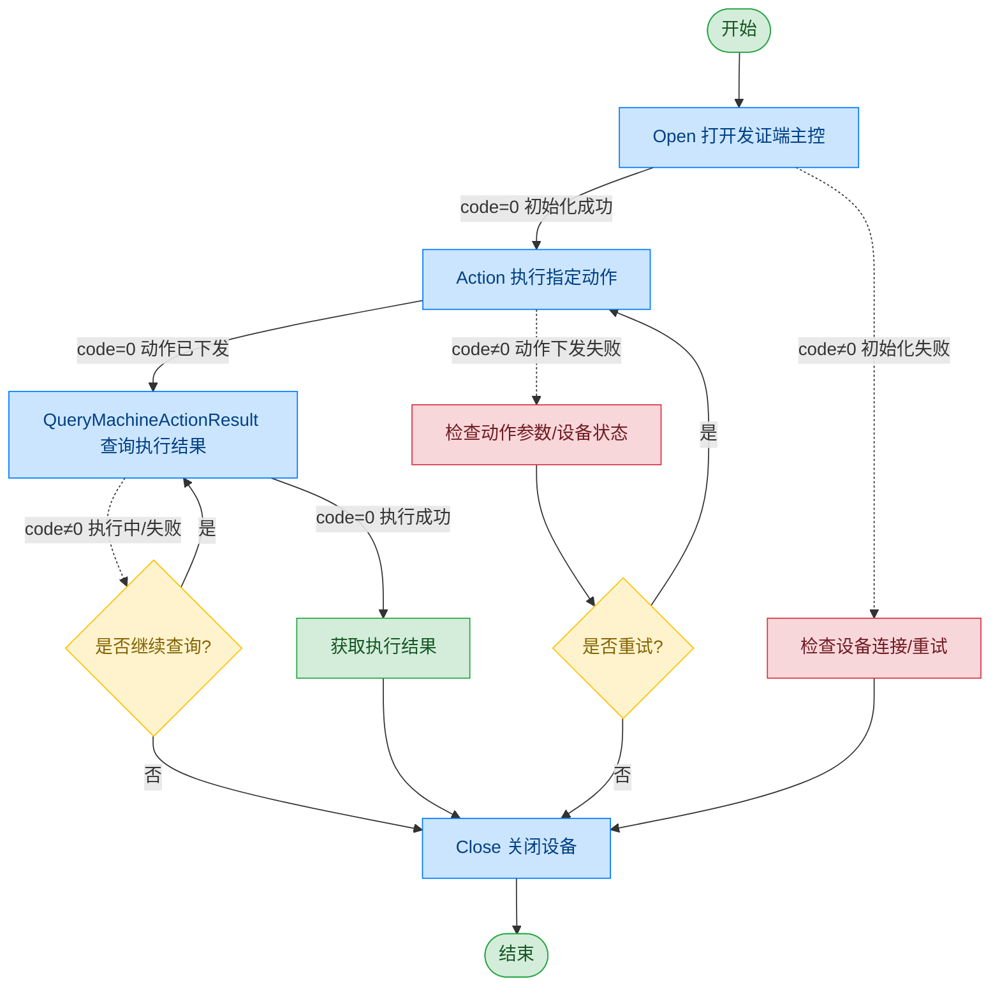

# 发证端主控

## 文档版本

| 版本 | 日期 | 修改内容 |
|------|------|----------|
| V1.0 | 2026-06-16 | 初始版本，从原始文档拆分 |

## 设备信息

| 项目 | 内容 |
|------|------|
| 设备类型 | 发证端主控 |
| DIS 接口前缀 | DEV_Fazheng |

## 概述

发证端主控模块用于控制自助发证设备的机械运动和状态管理，包括证件平台升降、OCR 读取位置控制、LED 指示灯控制、设备电源管理等功能。

## 调用流程



## Action 指令说明

发证端主控通过 Action 指令下发不同的操作命令，具体操作由 act 字段指定：

| act 值 | 含义 |
|--------|------|
| ResetDevice | 设备复位 |
| Op_MovePositionOCR | 移动到 OCR 读取位置 |
| Op_StopOCR | 停止 OCR 位置移动 |
| Op_MovePositionPlatform | 移动证件平台到指定位置 |
| Op_StopPlatform | 停止证件平台移动 |
| Op_PlatformUp | 证件平台上升 |
| Op_PlatformDown | 证件平台下降 |
| MachineSetLedStatue | 设置 LED 灯状态 |
| MachineGetDistanceValue | 获取人体距离位置 |
| MachineGetPosition | 获取 OCR/平台位置 |
| SetPowerOn | 设备上电 |
| SetPowerOff | 设备断电 |

## 接口列表

### 1. 打开发证端（Open）

#### 请求参数

请求示例：

```json
{
  "seq": "DEV_Fazheng_Open_${uuid}",
  "cmd": "Open",
  "datetime": "20211201130101",
  "posidx": "00",
  "timeout": "30000",
  "async": "0"
}
```

参数说明：

| 参数名称 | 格式 | 是否必填 | 参数说明 |
|----------|------|----------|----------|
| seq | string | 是 | DEV_Fazheng_Open_${uuid} |
| cmd | string | 是 | 固定为"Open" |
| datetime | string | 是 | 指令的下发时间，格式：YYYYMMddHHmmss |
| posidx | string | 是 | 多个同款设备的工位号；"00"~"99" |
| timeout | string | 是 | 超时时间(ms) |
| async | string | 是 | 是否异步（默认0:同步）；0：同步；1：异步 |

#### 返回参数

返回示例：

```json
{
  "seq": "DEV_Fazheng_Open_${uuid}",
  "cmd": "Open",
  "datetime": "20211201130102",
  "code": "0",
  "msg": "Success",
  "suggest": "",
  "posidx": "00"
}
```

参数说明：

| 参数名称 | 格式 | 是否必填 | 参数说明 |
|----------|------|----------|----------|
| seq | string | 是 | 同下发的 seq |
| cmd | string | 是 | 同下发的 cmd |
| datetime | string | 是 | 指令的下发时间，格式：YYYYMMddHHmmss |
| code | string | 是 | 参照通用返回码 / 发证端返回码 |
| msg | string | 否 | 提示信息 |
| suggest | string | 否 | 建议 |
| posidx | string | 是 | 多个同款设备的工位号；"00"~"99" |

---

### 2. 执行动作（Action）

通过本条指令上层应用可以控制发证端执行指定动作。具体操作由 param.act 字段决定。

#### 请求参数

请求示例：

```json
{
  "seq": "DEV_Fazheng_Action_${uuid}",
  "cmd": "Action",
  "datetime": "20211201130101",
  "posidx": "00",
  "timeout": "30000",
  "async": "0",
  "param": {
    "act": "Op_MovePositionOCR"
  }
}
```

参数说明：

| 参数名称 | 格式 | 是否必填 | 参数说明 |
|----------|------|----------|----------|
| seq | string | 是 | DEV_Fazheng_Action_${uuid} |
| cmd | string | 是 | 固定为"Action" |
| datetime | string | 是 | 指令的下发时间，格式：YYYYMMddHHmmss |
| posidx | string | 是 | 多个同款设备的工位号；"00"~"99" |
| timeout | string | 是 | 超时时间(ms) |
| async | string | 是 | 是否异步（默认0:同步）；0：同步；1：异步 |
| param | object | 是 | 参数对象 |
| ↳ act | string | 是 | 操作命令，参见 Action 指令说明表 |

#### LED 控制参数

当 act 为 "MachineSetLedStatue" 时，param 需包含以下额外参数：

| 参数名称 | 格式 | 是否必填 | 参数说明 |
|----------|------|----------|----------|
| IDLight | string | 是 | 灯编号 |
| LightBlinkTime | string | 否 | 灯闪频率 |
| LightPwmCount | string | 否 | 灯亮度等级 |

#### 返回参数

返回示例：

```json
{
  "seq": "DEV_Fazheng_Action_${uuid}",
  "cmd": "Action",
  "datetime": "20211201130102",
  "code": "0",
  "msg": "Success",
  "suggest": "",
  "posidx": "00"
}
```

参数说明：

| 参数名称 | 格式 | 是否必填 | 参数说明 |
|----------|------|----------|----------|
| seq | string | 是 | 同下发的 seq |
| cmd | string | 是 | 同下发的 cmd |
| datetime | string | 是 | 指令的下发时间，格式：YYYYMMddHHmmss |
| code | string | 是 | 参照通用返回码 / 发证端返回码 |
| msg | string | 否 | 提示信息 |
| suggest | string | 否 | 建议 |
| posidx | string | 是 | 多个同款设备的工位号；"00"~"99" |

---

### 3. 查询动作执行结果（QueryMachineActionResult）

通过本条指令上层应用可以查询发证端动作执行结果。

#### 请求参数

请求示例：

```json
{
  "seq": "DEV_Fazheng_QueryMachineActionResult_${uuid}",
  "cmd": "QueryMachineActionResult",
  "datetime": "20211201130101",
  "posidx": "00",
  "timeout": "30000",
  "async": "0"
}
```

参数说明：

| 参数名称 | 格式 | 是否必填 | 参数说明 |
|----------|------|----------|----------|
| seq | string | 是 | DEV_Fazheng_QueryMachineActionResult_${uuid} |
| cmd | string | 是 | 固定为"QueryMachineActionResult" |
| datetime | string | 是 | 指令的下发时间，格式：YYYYMMddHHmmss |
| posidx | string | 是 | 多个同款设备的工位号；"00"~"99" |
| timeout | string | 是 | 超时时间(ms) |
| async | string | 是 | 是否异步（默认0:同步）；0：同步；1：异步 |

#### 返回参数

返回示例：

```json
{
  "seq": "DEV_Fazheng_QueryMachineActionResult_${uuid}",
  "cmd": "QueryMachineActionResult",
  "datetime": "20211201130102",
  "code": "0",
  "msg": "Success",
  "suggest": "",
  "posidx": "00",
  "data": {
    "OCRHeight": "0",
    "PlatformHeight": "0",
    "DistanceValue": "0"
  }
}
```

参数说明：

| 参数名称 | 格式 | 是否必填 | 参数说明 |
|----------|------|----------|----------|
| seq | string | 是 | 同下发的 seq |
| cmd | string | 是 | 同下发的 cmd |
| datetime | string | 是 | 指令的下发时间，格式：YYYYMMddHHmmss |
| code | string | 是 | 参照通用返回码 / 发证端返回码 |
| msg | string | 否 | 提示信息 |
| suggest | string | 否 | 建议 |
| posidx | string | 是 | 多个同款设备的工位号；"00"~"99" |
| data | object | 否 | 返回数据 |
| ↳ OCRHeight | string | 否 | OCR 位置高度 |
| ↳ PlatformHeight | string | 否 | 平台位置高度 |
| ↳ DistanceValue | string | 否 | 人体距离值 |

---

### 4. 关闭发证端（Close）

#### 请求参数

请求示例：

```json
{
  "seq": "DEV_Fazheng_Close_${uuid}",
  "cmd": "Close",
  "datetime": "20211201130101",
  "posidx": "00",
  "timeout": "30000",
  "async": "0"
}
```

参数说明：

| 参数名称 | 格式 | 是否必填 | 参数说明 |
|----------|------|----------|----------|
| seq | string | 是 | DEV_Fazheng_Close_${uuid} |
| cmd | string | 是 | 固定为"Close" |
| datetime | string | 是 | 指令的下发时间，格式：YYYYMMddHHmmss |
| posidx | string | 是 | 多个同款设备的工位号；"00"~"99" |
| timeout | string | 是 | 超时时间(ms) |
| async | string | 是 | 是否异步（默认0:同步）；0：同步；1：异步 |

#### 返回参数

返回示例：

```json
{
  "seq": "DEV_Fazheng_Close_${uuid}",
  "cmd": "Close",
  "datetime": "20211201130102",
  "code": "0",
  "msg": "Success",
  "suggest": "",
  "posidx": "00"
}
```

参数说明：

| 参数名称 | 格式 | 是否必填 | 参数说明 |
|----------|------|----------|----------|
| seq | string | 是 | 同下发的 seq |
| cmd | string | 是 | 同下发的 cmd |
| datetime | string | 是 | 指令的下发时间，格式：YYYYMMddHHmmss |
| code | string | 是 | 参照通用返回码 / 发证端返回码 |
| msg | string | 否 | 提示信息 |
| suggest | string | 否 | 建议 |
| posidx | string | 是 | 多个同款设备的工位号；"00"~"99" |

## 错误码

| 序号 | 错误码 | 含义 |
|------|--------|------|
| 1 | 17133001 | 设备未打开 |
| 2 | 17133002 | 下发参数错误 |
| 3 | 17133003 | 不支持的指令 |
| 4 | 17133004 | 设备操作失败 |
| 5 | 17133005 | lua 脚本返回错误码 |
| 6 | 17133006 | 设备不支持 |
| 7 | 17133007 | 主动取消 |
| 8 | 17133008 | 超时 |

> 通用返回码（0~1037）请参阅 [通用返回码](../00-通用协议层/06-通用返回码.md)
