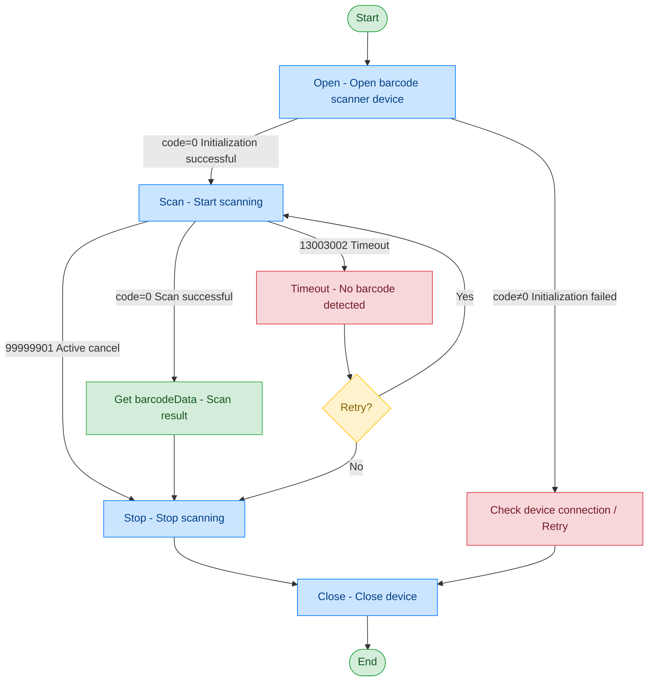

# Barcode Scanner - NT351G

## Document Version

| Version | Date | Changes |
|---------|------|---------|
| V1.0 | 2026-06-16 | Initial version, split from original document |
| V1.1 | 2026-06-17 | Optimized call flow diagram, added exception handling paths |

## Device Information

| Item | Details |
|------|---------|
| Device Type | Barcode Scanner |
| Brand | Niutu |
| Model | NT351G |
| DIS Interface Prefix | DEV_QrScan |

## Call Flow



## Interface List

### 1. Open Barcode Scanner Device (Open)

This command is used to open and initialize the barcode scanner device. After successful initialization, the device enters the ready state and can perform scanning operations.

#### Request Parameters

Request example:

```json
{
  "seq": "DEV_QrScan_Open_${uuid}",
  "cmd": "Open",
  "datetime": "20211201130101",
  "posidx": "00",
  "timeout": "30000",
  "async": "0"
}
```

Parameter description:

| Parameter Name | Format | Required | Description |
|----------------|--------|----------|-------------|
| seq | string | Yes | DEV_QrScan_Open_${uuid} |
| cmd | string | Yes | Fixed as "Open" |
| datetime | string | Yes | Command dispatch time, format: YYYYMMddHHmmss |
| posidx | string | Yes | Station number for multiple devices of the same type; "00"~"99" |
| timeout | string | Yes | Timeout duration (ms) |
| async | string | Yes | Asynchronous or not (default 0: synchronous); 0: synchronous; 1: asynchronous |

#### Response Parameters

Response example:

```json
{
  "seq": "DEV_QrScan_Open_${uuid}",
  "cmd": "Open",
  "datetime": "20211201130102",
  "code": "0",
  "msg": "Success",
  "posidx": "00"
}
```

Parameter description:

| Parameter Name | Format | Required | Description |
|----------------|--------|----------|-------------|
| seq | string | Yes | Same as the dispatched seq |
| cmd | string | Yes | Same as the dispatched cmd |
| datetime | string | Yes | Command dispatch time, format: YYYYMMddHHmmss |
| code | string | Yes | Refer to general return codes / barcode scanner return codes |
| msg | string | No | Refer to general return codes / barcode scanner return codes |
| posidx | string | Yes | Station number for multiple devices of the same type; "00"~"99" |

---

### 2. Scan Barcode (Scan)

This command is used to trigger the barcode scanner to start recognizing barcodes. The scan result is returned via callback, with the following possible outcomes:
- Scan successful: returns barcodeData (scan result data)
- Scan timeout: returns timeout (barcode not recognized within the specified time)

If a timeout occurs, the upper-layer application can resend the scan command to retry based on business needs.

#### Request Parameters

Request example:

```json
{
  "seq": "DEV_QrScan_Scan_${uuid}",
  "cmd": "Scan",
  "datetime": "20211201130101",
  "timeout": "30000",
  "posidx": "00",
  "async": "0"
}
```

Parameter description:

| Parameter Name | Format | Required | Description |
|----------------|--------|----------|-------------|
| seq | string | Yes | DEV_QrScan_Scan_${uuid} |
| cmd | string | Yes | Fixed as "Scan" |
| datetime | string | Yes | Command dispatch time, format: YYYYMMddHHmmss |
| posidx | string | Yes | Station number for multiple devices of the same type; "00"~"99" |
| timeout | string | Yes | Timeout duration (ms) |
| async | string | Yes | Asynchronous or not (default 0: synchronous); 0: synchronous; 1: asynchronous |

#### Response Parameters

Response example:

```json
{
  "seq": "DEV_QrScan_Scan_${uuid}",
  "cmd": "Scan",
  "datetime": "20211201130102",
  "code": "0",
  "data": {
    "zzzptm": "123456789"
  },
  "msg": "Success",
  "posidx": "00"
}
```

Parameter description:

| Parameter Name | Format | Required | Description |
|----------------|--------|----------|-------------|
| seq | string | Yes | Same as the dispatched seq |
| cmd | string | Yes | Same as the dispatched cmd |
| datetime | string | Yes | Command dispatch time, format: YYYYMMddHHmmss |
| code | string | Yes | Refer to general return codes / barcode scanner return codes |
| msg | string | No | Refer to general return codes / barcode scanner return codes |
| posidx | string | Yes | Station number for multiple devices of the same type; "00"~"99" |
| data | object | No | Returned data |
| ↳ zzzptm | string | Yes | Barcode or QR code data |

---

### 3. Stop Scanning (Stop)

Through this command, the upper-layer application can control the barcode scanner to stop scanning.

#### Request Parameters

Request example:

```json
{
  "seq": "DEV_QrScan_Stop_${uuid}",
  "cmd": "Stop",
  "datetime": "20211201130101",
  "timeout": "30000",
  "posidx": "00",
  "async": "1"
}
```

Parameter description:

| Parameter Name | Format | Required | Description |
|----------------|--------|----------|-------------|
| seq | string | Yes | DEV_QrScan_Stop_${uuid} |
| cmd | string | Yes | Fixed as "Stop" |
| datetime | string | Yes | Command dispatch time, format: YYYYMMddHHmmss |
| posidx | string | Yes | Station number for multiple devices of the same type; "00"~"99" |
| timeout | string | Yes | Timeout duration (ms) |
| async | string | Yes | Asynchronous or not (recommended as 1); 0: synchronous; 1: asynchronous |

#### Response Parameters

Response example:

```json
{
  "seq": "DEV_QrScan_Stop_${uuid}",
  "cmd": "Stop",
  "datetime": "20211201130102",
  "code": "0",
  "msg": "Success",
  "posidx": "00"
}
```

Parameter description:

| Parameter Name | Format | Required | Description |
|----------------|--------|----------|-------------|
| seq | string | Yes | Same as the dispatched seq |
| cmd | string | Yes | Same as the dispatched cmd |
| datetime | string | Yes | Command dispatch time, format: YYYYMMddHHmmss |
| code | string | Yes | Refer to general return codes / barcode scanner return codes |
| msg | string | No | Refer to general return codes / barcode scanner return codes |
| posidx | string | Yes | Station number for multiple devices of the same type; "00"~"99" |

---

### 4. Close Barcode Scanner (Close)

When the barcode scanner has finished working, the upper-layer application can close the scanning device and release resources through this command.

#### Request Parameters

Request example:

```json
{
  "seq": "DEV_QrScan_Close_${uuid}",
  "cmd": "Close",
  "datetime": "20211201130101",
  "timeout": "30000",
  "posidx": "00",
  "async": "0"
}
```

Parameter description:

| Parameter Name | Format | Required | Description |
|----------------|--------|----------|-------------|
| seq | string | Yes | DEV_QrScan_Close_${uuid} |
| cmd | string | Yes | Fixed as "Close" |
| datetime | string | Yes | Command dispatch time, format: YYYYMMddHHmmss |
| posidx | string | Yes | Station number for multiple devices of the same type; "00"~"99" |
| timeout | string | Yes | Timeout duration (ms) |
| async | string | Yes | Asynchronous or not (default 0: synchronous); 0: synchronous; 1: asynchronous |

#### Response Parameters

Response example:

```json
{
  "seq": "DEV_QrScan_Close_${uuid}",
  "cmd": "Close",
  "datetime": "20211201130102",
  "code": "0",
  "msg": "ok",
  "posidx": "00"
}
```

Parameter description:

| Parameter Name | Format | Required | Description |
|----------------|--------|----------|-------------|
| seq | string | Yes | Same as the dispatched seq |
| cmd | string | Yes | Same as the dispatched cmd |
| datetime | string | Yes | Command dispatch time, format: YYYYMMddHHmmss |
| code | string | Yes | Refer to general return codes / barcode scanner return codes |
| msg | string | No | Refer to general return codes / barcode scanner return codes |
| posidx | string | Yes | Station number for multiple devices of the same type; "00"~"99" |

## Error Codes

| No. | Error Code | Meaning |
|-----|------------|---------|
| 1 | 99999901 | Active cancel |
| 2 | 13003001 | Device not opened |
| 3 | 13003002 | Timeout - No barcode detected |
| 4 | 13003003 | Command reception or read failure |
| 5 | 13003004 | Hardware model or type mismatch |
| 6 | 13003005 | Cancelled |

> For general return codes (0~1037), please refer to [General Return Codes](../00-Common-Protocol/06-Common-Return-Codes.md)
