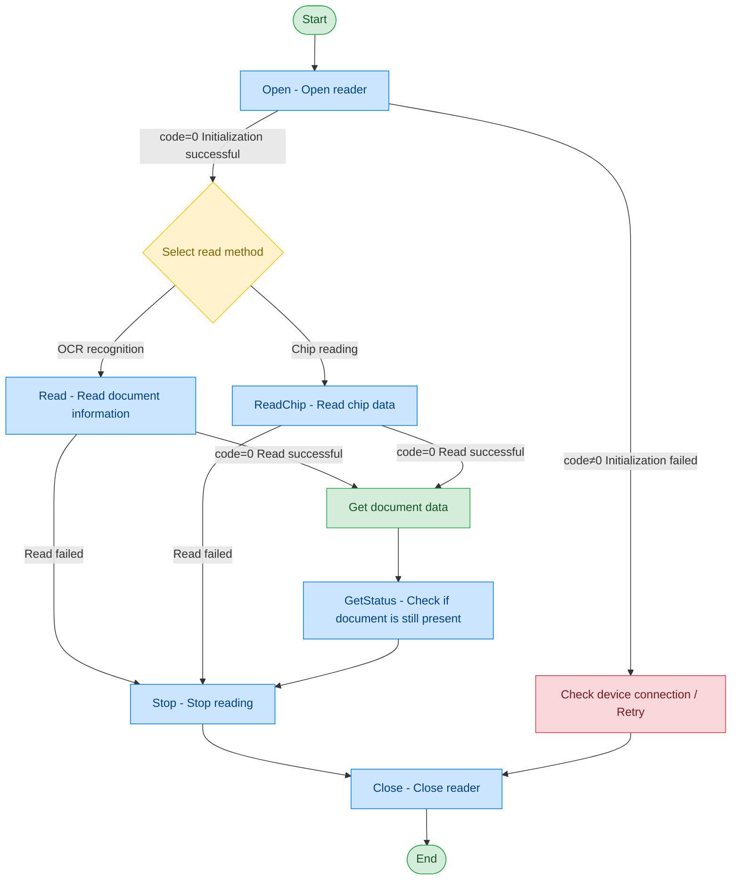

# Passport Reader - ARH

## Document Version

| Version | Date | Changes |
|---------|------|---------|
| V1.0 | 2026-06-16 | Initial version, split from original document |
| V1.1 | 2026-06-17 | Optimized call flow diagram, added exception handling paths |

## Device Information

| Item | Details |
|------|---------|
| Device Type | Passport Reader |
| Brand | ARH |
| DIS Interface Prefix | DEV_Passport |

## Call Flow



## Interface List

### 1. Open Passport Reader (Open)

Through this command, the upper-layer application can open the passport reader for reading passport information.

#### Request Parameters

Request example:

```json
{
  "seq": "DEV_Passport_Open_${uuid}",
  "cmd": "Open",
  "datetime": "20211201130101",
  "posidx": "00",
  "timeout": "30000",
  "async": "0"
}
```

Parameter description:

| Parameter Name | Format | Required | Description |
|----------------|--------|----------|-------------|
| seq | string | Yes | Request serial number: field format is business identifier prefix + underscore + unique ID |
| cmd | string | Yes | For this command, fixed as "Open" |
| datetime | string | Yes | Command dispatch time, format: YYYYMMddHHmmss |
| posidx | string | Yes | Station number for multiple devices of the same type; "00"~"99" |
| timeout | string | Yes | Timeout duration (ms) |
| async | string | Yes | Asynchronous or not (default 0: synchronous); 0: synchronous; 1: asynchronous |

#### Response Parameters

Response example:

```json
{
  "seq": "DEV_Passport_Open_${uuid}",
  "cmd": "Open",
  "datetime": "20211201130101",
  "code": "0",
  "msg": "success",
  "posidx": "00",
  "async": "0"
}
```

Parameter description:

| Parameter Name | Format | Required | Description |
|----------------|--------|----------|-------------|
| seq | string | Yes | Same as the dispatched seq |
| cmd | string | Yes | Same as the dispatched cmd |
| datetime | string | Yes | Command dispatch time, format: YYYYMMddHHmmss |
| code | string | Yes | Refer to general return codes / passport reader return codes |
| msg | string | No | Refer to general return codes / passport reader return codes |
| posidx | string | Yes | Station number for multiple devices of the same type; "00"~"99" |

---

### 2. Read Document Surface Information (Read)

Through this command, the upper-layer application can read the document surface information.

#### Request Parameters

Request example:

```json
{
  "seq": "DEV_Passport_Read_${uuid}",
  "cmd": "Read",
  "datetime": "20211201130101",
  "timeout": "30000",
  "posidx": "00",
  "async": "0"
}
```

Parameter description:

| Parameter Name | Format | Required | Description |
|----------------|--------|----------|-------------|
| seq | string | Yes | Request serial number: field format is business identifier prefix + underscore + unique ID |
| cmd | string | Yes | For this command, fixed as "Read" |
| datetime | string | Yes | Command dispatch time, format: YYYYMMddHHmmss |
| posidx | string | Yes | Station number for multiple devices of the same type; "00"~"99" |
| timeout | string | Yes | Timeout duration (ms) |
| async | string | Yes | Asynchronous or not (default 0: synchronous); 0: synchronous; 1: asynchronous |

#### Response Parameters

Response example:

```json
{
  "seq": "DEV_Passport_Read_${uuid}",
  "cmd": "Read",
  "datetime": "20211201130101",
  "code": "0",
  "data": {
    "VizDocumentNumber": "KH082955(5)",
    "VizIssueDate": "2017-07-14",
    "DocCode": "3988",
    "DocType": "Hong Kong ID card - front, 2016P",
    "FullPage": "D:/FullPage.jpg",
    "PersoFace": "D:/PersoFace.jpg",
    "MRZXML": "D:/MRZ.xml",
    "ChineseNameByteArr": "",
    "Name": ""
  },
  "msg": "success",
  "posidx": "00"
}
```

Parameter description:

| Parameter Name | Format | Required | Description |
|----------------|--------|----------|-------------|
| seq | string | Yes | Same as the dispatched seq |
| cmd | string | Yes | Same as the dispatched cmd |
| datetime | string | Yes | Command dispatch time, format: YYYYMMddHHmmss |
| code | string | Yes | Refer to general return codes / passport reader return codes |
| msg | string | No | Refer to general return codes / passport reader return codes |
| posidx | string | Yes | Station number for multiple devices of the same type; "00"~"99" |
| data | object | Yes | Returned data object |
| ↳ VizDocumentNumber | string | Yes | Document number |
| ↳ VizIssueDate | string | Yes | Document expiry date |
| ↳ DocCode | string | Yes | Document code |
| ↳ DocType | string | Yes | Document type |
| ↳ FullPage | string | Yes | Full page image |
| ↳ PersoFace | string | Yes | Portrait information |
| ↳ MRZXML | string | Yes | MRZ information |
| ↳ ChineseNameByteArr | string | Yes | Chinese name |
| ↳ Name | string | Yes | Name |

---

### 3. Read Document Chip Information (ReadChip)

Through this command, the upper-layer application can read the document chip information.

#### Request Parameters

Request example:

```json
{
  "seq": "DEV_Passport_ReadChip_${uuid}",
  "cmd": "ReadChip",
  "datetime": "20211201130101",
  "timeout": "30000",
  "posidx": "00",
  "async": "0"
}
```

Parameter description:

| Parameter Name | Format | Required | Description |
|----------------|--------|----------|-------------|
| seq | string | Yes | Request serial number: field format is business identifier prefix + underscore + unique ID |
| cmd | string | Yes | For this command, fixed as "ReadChip" |
| datetime | string | Yes | Command dispatch time, format: YYYYMMddHHmmss |
| posidx | string | Yes | Station number for multiple devices of the same type; "00"~"99" |
| timeout | string | Yes | Timeout duration (ms) |
| async | string | Yes | Asynchronous or not (default 0: synchronous); 0: synchronous; 1: asynchronous |

#### Response Parameters

Response example:

```json
{
  "data": {
    "Birth": "910101",
    "ChineseNameByteArr": "6d105c029f029f0209e9bd8ae6a882e682a0",
    "CountryCode": "CHN",
    "ECardBirthPlace": "HONG KONG",
    "ECardDocumentDescriptor": "1.8",
    "ECardExpiryDate": "2034-09-02 16:00:00.000",
    "ECardFace": "",
    "ECardIssueCountry": "CZE",
    "ECardIssueDate": "2023-09-28",
    "ECardIssueOrg": "IMMIGRATION DEPARTMENT, HONG KONG SPECIAL ADMINISTRATIVE REGION",
    "ECardName": "CHAI<<LOK<YAU",
    "ECardObservations": "Please refer to the observations page for any additional information of the bearer.",
    "Name": "CHAI LOK YAU",
    "Nationality": "CHN",
    "NotAfter": "330928",
    "PassportNo": "H91234903",
    "Reserved": "HK0000158",
    "Sex": "F",
    "Type": "P",
    "PersoFace": "D:/5.ENV/EmpDIS_V2_new/data/Passport/PersoFace.jpg"
  },
  "seq": "DEV_Passport_ReadChip_${uuid}",
  "cmd": "ReadChip",
  "code": "0",
  "datetime": "20260421163623.795",
  "msg": "Success",
  "suggest": "",
  "posidx": "0",
  "DllVersion": "V6.24.703.1"
}
```

Parameter description:

| Parameter Name | Format | Required | Description |
|----------------|--------|----------|-------------|
| seq | string | Yes | Same as the dispatched seq |
| cmd | string | Yes | Same as the dispatched cmd |
| datetime | string | Yes | Command dispatch time, format: YYYYMMddHHmmss |
| code | string | Yes | Refer to general return codes / passport reader return codes |
| msg | string | No | Refer to general return codes / passport reader return codes |
| posidx | string | Yes | Station number for multiple devices of the same type; "00"~"99" |
| DllVersion | string | No | Peripheral library version |
| data | object | Yes | Returned data object |
| ↳ Birth | string | Yes | Date of birth |
| ↳ ChineseNameByteArr | string | Yes | Chinese name |
| ↳ CountryCode | string | Yes | Country code |
| ↳ ECardBirthPlace | string | Yes | Place of birth (chip information) |
| ↳ ECardDocumentDescriptor | string | Yes | Document descriptor (chip information) |
| ↳ ECardExpiryDate | string | Yes | Expiry date (chip information) |
| ↳ ECardFace | string | No | Portrait (chip information) |
| ↳ ECardIssueCountry | string | Yes | Issuing country (chip information) |
| ↳ ECardIssueDate | string | Yes | Issue date (chip information) |
| ↳ ECardIssueOrg | string | Yes | Issuing authority (chip information) |
| ↳ ECardName | string | Yes | Card name (chip information) |
| ↳ ECardObservations | string | No | Observations |
| ↳ Name | string | Yes | Name |
| ↳ Nationality | string | Yes | Nationality |
| ↳ NotAfter | string | Yes | Validity period |
| ↳ PassportNo | string | Yes | Passport number |
| ↳ Reserved | string | No | ID number |
| ↳ Sex | string | Yes | Gender |
| ↳ Type | string | Yes | Category |
| ↳ PersoFace | string | Yes | Portrait image path |

---

### 4. Check Reader Surface Status (GetStatus)

Through this command, the upper-layer application can check whether a document is still placed on the reader surface.

#### Request Parameters

Request example:

```json
{
  "seq": "DEV_Passport_GetStatus_${uuid}",
  "cmd": "GetStatus",
  "datetime": "20211201130101",
  "timeout": "30000",
  "posidx": "00",
  "async": "0"
}
```

Parameter description:

| Parameter Name | Format | Required | Description |
|----------------|--------|----------|-------------|
| seq | string | Yes | Request serial number: field format is business identifier prefix + underscore + unique ID |
| cmd | string | Yes | For this command, fixed as "GetStatus" |
| datetime | string | Yes | Command dispatch time, format: YYYYMMddHHmmss |
| posidx | string | Yes | Station number for multiple devices of the same type; "00"~"99" |
| timeout | string | Yes | Timeout duration (ms) |
| async | string | Yes | Asynchronous or not (default 0: synchronous); 0: synchronous; 1: asynchronous |

#### Response Parameters

Response example:

```json
{
  "seq": "DEV_Passport_GetStatus_${uuid}",
  "cmd": "GetStatus",
  "datetime": "20211201130102",
  "code": "0",
  "msg": "success",
  "posidx": "00",
  "async": "0",
  "data": {
    "CardInWindow": "0"
  }
}
```

Parameter description:

| Parameter Name | Format | Required | Description |
|----------------|--------|----------|-------------|
| seq | string | Yes | Same as the dispatched seq |
| cmd | string | Yes | Same as the dispatched cmd |
| datetime | string | Yes | Command dispatch time, format: YYYYMMddHHmmss |
| code | string | Yes | Refer to general return codes / passport reader return codes |
| msg | string | No | Refer to general return codes / passport reader return codes |
| posidx | string | Yes | Station number for multiple devices of the same type; "00"~"99" |
| data | object | Yes | Returned data |
| ↳ CardInWindow | string | Yes | 0: Normal; 1: Document present |

---

### 5. Close Reader (Close)

Through this command, the upper-layer application can close the passport reader.

#### Request Parameters

Request example:

```json
{
  "seq": "DEV_Passport_Close_${uuid}",
  "cmd": "Close",
  "datetime": "20211201130101",
  "posidx": "00",
  "async": "0",
  "timeout": "30000"
}
```

Parameter description:

| Parameter Name | Format | Required | Description |
|----------------|--------|----------|-------------|
| seq | string | Yes | Request serial number: field format is business identifier prefix + underscore + unique ID |
| cmd | string | Yes | For this command, fixed as "Close" |
| datetime | string | Yes | Command dispatch time, format: YYYYMMddHHmmss |
| posidx | string | Yes | Station number for multiple devices of the same type; "00"~"99" |
| timeout | string | Yes | Timeout duration (ms) |
| async | string | Yes | Asynchronous or not (default 0: synchronous); 0: synchronous; 1: asynchronous |

#### Response Parameters

Response example:

```json
{
  "seq": "DEV_Passport_Close_${uuid}",
  "cmd": "Close",
  "datetime": "20211201130102",
  "code": "0",
  "msg": "success",
  "posidx": "00",
  "async": "0"
}
```

Parameter description:

| Parameter Name | Format | Required | Description |
|----------------|--------|----------|-------------|
| seq | string | Yes | Same as the dispatched seq |
| cmd | string | Yes | Same as the dispatched cmd |
| datetime | string | Yes | Command dispatch time, format: YYYYMMddHHmmss |
| code | string | Yes | Refer to general return codes / passport reader return codes |
| msg | string | No | Refer to general return codes / passport reader return codes |
| posidx | string | Yes | Station number for multiple devices of the same type; "00"~"99" |

---

### 6. Stop Reading (Stop)

Through this command, the upper-layer application can stop the passport reader from reading and cancel the current read operation.

#### Request Parameters

Request example:

```json
{
  "seq": "DEV_Passport_Stop_${uuid}",
  "cmd": "Stop",
  "datetime": "20211201130101",
  "timeout": "30000",
  "posidx": "00",
  "async": "0"
}
```

Parameter description:

| Parameter Name | Format | Required | Description |
|----------------|--------|----------|-------------|
| seq | string | Yes | Request serial number: field format is business identifier prefix + underscore + unique ID |
| cmd | string | Yes | For this command, fixed as "Stop" |
| datetime | string | Yes | Command dispatch time, format: YYYYMMddHHmmss |
| posidx | string | Yes | Station number for multiple devices of the same type; "00"~"99" |
| timeout | string | Yes | Timeout duration (ms) |
| async | string | Yes | Asynchronous or not (default 0: synchronous); 0: synchronous; 1: asynchronous |

#### Response Parameters

Response example:

```json
{
  "seq": "DEV_Passport_Stop_${uuid}",
  "cmd": "Stop",
  "datetime": "20211201130102",
  "code": "0",
  "msg": "success",
  "posidx": "00",
  "async": "0"
}
```

Parameter description:

| Parameter Name | Format | Required | Description |
|----------------|--------|----------|-------------|
| seq | string | Yes | Same as the dispatched seq |
| cmd | string | Yes | Same as the dispatched cmd |
| datetime | string | Yes | Command dispatch time, format: YYYYMMddHHmmss |
| code | string | Yes | Refer to general return codes / passport reader return codes |
| msg | string | No | Refer to general return codes / passport reader return codes |
| posidx | string | Yes | Station number for multiple devices of the same type; "00"~"99" |

## Error Codes

| No. | Error Code | Meaning |
|-----|------------|---------|
| 1 | 16601102 | Device not found |
| 2 | 16601103 | Initialization failed |
| 3 | 16602101 | Chip not detected |
| 4 | 16602201 | Information not read |

> For general return codes (0~1037), please refer to [General Return Codes](../00-Common-Protocol/06-Common-Return-Codes.md)
