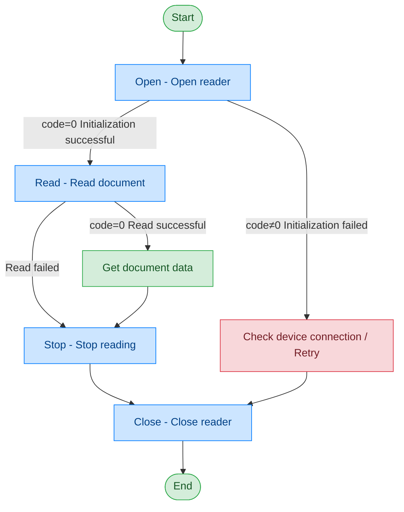

# Passport Reader - DESKO

## Document Version

| Version | Date | Changes |
|---------|------|---------|
| V1.0 | 2026-06-16 | Initial version, split from original document |
| V1.1 | 2026-06-17 | Optimized call flow diagram, added exception handling paths |

## Device Information

| Item | Details |
|------|---------|
| Device Type | Passport Reader |
| Brand | DESKO |
| DIS Interface Prefix | DEV_Passport |

## Call Flow



## Interface List

### 1. Open Passport Reader (Open)

This command is used to open and initialize the passport reader. After successful initialization, the device enters the ready state and can perform passport information reading operations.

#### Request Parameters

Request example:

```json
{
  "seq": "DEV_Passport_Open_${uuid}",
  "cmd": "Open",
  "datetime": "20211201130101",
  "posidx": "00",
  "timeout": "30000",
  "async": "0"
}
```

Parameter description:

| Parameter Name | Format | Required | Description |
|----------------|--------|----------|-------------|
| seq | string | Yes | DEV_Passport_Open_${uuid} |
| cmd | string | Yes | Fixed as "Open" |
| datetime | string | Yes | Command dispatch time, format: YYYYMMddHHmmss |
| posidx | string | Yes | Station number for multiple devices of the same type; "00"~"99" |
| timeout | string | Yes | Timeout duration (ms) |
| async | string | Yes | Asynchronous or not (default 0: synchronous); 0: synchronous; 1: asynchronous |

#### Response Parameters

Response example:

```json
{
  "seq": "DEV_Passport_Open_${uuid}",
  "cmd": "Open",
  "datetime": "20211201130102",
  "code": "0",
  "msg": "Success",
  "suggest": "",
  "posidx": "00"
}
```

Parameter description:

| Parameter Name | Format | Required | Description |
|----------------|--------|----------|-------------|
| seq | string | Yes | Same as the dispatched seq |
| cmd | string | Yes | Same as the dispatched cmd |
| datetime | string | Yes | Command dispatch time, format: YYYYMMddHHmmss |
| code | string | Yes | Refer to general return codes / passport reader return codes |
| msg | string | No | Prompt message |
| suggest | string | No | Suggestion |
| posidx | string | Yes | Station number for multiple devices of the same type; "00"~"99" |

---

### 2. Read Document (Read)

Through this command, the upper-layer application can read document information.

#### Request Parameters

Request example:

```json
{
  "seq": "DEV_Passport_Read_${uuid}",
  "cmd": "Read",
  "datetime": "20211201130101",
  "posidx": "00",
  "timeout": "30000",
  "async": "0"
}
```

Parameter description:

| Parameter Name | Format | Required | Description |
|----------------|--------|----------|-------------|
| seq | string | Yes | DEV_Passport_Read_${uuid} |
| cmd | string | Yes | Fixed as "Read" |
| datetime | string | Yes | Command dispatch time, format: YYYYMMddHHmmss |
| posidx | string | Yes | Station number for multiple devices of the same type; "00"~"99" |
| timeout | string | Yes | Timeout duration (ms) |
| async | string | Yes | Asynchronous or not (recommended as 1); 0: synchronous; 1: asynchronous |

#### Response Parameters

Response example:

```json
{
  "seq": "DEV_Passport_Read_${uuid}",
  "cmd": "Read",
  "datetime": "20211201130102",
  "code": "0",
  "msg": "Success",
  "suggest": "",
  "posidx": "00",
  "data": {
    "IsChip": "1",
    "zjhm": "E16353007",
    "zjlx": "PASSPORT",
    "ywxm": "ZENG<<LEI",
    "PersoFace": "D:/data/Passport/PersoFace.jpg"
  }
}
```

Parameter description:

| Parameter Name | Format | Required | Description |
|----------------|--------|----------|-------------|
| seq | string | Yes | Same as the dispatched seq |
| cmd | string | Yes | Same as the dispatched cmd |
| datetime | string | Yes | Command dispatch time, format: YYYYMMddHHmmss |
| code | string | Yes | Refer to general return codes / passport reader return codes |
| msg | string | No | Prompt message |
| suggest | string | No | Suggestion |
| posidx | string | Yes | Station number for multiple devices of the same type; "00"~"99" |
| data | object | No | Returned data |
| ↳ IsChip | string | Yes | Whether chip is present; "1": chip present |
| ↳ zjhm | string | Yes | Document number |
| ↳ zjlx | string | Yes | Document type |
| ↳ ywxm | string | Yes | English name |
| ↳ PersoFace | string | Yes | Document image path |

---

### 3. Stop Reading (Stop)

Through this command, the upper-layer application can stop the passport reader from reading and cancel the current read operation.

#### Request Parameters

Request example:

```json
{
  "seq": "DEV_Passport_Stop_${uuid}",
  "cmd": "Stop",
  "datetime": "20211201130101",
  "posidx": "00",
  "timeout": "30000",
  "async": "1"
}
```

Parameter description:

| Parameter Name | Format | Required | Description |
|----------------|--------|----------|-------------|
| seq | string | Yes | DEV_Passport_Stop_${uuid} |
| cmd | string | Yes | Fixed as "Stop" |
| datetime | string | Yes | Command dispatch time, format: YYYYMMddHHmmss |
| posidx | string | Yes | Station number for multiple devices of the same type; "00"~"99" |
| timeout | string | Yes | Timeout duration (ms) |
| async | string | Yes | Asynchronous or not (recommended as 1); 0: synchronous; 1: asynchronous |

#### Response Parameters

Response example:

```json
{
  "seq": "DEV_Passport_Stop_${uuid}",
  "cmd": "Stop",
  "datetime": "20211201130102",
  "code": "0",
  "msg": "Success",
  "suggest": "",
  "posidx": "00"
}
```

Parameter description:

| Parameter Name | Format | Required | Description |
|----------------|--------|----------|-------------|
| seq | string | Yes | Same as the dispatched seq |
| cmd | string | Yes | Same as the dispatched cmd |
| datetime | string | Yes | Command dispatch time, format: YYYYMMddHHmmss |
| code | string | Yes | Refer to general return codes / passport reader return codes |
| msg | string | No | Prompt message |
| suggest | string | No | Suggestion |
| posidx | string | Yes | Station number for multiple devices of the same type; "00"~"99" |

---

### 4. Close Reader (Close)

This command is used to close the passport reader and release related resources. After a successful call, the device stops working and can no longer perform read operations.

#### Request Parameters

Request example:

```json
{
  "seq": "DEV_Passport_Close_${uuid}",
  "cmd": "Close",
  "datetime": "20211201130101",
  "posidx": "00",
  "timeout": "30000",
  "async": "0"
}
```

Parameter description:

| Parameter Name | Format | Required | Description |
|----------------|--------|----------|-------------|
| seq | string | Yes | DEV_Passport_Close_${uuid} |
| cmd | string | Yes | Fixed as "Close" |
| datetime | string | Yes | Command dispatch time, format: YYYYMMddHHmmss |
| posidx | string | Yes | Station number for multiple devices of the same type; "00"~"99" |
| timeout | string | Yes | Timeout duration (ms) |
| async | string | Yes | Asynchronous or not (default 0: synchronous); 0: synchronous; 1: asynchronous |

#### Response Parameters

Response example:

```json
{
  "seq": "DEV_Passport_Close_${uuid}",
  "cmd": "Close",
  "datetime": "20211201130102",
  "code": "0",
  "msg": "Success",
  "suggest": "",
  "posidx": "00"
}
```

Parameter description:

| Parameter Name | Format | Required | Description |
|----------------|--------|----------|-------------|
| seq | string | Yes | Same as the dispatched seq |
| cmd | string | Yes | Same as the dispatched cmd |
| datetime | string | Yes | Command dispatch time, format: YYYYMMddHHmmss |
| code | string | Yes | Refer to general return codes / passport reader return codes |
| msg | string | No | Prompt message |
| suggest | string | No | Suggestion |
| posidx | string | Yes | Station number for multiple devices of the same type; "00"~"99" |

## Error Codes

| No. | Error Code | Meaning |
|-----|------------|---------|
| 1 | 12603001 | Unknown error |
| 2 | 12603002 | SDK not enabled for this specific function |
| 3 | 12603003 | SDK does not support this specific function |
| 4 | 12603004 | SDK not initialized |
| 5 | 12603005 | SDK already initialized, no need to initialize again |

> For general return codes (0~1037), please refer to [General Return Codes](../00-Common-Protocol/06-Common-Return-Codes.md)
