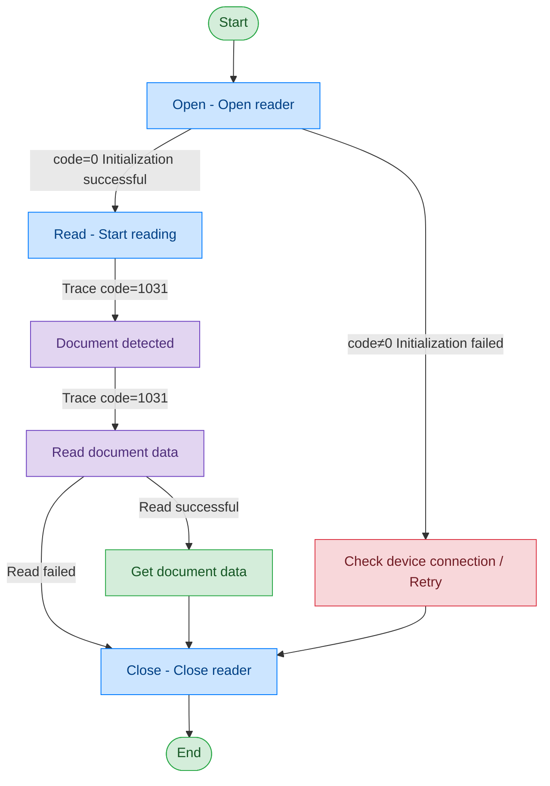

# Passport Reader - THALES

## Document Version

| Version | Date | Changes |
|---------|------|---------|
| V1.0 | 2026-06-16 | Initial version, split from original document |
| V1.1 | 2026-06-17 | Optimized call flow diagram, added exception handling paths |

## Device Information

| Item | Details |
|------|---------|
| Device Type | Passport Reader |
| Brand | THALES |
| DIS Interface Prefix | DEV_Passport |

## Call Flow



> The THALES passport reader's Read command returns detection and reading results through Trace messages (code=1031), rather than carrying data directly in the command response.

## Interface List

### 1. Open Passport Reader (Open)

Through this command, the upper-layer application can open the passport reader for reading passport information.

#### Request Parameters

Request example:

```json
{
  "seq": "DEV_Passport_Open_${uuid}",
  "cmd": "Open",
  "datetime": "20211201130101",
  "posidx": "00",
  "Timeout": "30000",
  "ASYNC": "0"
}
```

Parameter description:

| Parameter Name | Format | Required | Description |
|----------------|--------|----------|-------------|
| seq | string | Yes | DEV_Passport_Open_${uuid} |
| cmd | string | Yes | Fixed as "Open" |
| datetime | string | Yes | Command dispatch time, format: YYYYMMddHHmmss |
| posidx | string | Yes | Station number for multiple devices of the same type; "00"~"99" |
| Timeout | string | Yes | Timeout duration (ms) |
| ASYNC | string | Yes | Asynchronous or not (default 0: synchronous); 0: synchronous; 1: asynchronous |

#### Response Parameters

Response example:

```json
{
  "seq": "DEV_Passport_Open_${uuid}",
  "cmd": "Open",
  "datetime": "20211201130101",
  "code": "0",
  "msg": "Success",
  "suggest": "",
  "posidx": "00",
  "ASYNC": "0"
}
```

Parameter description:

| Parameter Name | Format | Required | Description |
|----------------|--------|----------|-------------|
| seq | string | Yes | Same as the dispatched seq |
| cmd | string | Yes | Same as the dispatched cmd |
| datetime | string | Yes | Command dispatch time, format: YYYYMMddHHmmss |
| code | string | Yes | Refer to general return codes / passport reader return codes |
| msg | string | No | Prompt message |
| suggest | string | No | Processing suggestion |
| posidx | string | Yes | Station number for multiple devices of the same type; "00"~"99" |
| ASYNC | string | Yes | Asynchronous or not; 0: synchronous; 1: asynchronous |

---

### 2. Read Document (Read)

Through this command, the upper-layer application can read document information. The THALES passport reader returns detection and reading results through Trace messages.

#### Request Parameters

Request example:

```json
{
  "seq": "DEV_Passport_Read_${uuid}",
  "cmd": "Read",
  "datetime": "20211201130101",
  "posidx": "00",
  "Timeout": "30000",
  "ASYNC": "0"
}
```

Parameter description:

| Parameter Name | Format | Required | Description |
|----------------|--------|----------|-------------|
| seq | string | Yes | DEV_Passport_Read_${uuid} |
| cmd | string | Yes | Fixed as "Read" |
| datetime | string | Yes | Command dispatch time, format: YYYYMMddHHmmss |
| posidx | string | Yes | Station number for multiple devices of the same type; "00"~"99" |
| Timeout | string | Yes | Timeout duration (ms) |
| ASYNC | string | Yes | Asynchronous or not (recommended as 1); 0: synchronous; 1: asynchronous |

#### Trace Message: Document Detected

When the device detects a document placed, a Trace message is returned:

Response example:

```json
{
  "cmd": "Read",
  "code": "1031",
  "data": {
    "event_type": "1000",
    "tips": "{\"cmd\":\"Read\",\"code\":\"1\",\"DllVersion\":\"\",\"data\":\"\",\"datetime\":\"\",\"msg\":\"Success\",\"posidx\":\"0\",\"seq\":\"\",\"suggest\":\"\"}"
  },
  "datetime": "20260602183327.426",
  "msg": "trace message",
  "posidx": "0",
  "seq": "DEV_Passport_Read_${uuid}"
}
```

Trace message parameter description:

| Parameter Name | Format | Required | Description |
|----------------|--------|----------|-------------|
| seq | string | Yes | Same as the seq of the currently executing command |
| cmd | string | Yes | Same as the cmd of the currently executing command |
| code | string | Yes | Fixed value: "1031" (Trace message) |
| msg | string | Yes | trace message |
| data | object | Yes | Trace data |
| ↳ event_type | string | Yes | Event type; "1000": passport reader event |
| ↳ tips | string | Yes | JSON-formatted detailed information, where code="1" indicates detection in progress |

#### Trace Message: Document Read Result

When document reading is complete, a Trace message is returned:

Response example:

```json
{
  "cmd": "Read",
  "code": "1031",
  "data": {
    "event_type": "1000",
    "tips": "{\"cmd\":\"Read\",\"code\":\"0\",\"DllVersion\":\"\",\"data\":{\"IsChip\":\"1\",\"zjhm\":\"E16353007\",\"zjlx\":\"PASSPORT\",\"ywxm\":\"***\",\"PersoFace\":\"******\"},\"datetime\":\"\",\"msg\":\"Success\",\"posidx\":\"0\",\"seq\":\"\",\"suggest\":\"\"}"
  },
  "datetime": "20260602183330.761",
  "msg": "trace message",
  "posidx": "0",
  "seq": "DEV_Passport_Read_${uuid}"
}
```

Trace message parameter description:

| Parameter Name | Format | Required | Description |
|----------------|--------|----------|-------------|
| seq | string | Yes | Same as the seq of the currently executing command |
| cmd | string | Yes | Same as the cmd of the currently executing command |
| code | string | Yes | Fixed value: "1031" (Trace message) |
| msg | string | Yes | trace message |
| data | object | Yes | Trace data |
| ↳ event_type | string | Yes | Event type; "1000": passport reader event |
| ↳ tips | string | Yes | JSON-formatted detailed data, where code="0" indicates read success, data contains document information |
| ↳↳ data inside tips | object | Yes | Document data |
| ↳↳↳ IsChip | string | Yes | Whether chip is present; "1": chip present |
| ↳↳↳ zjhm | string | Yes | Document number |
| ↳↳↳ zjlx | string | Yes | Document type |
| ↳↳↳ ywxm | string | Yes | Document name |
| ↳↳↳ PersoFace | string | Yes | Document image path |

---

### 3. Close Reader (Close)

This command is used to close the passport reader and release related resources. After a successful call, the device stops working and can no longer perform read operations.

#### Request Parameters

Request example:

```json
{
  "seq": "DEV_Passport_Close_${uuid}",
  "cmd": "Close",
  "datetime": "20211201130101",
  "posidx": "00",
  "ASYNC": "0",
  "Timeout": "30000"
}
```

Parameter description:

| Parameter Name | Format | Required | Description |
|----------------|--------|----------|-------------|
| seq | string | Yes | DEV_Passport_Close_${uuid} |
| cmd | string | Yes | Fixed as "Close" |
| datetime | string | Yes | Command dispatch time, format: YYYYMMddHHmmss |
| posidx | string | Yes | Station number for multiple devices of the same type; "00"~"99" |
| Timeout | string | Yes | Timeout duration (ms) |
| ASYNC | string | Yes | Asynchronous or not (default 0: synchronous); 0: synchronous; 1: asynchronous |

#### Response Parameters

Response example:

```json
{
  "seq": "DEV_Passport_Close_${uuid}",
  "cmd": "Close",
  "datetime": "20211201130102",
  "code": "0",
  "msg": "Success",
  "suggest": "",
  "DllVersion": "V6.24.703.1",
  "posidx": "00",
  "ASYNC": "0"
}
```

Parameter description:

| Parameter Name | Format | Required | Description |
|----------------|--------|----------|-------------|
| seq | string | Yes | Same as the dispatched seq |
| cmd | string | Yes | Same as the dispatched cmd |
| datetime | string | Yes | Command dispatch time, format: YYYYMMddHHmmss |
| code | string | Yes | Refer to general return codes / passport reader return codes |
| msg | string | No | Prompt message |
| suggest | string | No | Suggestion |
| DllVersion | string | No | Peripheral library version number |
| posidx | string | Yes | Station number for multiple devices of the same type; "00"~"99" |
| ASYNC | string | Yes | Asynchronous or not; 0: synchronous; 1: asynchronous |

## Error Codes

| No. | Error Code | Meaning |
|-----|------------|---------|
| 1 | 12700701 | Initialization or configuration file loading illegal |
| 2 | 12700702 | Missing required field or parameter |
| 3 | 12700703 | Illegal field or parameter |
| 4 | 12703001 | Unknown error |
| 5 | 12703002 | SDK not enabled for this specific function |
| 6 | 12703003 | SDK does not support this specific function |
| 7 | 12703004 | SDK not initialized |
| 8 | 12703005 | SDK already initialized, no need to initialize again |
| 9 | 12703006 | SDK initialization error occurred |
| 10 | 12703007 | Device suspended, unable to execute operation |
| 11 | 12703008 | Operation cannot be executed because it is being used by another transaction |
| 12 | 12703009 | Device not connected |
| 13 | 12703030 | Operation timed out |
| 14 | 12703032 | Operation actively cancelled |

> For general return codes (0~1037), please refer to [General Return Codes](../00-通用协议层/06-通用返回码.md)
