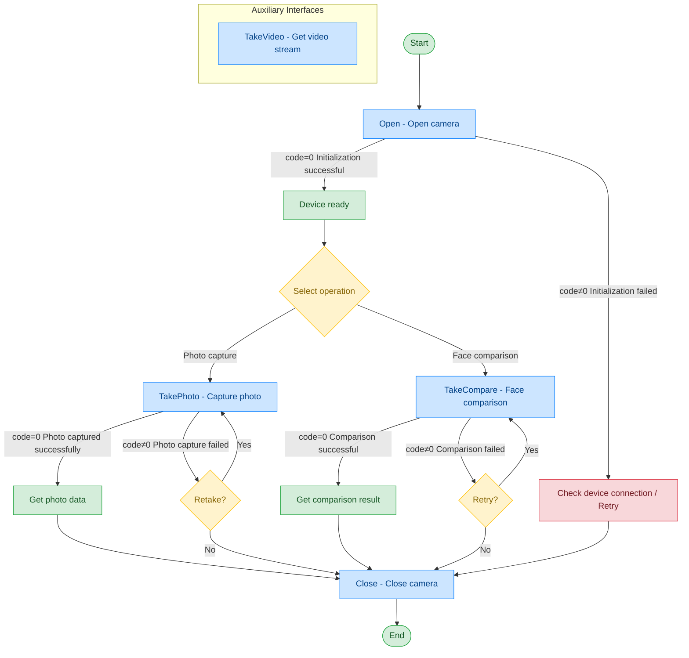

# Camera - Aoni USB Camera

## Document Version

| Version | Date | Changes |
|---------|------|---------|
| V1.0 | 2026-06-16 | Initial version, split from original document |
| V1.1 | 2026-06-17 | Optimized call flow diagram, added exception handling paths |

## Device Information

| Item | Details |
|------|---------|
| Device Type | Camera |
| Brand | Aoni |
| Model | USB Camera |
| DIS Interface Prefix | DEV_Camera |
| Interface Mode | Traditional Camera |

## Call Flow



> For TakeVideo video stream acquisition, please refer to [General Protocol Layer - Video Stream Acquisition](../00-通用协议层/04-视频流获取.md)

## posidx Number Description

| posidx Number | Corresponding Function |
|---------------|----------------------|
| "00" | Camera 00, video address: ws://127.0.0.1:26034/dis/hi_video |
| "01" | Camera 01, video address: ws://127.0.0.1:27034/dis/hi_video |
| "02" | Camera 02, video address: ws://127.0.0.1:28034/dis/hi_video |
| "03" | Camera 03, video address: ws://127.0.0.1:29034/dis/hi_video |
| "04" | Camera 04, video address: ws://127.0.0.1:30034/dis/hi_video |

## Interface List

### 1. Open Camera (Open)

Through this command, the upper-layer application can open the camera for photo or video capture. For video stream acquisition, please refer to General Protocol Layer - Video Stream Acquisition.

#### Request Parameters

Request example:

```json
{
  "seq": "DEV_Camera_Open_${uuid}",
  "cmd": "Open",
  "datetime": "20211201130101",
  "Timeout": "10000",
  "param": {
    "Angel": "",
    "Name": ""
  },
  "posidx": "00",
  "ASYNC": "0"
}
```

Parameter description:

| Parameter Name | Format | Required | Description |
|----------------|--------|----------|-------------|
| seq | string | Yes | DEV_Camera_Open_${uuid} |
| cmd | string | Yes | Fixed as "Open" |
| datetime | string | Yes | Command dispatch time, format: YYYYMMddHHmmss |
| posidx | string | Yes | Station number for multiple devices of the same type; "00"~"99" |
| Timeout | string | Yes | Timeout duration (ms) |
| ASYNC | string | Yes | Asynchronous or not (default 0: synchronous); 0: synchronous; 1: asynchronous |
| param | object | Yes | Request parameter object |
| ↳ Angel | string | No | Image rotation angle; 0: no rotation; 90: rotate 90°; 180: rotate 180°; 270: rotate 270° |
| ↳ Name | string | No | Name of the camera to open |

#### Response Parameters

Response example:

```json
{
  "seq": "DEV_Camera_Open_${uuid}",
  "cmd": "Open",
  "datetime": "20211201130102",
  "code": "0",
  "msg": "Success",
  "suggest": "",
  "data": {
    "video_url": [
      {
        "00": "ws://127.0.0.1:26034/dis/hi_video"
      }
    ]
  }
}
```

Parameter description:

| Parameter Name | Format | Required | Description |
|----------------|--------|----------|-------------|
| seq | string | Yes | Same as the dispatched seq |
| cmd | string | Yes | Same as the dispatched cmd |
| datetime | string | Yes | Command dispatch time, format: YYYYMMddHHmmss |
| code | string | Yes | Refer to general return codes / camera return codes |
| msg | string | No | Prompt message |
| suggest | string | No | Suggestion |
| posidx | string | Yes | Station number for multiple devices of the same type; "00"~"99" |
| data | object | Yes | Returned data |
| ↳ video_url | array | Yes | Data stream address of the opened camera, containing video stream addresses for each camera |

---

### 2. Simple Photo Capture (TakePhoto)

Through this command, the upper-layer application can open the camera to capture a photo.

#### Request Parameters

Request example:

```json
{
  "seq": "DEV_Camera_TakePhoto_${uuid}",
  "cmd": "TakePhoto",
  "datetime": "20211201130101",
  "Timeout": "30000",
  "param": {
    "PersoFace": "D:/data/Camera/TakePhoto.jpg",
    "Angel": "90",
    "cut_type": "0",
    "NoBase64Enable": "1"
  },
  "posidx": "00",
  "ASYNC": "0"
}
```

Parameter description:

| Parameter Name | Format | Required | Description |
|----------------|--------|----------|-------------|
| seq | string | Yes | DEV_Camera_TakePhoto_${uuid} |
| cmd | string | Yes | Fixed as "TakePhoto" |
| datetime | string | Yes | Command dispatch time, format: YYYYMMddHHmmss |
| posidx | string | Yes | Station number for multiple devices of the same type; "00"~"99" |
| Timeout | string | Yes | Timeout duration (ms) |
| ASYNC | string | Yes | Asynchronous or not (default 0: synchronous); 0: synchronous; 1: asynchronous |
| param | object | Yes | Request parameter data object |
| ↳ Angel | string | No | Photo rotation angle; 0: no rotation; 90: clockwise 90°; 180: clockwise 180°; 270: clockwise 270° |
| ↳ PersoFace | string | No | Local path to save the photo; if not specified, the peripheral library will decide |
| ↳ NoBase64Enable | string | No | Whether to return the Base64 data of the image, default is 0; 0: return; 1: do not return |
| ↳ cut_type | string | No | Edge cropping save mode; "0" save without cropping; "1" auto-crop and save; "2" custom crop and save; "4" face save full image; "5" face crop (small portrait); "6" face crop (large portrait) |

#### Response Parameters

Response example:

```json
{
  "seq": "DEV_Camera_TakePhoto_${uuid}",
  "cmd": "TakePhoto",
  "datetime": "20211201130102",
  "code": "0",
  "msg": "Success",
  "data": {
    "PersoFace": "D:/data/Camera/TakePhoto.jpg",
    "FaceData": "data:image/png;base64,iVBORw0KGgoAAAANSUhEUgAAAbMAAAGrCAY"
  },
  "ASYNC": "0"
}
```

Parameter description:

| Parameter Name | Format | Required | Description |
|----------------|--------|----------|-------------|
| seq | string | Yes | Same as the dispatched seq |
| cmd | string | Yes | Same as the dispatched cmd |
| datetime | string | Yes | Command dispatch time, format: YYYYMMddHHmmss |
| code | string | Yes | Refer to general return codes / camera return codes |
| msg | string | No | Prompt message |
| posidx | string | Yes | Station number for multiple devices of the same type; "00"~"99" |
| data | object | Yes | Returned data |
| ↳ PersoFace | string | Yes | Path where the photo is saved, consistent with the PersoFace in the request |
| ↳ FaceData | string | No | Base64 value of the photo binary content |

---

### 3. Comparison Photo Capture (TakeCompare)

Through this command, the upper-layer application can open the camera for comparison photo capture.

#### Request Parameters

Request example:

```json
{
  "seq": "DEV_Camera_TakeCompare_${uuid}",
  "cmd": "TakeCompare",
  "datetime": "20211201130101",
  "Timeout": "30000",
  "param": {
    "PersoFace": "D:/data/Camera/TakePhoto.jpg",
    "SFZFace": "D:/data/Camera/sfz.jpg",
    "SFZFaceData": "data:image/png;base64,iVBORw0KGgoAAAANSUhEUgAAAbMAAAGrCAY",
    "LiveCheckEnable": "1",
    "FaceCompareEnable": "1"
  },
  "posidx": "",
  "ASYNC": "0"
}
```

Parameter description:

| Parameter Name | Format | Required | Description |
|----------------|--------|----------|-------------|
| seq | string | Yes | DEV_Camera_TakeCompare_${uuid} |
| cmd | string | Yes | Fixed as "TakeCompare" |
| datetime | string | Yes | Command dispatch time, format: YYYYMMddHHmmss |
| posidx | string | Yes | Station number for multiple devices of the same type; "00"~"99" |
| Timeout | string | Yes | Timeout duration (ms) |
| ASYNC | string | Yes | Asynchronous or not (default 0: synchronous); 0: synchronous; 1: asynchronous |
| param | object | Yes | Request parameters |
| ↳ SFZFace | string | No | Image path of the comparison photo |
| ↳ PersoFace | string | No | Local path to save the photo; if not specified, the peripheral library will decide |
| ↳ SFZFaceData | string | No | Base64 data of the comparison photo; when both SFZFace and SFZFaceData exist, SFZFaceData is the effective parameter |
| ↳ NoBase64Enable | string | No | Whether to return the Base64 data of the image, returned by default |
| ↳ LocalCompareEnable | string | No | Local comparison enable, default is 1 (enabled) |
| ↳ LiveCheckEnable | string | No | Liveness detection enable; 0: no liveness detection; 1: perform liveness detection |
| ↳ FaceCompareEnable | string | No | Face comparison enable; 0: no face comparison; 1: perform face comparison |
| ↳ SetScore | string | No | Set the comparison score, default is 60, only effective when FaceCompareEnable is 1 |

#### Response Parameters

Response example:

```json
{
  "seq": "DEV_Camera_TakeCompare_${uuid}",
  "cmd": "TakeCompare",
  "datetime": "20211201130102",
  "code": "0",
  "msg": "Success",
  "data": {
    "PersoFace": "D:/data/Camera/TakePhoto.jpg",
    "FaceData": "data:image/png;base64,iVBORw0KGgoAAAANSUhEUgAAAbMAAAGrCAY",
    "Score": "60"
  }
}
```

Parameter description:

| Parameter Name | Format | Required | Description |
|----------------|--------|----------|-------------|
| seq | string | Yes | Same as the dispatched seq |
| cmd | string | Yes | Same as the dispatched cmd |
| datetime | string | Yes | Command dispatch time, format: YYYYMMddHHmmss |
| code | string | Yes | Refer to general return codes / camera return codes |
| msg | string | No | Prompt message |
| posidx | string | Yes | Station number for multiple devices of the same type; "00"~"99" |
| data | object | Yes | Returned data |
| ↳ PersoFace | string | Yes | Path where the photo is saved, consistent with the PersoFace in the request |
| ↳ FaceData | string | No | Base64 value of the photo binary content |
| ↳ Score | string | Yes | Returned comparison score |

---

### 4. Close Camera (Close)

Through this command, the upper-layer application can close the camera and end the capture session.

#### Request Parameters

Request example:

```json
{
  "seq": "DEV_Camera_Close_${uuid}",
  "cmd": "Close",
  "datetime": "20211201130101",
  "posidx": "",
  "Timeout": "30000",
  "ASYNC": "0"
}
```

Parameter description:

| Parameter Name | Format | Required | Description |
|----------------|--------|----------|-------------|
| seq | string | Yes | DEV_Camera_Close_${uuid} |
| cmd | string | Yes | Fixed as "Close" |
| datetime | string | Yes | Command dispatch time, format: YYYYMMddHHmmss |
| posidx | string | Yes | Station number for multiple devices of the same type; "00"~"99" |
| Timeout | string | Yes | Timeout duration (ms) |
| ASYNC | string | Yes | Asynchronous or not (default 0: synchronous); 0: synchronous; 1: asynchronous |

#### Response Parameters

Response example:

```json
{
  "seq": "DEV_Camera_Close_${uuid}",
  "cmd": "Close",
  "datetime": "20211201130102",
  "code": "0",
  "msg": "Success",
  "suggest": "",
  "posidx": "00"
}
```

Parameter description:

| Parameter Name | Format | Required | Description |
|----------------|--------|----------|-------------|
| seq | string | Yes | Same as the dispatched seq |
| cmd | string | Yes | Same as the dispatched cmd |
| datetime | string | Yes | Command dispatch time, format: YYYYMMddHHmmss |
| code | string | Yes | Refer to general return codes / camera return codes |
| msg | string | No | Prompt message |
| suggest | string | No | Suggestion |
| posidx | string | Yes | Station number for multiple devices of the same type; "00"~"99" |

## Error Codes

| No. | Error Code | Meaning |
|-----|------------|---------|
| 1 | 15100001 | Timeout |
| 2 | 15100003 | Invalid pointer |
| 3 | 15100004 | This service function is not supported |
| 4 | 15100005 | Insufficient memory |
| 5 | 15100006 | Thread recovery failed |
| 6 | 15100007 | Thread creation failed |
| 7 | 15100008 | Event creation failed |
| 8 | 15100009 | Command execution failed |
| 9 | 15100010 | Command execution timeout |
| 10 | 99999999 | Unknown error |
| 11 | 15100101 | Device not opened |
| 12 | 15100107 | Device busy |
| 13 | 15100109 | Device already opened and initialized |
| 14 | 15100110 | Device does not exist |
| 15 | 15100113 | Device communication failed |
| 16 | 15100114 | Device operation failed |
| 17 | 15100115 | Device not supported |
| 18 | 15100116 | Invalid device handle |
| 19 | 15100117 | Initialization failed |
| 20 | 15100201 | File open failed |
| 21 | 15100203 | File does not exist |
| 22 | 15100206 | File write error |
| 23 | 15100207 | File read error |
| 24 | 15100208 | File save error |
| 25 | 15100210 | Directory does not exist |
| 26 | 15100211 | Directory creation failed |
| 27 | 15100302 | SDK API execution failed |
| 28 | 15100303 | SDK interface initialization failed |
| 29 | 15100304 | SDK file does not exist |
| 30 | 15100308 | SDK currently used function returned error |
| 31 | 15100309 | SDK currently used function is incompatible with hardware |
| 32 | 15100701 | Initialization or configuration file loading illegal |
| 33 | 15100702 | Missing required field or parameter |
| 34 | 15100703 | Illegal field or parameter |
| 35 | 15103001 | Face comparison file does not exist |
| 36 | 15103002 | Face comparison HTTP address illegal |
| 37 | 15103003 | Liveness detection failed |
| 38 | 15103004 | Face comparison failed |
| 39 | 15103005 | Feature value extraction failed |

> For general return codes (0~1037), please refer to [General Return Codes](../00-通用协议层/06-通用返回码.md)
