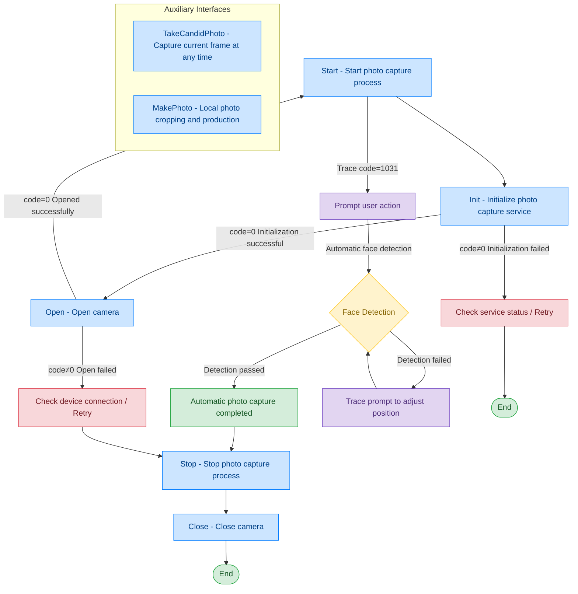

# Camera - TRSRT PhotoCapturer

## Document Version

| Version | Date | Changes |
|---------|------|---------|
| V1.0 | 2026-06-16 | Initial version, split from original document |
| V1.1 | 2026-06-17 | Optimized call flow diagram, added exception handling paths |

## Device Information

| Item | Details |
|------|---------|
| Device Type | Camera (Self-service Photo Capture Service) |
| DIS Interface Prefix | TRSRT_PhotoCapturer |
| Interface Mode | Self-service Photo Capture Service |

## Overview

Unlike traditional cameras (DEV_Camera), the self-service photo capture service provides a highly encapsulated photo capture workflow: automatic face detection, eye positioning, compliance verification, and automatic photo capture. The upper-layer application does not need to manually control the timing of photo capture; the service automatically completes the entire photo capture process.

## Call Flow



## Interface List

### 1. Initialize Photo Capture Service (Init)

#### Request Parameters

Request example:

```json
{
  "seq": "TRSRT_PhotoCapturer_Init_${uuid}",
  "cmd": "Init",
  "datetime": "20211201130101",
  "posidx": "00",
  "timeout": "30000",
  "async": "0"
}
```

Parameter description:

| Parameter Name | Format | Required | Description |
|----------------|--------|----------|-------------|
| seq | string | Yes | TRSRT_PhotoCapturer_Init_${uuid} |
| cmd | string | Yes | Fixed as "Init" |
| datetime | string | Yes | Command dispatch time, format: YYYYMMddHHmmss |
| posidx | string | Yes | Station number for multiple devices of the same type; "00"~"99" |
| timeout | string | Yes | Timeout duration (ms) |
| async | string | Yes | Asynchronous or not (default 0: synchronous); 0: synchronous; 1: asynchronous |

#### Response Parameters

Response example:

```json
{
  "seq": "TRSRT_PhotoCapturer_Init_${uuid}",
  "cmd": "Init",
  "datetime": "20211201130102",
  "code": "0",
  "msg": "Success",
  "posidx": "00",
  "async": "0"
}
```

Parameter description:

| Parameter Name | Format | Required | Description |
|----------------|--------|----------|-------------|
| seq | string | Yes | Same as the dispatched seq |
| cmd | string | Yes | Same as the dispatched cmd |
| datetime | string | Yes | Command dispatch time, format: YYYYMMddHHmmss |
| code | string | Yes | Refer to general return codes / camera return codes |
| msg | string | No | Prompt message |
| posidx | string | Yes | Station number for multiple devices of the same type; "00"~"99" |

---

### 2. Open Photo Capture Service (Open)

Called before each photo capture to start the video stream service. For video stream acquisition, please refer to General Protocol Layer - Video Stream Acquisition.

#### Request Parameters

Request example:

```json
{
  "seq": "TRSRT_PhotoCapturer_Open_${uuid}",
  "cmd": "Open",
  "datetime": "20211201130101",
  "posidx": "00",
  "timeout": "30000",
  "async": "0"
}
```

Parameter description:

| Parameter Name | Format | Required | Description |
|----------------|--------|----------|-------------|
| seq | string | Yes | TRSRT_PhotoCapturer_Open_${uuid} |
| cmd | string | Yes | Fixed as "Open" |
| datetime | string | Yes | Command dispatch time, format: YYYYMMddHHmmss |
| posidx | string | Yes | Station number for multiple devices of the same type; "00"~"99" |
| timeout | string | Yes | Timeout duration (ms) |
| async | string | Yes | Asynchronous or not (default 0: synchronous); 0: synchronous; 1: asynchronous |

#### Response Parameters

Response example:

```json
{
  "seq": "TRSRT_PhotoCapturer_Open_${uuid}",
  "cmd": "Open",
  "datetime": "20211201130102",
  "code": "0",
  "msg": "success",
  "posidx": "00",
  "async": "0",
  "data": {
    "video_url": [
      {
        "00": ""
      }
    ]
  }
}
```

Parameter description:

| Parameter Name | Format | Required | Description |
|----------------|--------|----------|-------------|
| seq | string | Yes | Same as the dispatched seq |
| cmd | string | Yes | Same as the dispatched cmd |
| datetime | string | Yes | Command dispatch time, format: YYYYMMddHHmmss |
| code | string | Yes | Refer to general return codes / camera return codes |
| msg | string | No | Prompt message |
| posidx | string | Yes | Station number for multiple devices of the same type; "00"~"99" |
| data | object | No | Returned data |
| ↳ video_url | array | Yes | Camera video stream address |

---

### 3. Start Photo Capture (Start)

Through this command, the upper-layer application can start the camera and execute the face positioning and photo capture process. The specific process is as follows: start the camera video stream, continuously capture frames and perform face detection; if no face is recognized, polling continues. After a face is detected, eye key points are extracted and eye position compliance is verified; if the threshold requirements are met, a photo is automatically captured and the process terminates; if not, the detection loop continues.

#### Request Parameters

Request example:

```json
{
  "seq": "TRSRT_PhotoCapturer_Start_${uuid}",
  "cmd": "Start",
  "datetime": "20211201130101",
  "timeout": "30000",
  "param": {
    "photoType": "",
    "language": ""
  },
  "posidx": "00",
  "async": "0"
}
```

Parameter description:

| Parameter Name | Format | Required | Description |
|----------------|--------|----------|-------------|
| seq | string | Yes | TRSRT_PhotoCapturer_Start_${uuid} |
| cmd | string | Yes | Fixed as "Start" |
| datetime | string | Yes | Command dispatch time, format: YYYYMMddHHmmss |
| posidx | string | Yes | Station number for multiple devices of the same type; "00"~"99" |
| timeout | string | Yes | Timeout duration (ms) |
| async | string | Yes | Asynchronous or not (default 0: synchronous); 0: synchronous; 1: asynchronous |
| param | object | No | Parameter object |
| ↳ photoType | string | No | Photo type |
| ↳ language | string | No | Language setting |

#### Response Parameters

Response example:

```json
{
  "seq": "TRSRT_PhotoCapturer_Start_${uuid}",
  "cmd": "Start",
  "datetime": "20211201130102",
  "code": "0",
  "msg": "Success",
  "suggest": "",
  "data": {
    "type": "CaptureFinish",
    "Result": "true",
    "msg": "",
    "photos": [
      {
        "passed": "true",
        "photoPath_Org": "D:\\1.jpg",
        "photoPath": "D:\\2.jpg",
        "nopassReason": "The head is relatively wide",
        "needChangeClothes": "false"
      }
    ]
  }
}
```

Parameter description:

| Parameter Name | Format | Required | Description |
|----------------|--------|----------|-------------|
| seq | string | Yes | Same as the dispatched seq |
| cmd | string | Yes | Same as the dispatched cmd |
| datetime | string | Yes | Command dispatch time, format: YYYYMMddHHmmss |
| code | string | Yes | Refer to general return codes / camera return codes |
| msg | string | No | Prompt message |
| suggest | string | No | Suggestion |
| posidx | string | Yes | Station number for multiple devices of the same type; "00"~"99" |
| data | object | No | Returned data |
| ↳ type | string | Yes | Result type; "CaptureFinish": photo capture completed |
| ↳ Result | string | Yes | Photo capture result; "true": success; "false": failure |
| ↳ photos | array | Yes | Photo result array |
| ↳↳ passed | string | Yes | Whether qualified; "true": qualified; "false": not qualified |
| ↳↳ photoPath_Org | string | Yes | Original photo path |
| ↳↳ photoPath | string | Yes | Cropped photo path |
| ↳↳ nopassReason | string | No | Reason for not passing |
| ↳↳ needChangeClothes | string | No | Whether clothes need to be changed; "true": yes; "false": no |

---

### 4. Photo Capture Trace Messages

During the self-service photo capture process, interactive Trace messages are returned to prompt the user to perform corresponding actions.

Response example:

```json
{
  "seq": "TRSRT_PhotoCapturer_Start_xxxxxxxxxxx",
  "cmd": "Start",
  "datetime": "20211201130102",
  "code": "1031",
  "msg": "trace message",
  "data": {
    "type": "NotifyMessage",
    "msg": "Please take off your glasses",
    "imgPath": "d:/1.jpg"
  }
}
```

Trace message parameter description:

| Parameter Name | Format | Required | Description |
|----------------|--------|----------|-------------|
| seq | string | Yes | Same as the seq of the currently executing command |
| cmd | string | Yes | Same as the cmd of the currently executing command |
| code | string | Yes | Fixed value: "1031" (Trace message) |
| msg | string | Yes | trace message |
| data | object | Yes | Trace data |
| ↳ type | string | Yes | Message type; "NotifyMessage": notification message |
| ↳ msg | string | Yes | Prompt message (e.g. "Please take off your glasses") |
| ↳ imgPath | string | No | Current frame screenshot path |

---

### 5. Stop Photo Capture (Stop)

Can be actively stopped during the photo capture process.

#### Request Parameters

Request example:

```json
{
  "seq": "TRSRT_PhotoCapturer_Stop_${uuid}",
  "cmd": "Stop",
  "datetime": "20211201130101",
  "posidx": "00",
  "timeout": "30000",
  "async": "0"
}
```

Parameter description:

| Parameter Name | Format | Required | Description |
|----------------|--------|----------|-------------|
| seq | string | Yes | TRSRT_PhotoCapturer_Stop_${uuid} |
| cmd | string | Yes | Fixed as "Stop" |
| datetime | string | Yes | Command dispatch time, format: YYYYMMddHHmmss |
| posidx | string | Yes | Station number for multiple devices of the same type; "00"~"99" |
| timeout | string | Yes | Timeout duration (ms) |
| async | string | Yes | Asynchronous or not (default 0: synchronous); 0: synchronous; 1: asynchronous |

#### Response Parameters

Response example:

```json
{
  "seq": "TRSRT_PhotoCapturer_Stop_${uuid}",
  "cmd": "Stop",
  "datetime": "20211201130102",
  "code": "0",
  "msg": "Success",
  "suggest": "",
  "posidx": "00"
}
```

Parameter description:

| Parameter Name | Format | Required | Description |
|----------------|--------|----------|-------------|
| seq | string | Yes | Same as the dispatched seq |
| cmd | string | Yes | Same as the dispatched cmd |
| datetime | string | Yes | Command dispatch time, format: YYYYMMddHHmmss |
| code | string | Yes | Refer to general return codes / camera return codes |
| msg | string | No | Prompt message |
| suggest | string | No | Suggestion |
| posidx | string | Yes | Station number for multiple devices of the same type; "00"~"99" |

---

### 6. Candid Photo Capture (TakeCandidPhoto)

During the photo capture process, the current frame can be captured at any time.

#### Request Parameters

Request example:

```json
{
  "seq": "TRSRT_PhotoCapturer_TakeCandidPhoto_${uuid}",
  "cmd": "TakeCandidPhoto",
  "datetime": "20211201130101",
  "posidx": "00",
  "timeout": "30000",
  "async": "0"
}
```

Parameter description:

| Parameter Name | Format | Required | Description |
|----------------|--------|----------|-------------|
| seq | string | Yes | TRSRT_PhotoCapturer_TakeCandidPhoto_${uuid} |
| cmd | string | Yes | Fixed as "TakeCandidPhoto" |
| datetime | string | Yes | Command dispatch time, format: YYYYMMddHHmmss |
| posidx | string | Yes | Station number for multiple devices of the same type; "00"~"99" |
| timeout | string | Yes | Timeout duration (ms) |
| async | string | Yes | Asynchronous or not (default 0: synchronous); 0: synchronous; 1: asynchronous |

#### Response Parameters

Response example:

```json
{
  "seq": "DEV_PhotoCapturer_TakeCandidPhoto_${uuid}",
  "cmd": "TakeCandidPhoto",
  "datetime": "20211201130102",
  "code": "0",
  "msg": "Success",
  "suggest": "",
  "posidx": "00"
}
```

Parameter description:

| Parameter Name | Format | Required | Description |
|----------------|--------|----------|-------------|
| seq | string | Yes | Same as the dispatched seq |
| cmd | string | Yes | Same as the dispatched cmd |
| datetime | string | Yes | Command dispatch time, format: YYYYMMddHHmmss |
| code | string | Yes | Refer to general return codes / camera return codes |
| msg | string | No | Prompt message |
| suggest | string | No | Suggestion |
| posidx | string | Yes | Station number for multiple devices of the same type; "00"~"99" |

---

### 7. Local Photo Cropping and Production (MakePhoto)

Perform image processing on individual photos.

#### Request Parameters

Request example:

```json
{
  "seq": "TRSRT_PhotoCapturer_MakePhoto_${uuid}",
  "cmd": "MakePhoto",
  "datetime": "20211201130101",
  "param": {
    "photoType": "IDCard",
    "photoPath": "D:\\xxxxxxxxx.jpg"
  },
  "posidx": "00",
  "timeout": "30000",
  "async": "0"
}
```

Parameter description:

| Parameter Name | Format | Required | Description |
|----------------|--------|----------|-------------|
| seq | string | Yes | TRSRT_PhotoCapturer_MakePhoto_${uuid} |
| cmd | string | Yes | Fixed as "MakePhoto" |
| datetime | string | Yes | Command dispatch time, format: YYYYMMddHHmmss |
| posidx | string | Yes | Station number for multiple devices of the same type; "00"~"99" |
| timeout | string | Yes | Timeout duration (ms) |
| async | string | Yes | Asynchronous or not (default 0: synchronous); 0: synchronous; 1: asynchronous |
| param | object | Yes | Parameter object |
| ↳ photoType | string | Yes | Photo type; e.g. "IDCard" |
| ↳ photoPath | string | Yes | Photo path to be processed |

#### Response Parameters

Response example:

```json
{
  "seq": "TRSRT_PhotoCapturer_MakePhoto_${uuid}",
  "cmd": "MakePhoto",
  "datetime": "20211201130102",
  "code": "0",
  "msg": "Success",
  "suggest": "",
  "data": {
    "type": "MakePhotoResult",
    "photos": [
      {
        "passed": "true",
        "photoPath_Org": "D:\\1.jpg",
        "photoPath": "D:\\2.jpg",
        "nopassReason": "The head is relatively wide",
        "needChangeClothes": "false"
      }
    ]
  }
}
```

Parameter description:

| Parameter Name | Format | Required | Description |
|----------------|--------|----------|-------------|
| seq | string | Yes | Same as the dispatched seq |
| cmd | string | Yes | Same as the dispatched cmd |
| datetime | string | Yes | Command dispatch time, format: YYYYMMddHHmmss |
| code | string | Yes | Refer to general return codes / camera return codes |
| msg | string | No | Prompt message |
| suggest | string | No | Suggestion |
| data | object | No | Returned data |
| ↳ type | string | Yes | Result type; "MakePhotoResult": production result |
| ↳ photos | array | Yes | Photo result array (same structure as the photos returned by Start) |

## Error Codes

| No. | Error Code | Meaning |
|-----|------------|---------|
| 1 | 15100001 | Timeout |
| 2 | 15100003 | Invalid pointer |
| 3 | 15100004 | This service function is not supported |
| 4 | 15100005 | Insufficient memory |
| 5 | 15100006 | Thread recovery failed |
| 6 | 15100007 | Thread creation failed |
| 7 | 15100008 | Event creation failed |
| 8 | 15100009 | Command execution failed |
| 9 | 15100010 | Command execution timeout |
| 10 | 99999999 | Unknown error |
| 11 | 15100101 | Device not opened |
| 12 | 15100107 | Device busy |
| 13 | 15100109 | Device already opened and initialized |
| 14 | 15100110 | Device does not exist |
| 15 | 15100113 | Device communication failed |
| 16 | 15100114 | Device operation failed |
| 17 | 15100115 | Device not supported |
| 18 | 15100116 | Invalid device handle |
| 19 | 15100117 | Initialization failed |
| 20 | 15100201 | File open failed |
| 21 | 15100203 | File does not exist |
| 22 | 15100206 | File write error |
| 23 | 15100207 | File read error |
| 24 | 15100208 | File save error |
| 25 | 15100210 | Directory does not exist |
| 26 | 15100211 | Directory creation failed |
| 27 | 15100302 | SDK API execution failed |
| 28 | 15100303 | SDK interface initialization failed |
| 29 | 15100304 | SDK file does not exist |
| 30 | 15100308 | SDK currently used function returned error |
| 31 | 15100309 | SDK currently used function is incompatible with hardware |
| 32 | 15100701 | Initialization or configuration file loading illegal |
| 33 | 15100702 | Missing required field or parameter |
| 34 | 15100703 | Illegal field or parameter |
| 35 | 15103001 | Face comparison file does not exist |
| 36 | 15103002 | Face comparison HTTP address illegal |
| 37 | 15103003 | Liveness detection failed |
| 38 | 15103004 | Face comparison failed |
| 39 | 15103005 | Feature value extraction failed |

> For general return codes (0~1037), please refer to [General Return Codes](../00-Common-Protocol/06-Common-Return-Codes.md)
