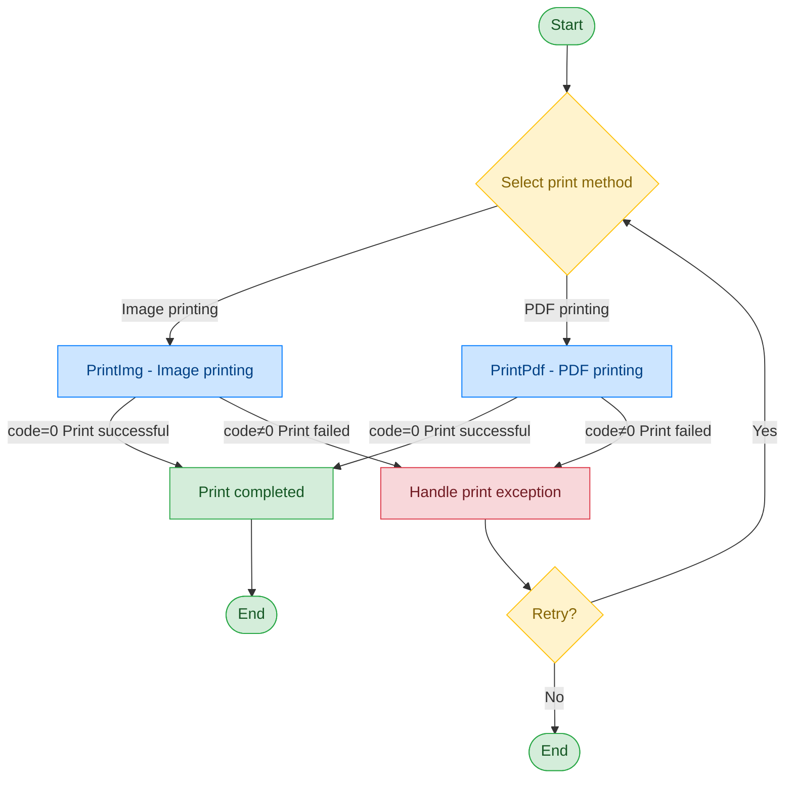

# Receipt Printer - MS-FPT301

## Document Version

| Version | Date | Changes |
|---------|------|---------|
| V1.0 | 2026-06-16 | Initial version, split from original document |
| V1.1 | 2026-06-17 | Optimized call flow diagram, added exception handling paths |

## Device Information

| Item | Details |
|------|---------|
| Device Type | Receipt Printer |
| Brand | Meisong |
| Model | MS-FPT301 |
| DIS Interface Prefix | DEV_SlipPrinter |

## Call Flow



> The print module uses direct invocation and does not involve device open and close operations.

## Interface List

### 1. Image Printing (PrintImg)

Through this command, the upper-layer application can use the receipt printer for image printing.

#### Request Parameters

Request example:

```json
{
  "seq": "DEV_SlipPrinter_PrintImg_${uuid}",
  "cmd": "PrintImg",
  "datetime": "20211201130101",
  "timeout": "30000",
  "posidx": "00",
  "async": "0",
  "param": {
    "ImagePath": "D:/data/SlipPrinter/test.bmp"
  }
}
```

Parameter description:

| Parameter Name | Format | Required | Description |
|----------------|--------|----------|-------------|
| seq | string | Yes | DEV_SlipPrinter_PrintImg_${uuid} |
| cmd | string | Yes | Fixed as "PrintImg" |
| datetime | string | Yes | Command dispatch time, format: YYYYMMddHHmmss |
| posidx | string | Yes | Station number for multiple devices of the same type; "00"~"99" |
| timeout | string | Yes | Timeout duration (ms) |
| async | string | Yes | Asynchronous or not (default 0: synchronous); 0: synchronous; 1: asynchronous |
| param | Object | Yes | Parameter object |
| ↳ ImagePath | string | Yes | Image path |

#### Response Parameters

Response example:

```json
{
  "seq": "DEV_SlipPrinter_PrintImg_${uuid}",
  "cmd": "PrintImg",
  "datetime": "20211201130102",
  "code": "0",
  "msg": "success",
  "posidx": "00"
}
```

Parameter description:

| Parameter Name | Format | Required | Description |
|----------------|--------|----------|-------------|
| seq | string | Yes | Same as the dispatched seq |
| cmd | string | Yes | Same as the dispatched cmd |
| datetime | string | Yes | Command dispatch time, format: YYYYMMddHHmmss |
| code | string | Yes | Refer to general return codes / receipt printer error codes |
| msg | string | No | Refer to general return codes / receipt printer error codes |
| posidx | string | Yes | Same as the requested posidx |

---

### 2. PDF Printing (PrintPdf)

Through this command, the upper-layer application can use the receipt printer for PDF printing.

#### Request Parameters

Request example:

```json
{
  "seq": "DEV_SlipPrinter_PrintPdf_${uuid}",
  "cmd": "PrintPdf",
  "datetime": "20211201130101",
  "timeout": "30000",
  "posidx": "00",
  "param": {
    "PdfPath": "D:/data/SlipPrinter/xxx.pdf",
    "Width": "80",
    "Height": "0"
  }
}
```

Parameter description:

| Parameter Name | Format | Required | Description |
|----------------|--------|----------|-------------|
| seq | string | Yes | DEV_SlipPrinter_PrintPdf_${uuid} |
| cmd | string | Yes | Fixed as "PrintPdf" |
| datetime | string | Yes | Command dispatch time, format: YYYYMMddHHmmss |
| posidx | string | Yes | Station number for multiple devices of the same type; "00"~"99" |
| timeout | string | Yes | Timeout duration (ms) |
| async | string | Yes | Asynchronous or not (default 0: synchronous); 0: synchronous; 1: asynchronous |
| param | Object | Yes | Parameter object |
| ↳ PdfPath | string | Yes | File path |
| ↳ Width | string | No | Default 80, unit: mm |
| ↳ Height | string | No | Default parameter 0, SDK performs auto-adaptation |

#### Response Parameters

Response example:

```json
{
  "seq": "DEV_SlipPrinter_PrintPdf_${uuid}",
  "cmd": "PrintPdf",
  "datetime": "20211201130102",
  "code": "0",
  "msg": "success",
  "suggest": "",
  "posidx": "00"
}
```

Parameter description:

| Parameter Name | Format | Required | Description |
|----------------|--------|----------|-------------|
| seq | string | Yes | Same as the dispatched seq |
| cmd | string | Yes | Same as the dispatched cmd |
| datetime | string | Yes | Command dispatch time, format: YYYYMMddHHmmss |
| code | string | Yes | Refer to general return codes / receipt printer error codes |
| msg | string | No | Refer to general return codes / receipt printer error codes |
| suggest | string | No | Suggestion |
| posidx | string | Yes | Same as the requested posidx |

## Error Codes

| No. | Error Code | Meaning |
|-----|------------|---------|
| 1 | 99999901 | Active cancel |
| 2 | 14203001 | Device not opened |
| 3 | 14203002 | Dispatched parameter error |
| 4 | 14203003 | ECL template to image conversion failed |
| 5 | 14203004 | Image loading failed |
| 6 | 14203005 | Unsupported command |
| 7 | 14203006 | Failed to get printer status |
| 8 | 14203007 | SDK returned failure |
| 9 | 14203008 | SDK loading failed |
| 10 | 14203009 | Printer status abnormal |
| 11 | 14299601 | Printer offline |
| 12 | 14299602 | Printer paper jam |
| 13 | 14299603 | Printer out of paper |
| 14 | 14299604 | Paper running low |
| 15 | 14299605 | Unknown error |
| 16 | 14299606 | Printer cover open |
| 17 | 14299607 | Printer overheated |
| 18 | 14299608 | Cutter error |

> For general return codes (0~1037), please refer to [General Return Codes](../00-Common-Protocol/06-Common-Return-Codes.md)
