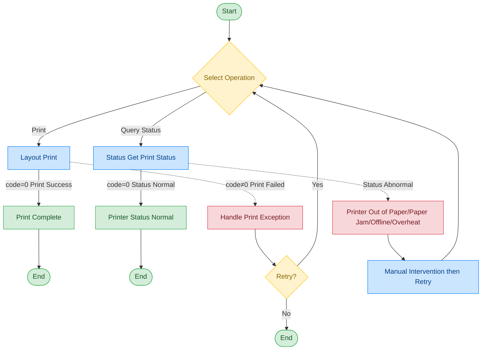

# A4 Printer - HP LaserJet Pro 4004

## Document Version

| Version | Date | Changes |
|------|------|----------|
| V1.0 | 2026-06-16 | Initial version, split from original document |

## Device Information

| Item | Content |
|------|------|
| Device Type | A4 Printer |
| Brand | HP |
| Model | LaserJet Pro 4004 |
| DIS Interface Prefix | DEV_Printer |

## Call Flow



> During the printing process, the print status is monitored in real time. If an abnormal result is returned such as paper jam or out of paper, manual intervention is required; you can also query the printer status before use to check whether it is in a normal working state.

## Interface List

### 1. Print (Layout)

Through this command, the upper-layer application can use the A4 printer to print.

#### Request Parameters

Request Example:

```json
{
  "seq": "DEV_Printer_Layout_${uuid}",
  "timeout": "60000",
  "cmd": "Layout",
  "datetime": "20230320092608",
  "posidx": "00",
  "async": "0",
  "param": {
    "Source": "2",
    "PrintName": "Microsoft Print to PDF",
    "Url1": "XXXX",
    "Url2": "XXXX",
    "DocType": "2",
    "Copy": "1",
    "Orientation": "Landscape",
    "PageSize": "A4",
    "PageMargins": "6,6,6,6",
    "Sided": "DuplexLongSide"
  }
}
```

Parameter Description:

| Parameter Name | Format | Required | Description |
|----------|------|----------|----------|
| seq | string | Yes | DEV_Printer_Layout_${uuid} |
| cmd | string | Yes | Fixed as "Layout" |
| datetime | string | Yes | Command dispatch time, format: YYYYMMddHHmmss |
| posidx | string | Yes | Station number for multiple devices of the same type; "00"~"99" |
| timeout | string | Yes | Timeout (ms) |
| async | string | Yes | Async flag (default 0: synchronous); 0: synchronous; 1: asynchronous |
| param | object | Yes | Parameter object |
| ↳ Source | string | Yes | Print content source |
| ↳ PrintName | string | No | Printer name |
| ↳ Url1 | string | No | Print address 1 |
| ↳ Url2 | string | No | Print address 2 |
| ↳ DocType | string | No | Document type |
| ↳ Copy | string | No | Number of copies |
| ↳ Orientation | string | No | Print orientation; Landscape: landscape; Portrait: portrait |
| ↳ PageSize | string | No | Paper size; e.g. A4 |
| ↳ PageMargins | string | No | Page margins; format: "top,bottom,left,right" |
| ↳ Sided | string | No | Single/double-sided printing; DuplexLongSide: duplex long edge; Simplex: single-sided |

#### Return Parameters

Return Example:

```json
{
  "seq": "DEV_Printer_Layout_${uuid}",
  "cmd": "Layout",
  "datetime": "20211201130102",
  "code": "0",
  "msg": "Success",
  "posidx": "00",
  "Copy": "1"
}
```

Parameter Description:

| Parameter Name | Format | Required | Description |
|----------|------|----------|----------|
| seq | string | Yes | Same as the dispatched seq |
| cmd | string | Yes | Same as the dispatched cmd |
| datetime | string | Yes | Command dispatch time, format: YYYYMMddHHmmss |
| code | string | Yes | Refer to General Return Codes / A4 Printer Error Codes |
| msg | string | No | Refer to General Return Codes / A4 Printer Error Codes |
| posidx | string | Yes | Station number for multiple devices of the same type; "00"~"99" |
| Copy | string | No | Number of copies |

---

### 2. Get Print Status (Status)

Through this command, the upper-layer application can query the print status of the A4 printer.

#### Request Parameters

Request Example:

```json
{
  "seq": "DEV_Printer_Status_${uuid}",
  "cmd": "Status",
  "datetime": "20211201130101",
  "posidx": "00",
  "async": "0",
  "timeout": "30000"
}
```

Parameter Description:

| Parameter Name | Format | Required | Description |
|----------|------|----------|----------|
| seq | string | Yes | DEV_Printer_Status_${uuid} |
| cmd | string | Yes | Fixed as "Status" |
| datetime | string | Yes | Command dispatch time, format: YYYYMMddHHmmss |
| posidx | string | Yes | Station number for multiple devices of the same type; "00"~"99" |
| timeout | string | Yes | Timeout (ms) |
| async | string | Yes | Async flag (default 0: synchronous); 0: synchronous; 1: asynchronous |

#### Return Parameters

Return Example:

```json
{
  "cmd": "Status",
  "code": "0",
  "data": [
    {
      "HP LaserJet Pro 4004": {
        "PrinterStatus": "3",
        "TonerStatus": "1",
        "PaperStatus": "1",
        "Toner": "80",
        "Life": "90",
        "Black": "80",
        "Color": "0"
      }
    }
  ]
}
```

Parameter Description:

| Parameter Name | Format | Required | Description |
|----------|------|----------|----------|
| seq | string | Yes | Same as the dispatched seq |
| cmd | string | Yes | Same as the dispatched cmd |
| datetime | string | Yes | Command dispatch time, format: YYYYMMddHHmmss |
| code | string | Yes | Refer to General Return Codes / A4 Printer Error Codes |
| data | array | No | Printer status list |
| ↳ [0].PrinterStatus | string | No | Printer status; 0: idle; 3: idle (no job); 4: printing; 5: out of paper; 6: paper jam; 7: paper low |
| ↳ [0].TonerStatus | string | No | Toner status |
| ↳ [0].PaperStatus | string | No | Paper status |
| ↳ [0].Toner | string | No | Toner level |
| ↳ [0].Life | string | No | Life |
| ↳ [0].Black | string | No | Black toner |
| ↳ [0].Color | string | No | Color toner |

## Error Codes

| No. | Error Code | Meaning |
|------|--------|------|
| 1 | 14731002 | Device self-fault |
| 2 | 14731203 | Failed to open file descriptor |
| 3 | 14734001 | Missing required parameter |
| 4 | 14734002 | Invalid field or parameter |
| 5 | 14734004 | Invalid JSON format |
| 6 | 14734202 | File inaccessible |
| 7 | 14739003 | Current task failed |
| 8 | 14739006 | Failed to load image |
| 9 | 14739007 | Failed to print image |
| 10 | 14739008 | Printer out of paper |

> For general return codes (0~1037), please refer to [General Return Codes](../00-通用协议层/06-通用返回码.md)
