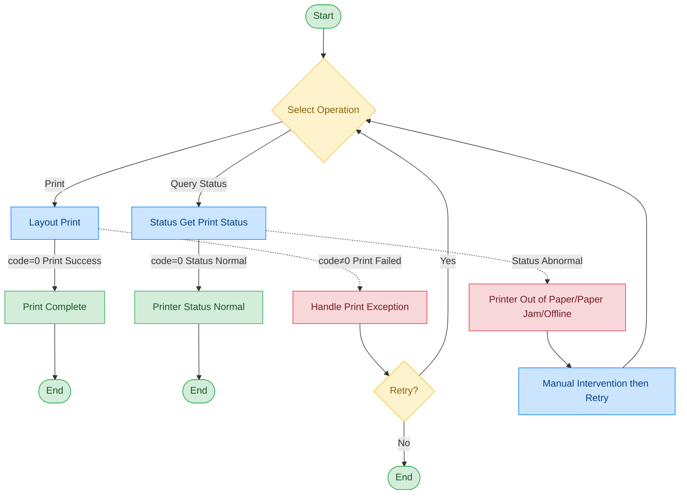

# A4 Printer - Lexmark MS439DN

## Document Version

| Version | Date | Changes |
|------|------|----------|
| V1.0 | 2026-06-16 | Initial version, split from original document |

## Device Information

| Item | Content |
|------|------|
| Device Type | A4 Printer |
| Brand | Lexmark |
| Model | MS439DN |
| DIS Interface Prefix | DEV_Printer |

## Call Flow



> Note: The A4 printer interface has been removed in some versions. Please confirm availability based on the actual project configuration.

## Interface List

### 1. Print (Layout)

#### Request Parameters

Request Example:

```json
{
  "seq": "DEV_Printer_Layout_${uuid}",
  "cmd": "Layout",
  "datetime": "20211201130101",
  "posidx": "00",
  "timeout": "30000",
  "async": "0",
  "param": {
    "source": "",
    "PrintName": "",
    "Url1": "",
    "Url2": "",
    "DocType": "",
    "Copy": "1",
    "Orientation": "",
    "PageSize": "",
    "PageMargins": "",
    "Sided": ""
  }
}
```

Parameter Description:

| Parameter Name | Format | Required | Description |
|----------|------|----------|----------|
| seq | string | Yes | Request serial number: format is business identifier prefix + underscore + unique ID |
| cmd | string | Yes | For this command, fixed as "Layout" |
| datetime | string | Yes | Command dispatch time, format: YYYYMMddHHmmss |
| posidx | string | Yes | Station number for multiple devices of the same type; "00"~"99" |
| timeout | string | Yes | Timeout (ms) |
| async | string | Yes | Async flag (default 0: synchronous); 0: synchronous; 1: asynchronous |
| param | object | Yes | Parameter object |
| ↳ source | string | Yes | Print content source |
| ↳ PrintName | string | No | Printer name |
| ↳ Url1 | string | No | Print address 1 |
| ↳ Url2 | string | No | Print address 2 |
| ↳ DocType | string | No | Document type |
| ↳ Copy | string | No | Number of copies |
| ↳ Orientation | string | No | Print orientation |
| ↳ PageSize | string | No | Paper size |
| ↳ PageMargins | string | No | Page margins |
| ↳ Sided | string | No | Single/double-sided printing |

#### Return Parameters

Return Example:

```json
{
  "seq": "DEV_Printer_Layout_${uuid}",
  "cmd": "Layout",
  "datetime": "20211201130102",
  "code": "0",
  "msg": "success",
  "posidx": "00"
}
```

Parameter Description:

| Parameter Name | Format | Required | Description |
|----------|------|----------|----------|
| seq | string | Yes | Same as the dispatched seq |
| cmd | string | Yes | Same as the dispatched cmd |
| datetime | string | Yes | Command dispatch time, format: YYYYMMddHHmmss |
| code | string | Yes | Refer to General Return Codes / A4 Printer Error Codes |
| msg | string | No | Refer to General Return Codes / A4 Printer Error Codes |
| posidx | string | Yes | Station number for multiple devices of the same type; "00"~"99" |

---

### 2. Get Print Status (Status)

#### Request Parameters

Request Example:

```json
{
  "seq": "DEV_Printer_Status_${uuid}",
  "cmd": "Status",
  "datetime": "20211201130101",
  "posidx": "00",
  "timeout": "30000",
  "async": "0"
}
```

Parameter Description:

| Parameter Name | Format | Required | Description |
|----------|------|----------|----------|
| seq | string | Yes | Request serial number: format is business identifier prefix + underscore + unique ID |
| cmd | string | Yes | For this command, fixed as "Status" |
| datetime | string | Yes | Command dispatch time, format: YYYYMMddHHmmss |
| posidx | string | Yes | Station number for multiple devices of the same type; "00"~"99" |
| timeout | string | Yes | Timeout (ms) |
| async | string | Yes | Async flag (default 0: synchronous); 0: synchronous; 1: asynchronous |

#### Return Parameters

Return Example:

```json
{
  "seq": "DEV_Printer_Status_${uuid}",
  "cmd": "Status",
  "datetime": "20211201130102",
  "code": "0",
  "msg": "success",
  "posidx": "00",
  "data": {
    "PrinterStatus": "",
    "TonerStatus": "",
    "PaperStatus": "",
    "Toner": "",
    "Life": "",
    "Black": "",
    "Color": ""
  }
}
```

Parameter Description:

| Parameter Name | Format | Required | Description |
|----------|------|----------|----------|
| seq | string | Yes | Same as the dispatched seq |
| cmd | string | Yes | Same as the dispatched cmd |
| datetime | string | Yes | Command dispatch time, format: YYYYMMddHHmmss |
| code | string | Yes | Refer to General Return Codes / A4 Printer Error Codes |
| msg | string | No | Refer to General Return Codes / A4 Printer Error Codes |
| posidx | string | Yes | Station number for multiple devices of the same type; "00"~"99" |
| data | object | No | Return data |
| ↳ PrinterStatus | string | No | Printer status |
| ↳ TonerStatus | string | No | Toner status |
| ↳ PaperStatus | string | No | Paper status |
| ↳ Toner | string | No | Toner level |
| ↳ Life | string | No | Life |
| ↳ Black | string | No | Black toner |
| ↳ Color | string | No | Color toner |

## Error Codes

| No. | Error Code | Meaning |
|------|--------|------|
| 1 | 14731002 | Device self-fault |
| 2 | 14731203 | Failed to open file descriptor |
| 3 | 14734001 | Missing required parameter |
| 4 | 14734002 | Invalid field or parameter |
| 5 | 14734004 | Invalid JSON format |
| 6 | 14734202 | File inaccessible |
| 7 | 14739003 | Current task failed |
| 8 | 14739006 | Failed to load image |
| 9 | 14739007 | Failed to print image |

> For general return codes (0~1037), please refer to [General Return Codes](../00-Common-Protocol/06-Common-Return-Codes.md)
