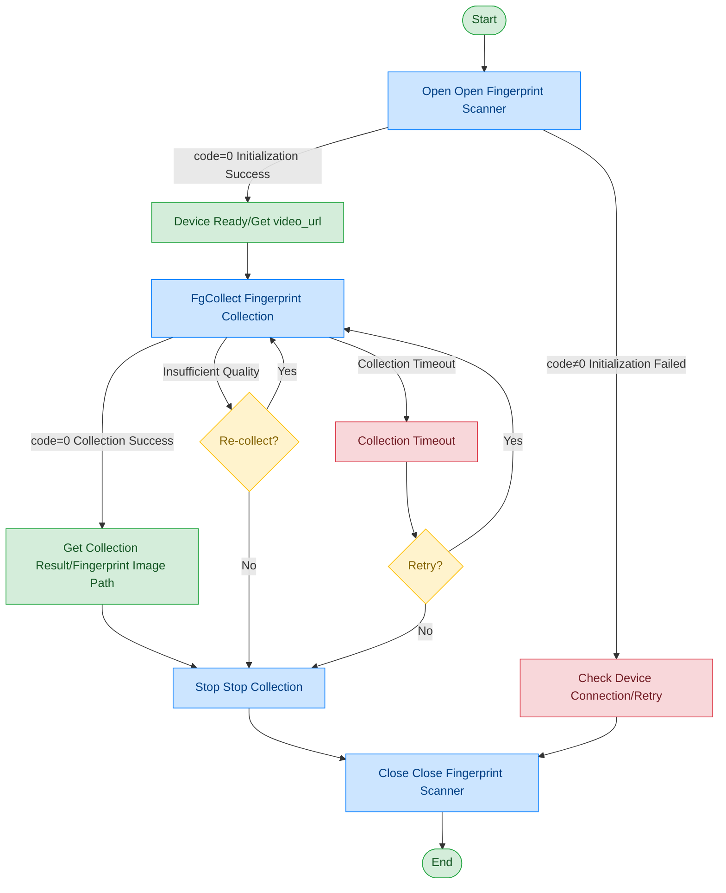

# Fingerprint Scanner - IB Kojak Four-Finger Scanner

## Document Version

| Version | Date | Changes |
|------|------|----------|
| V1.0 | 2026-06-16 | Initial version, split from original document |

## Device Information

| Item | Content |
|------|------|
| Device Type | Fingerprint Scanner (Four-Finger) |
| Brand | Integrated Biometrics (IB) |
| Model | Kojak |
| Connection Method | USB |
| DIS Interface Prefix | DEV_FPrint |
| Data Transfer Mode | File Path |

## Call Flow



> Open returns video_url, which can be used to obtain the fingerprint scanner preview video stream. For the process, please refer to [General Protocol Layer - Video Stream Acquisition](../00-Common-Protocol/04-Video-Stream.md)

## Finger Position Code Description

| Code | Meaning |
|------|------|
| 11 | Right thumb |
| 12 | Right index finger |
| 13 | Right middle finger |
| 14 | Right ring finger |
| 15 | Right little finger |
| 16 | Left thumb |
| 17 | Left index finger |
| 18 | Left middle finger |
| 19 | Left ring finger |
| 20 | Left little finger |
| 12+13+14+15 | Right four fingers |
| 17+18+19+20 | Left four fingers |
| 11+16 | Both thumbs |

## Interface List

### 1. Open Fingerprint Scanner (Open)

Through this command, the upper-layer application opens the fingerprint scanner and obtains the video stream at the same time.

#### Request Parameters

Request Example:

```json
{
  "seq": "DEV_FPrint_Open_${uuid}",
  "cmd": "Open",
  "datetime": "20211201130101",
  "posidx": "00",
  "Timeout": "30000",
  "ASYNC": "0"
}
```

Parameter Description:

| Parameter Name | Format | Required | Description |
|----------|------|----------|----------|
| seq | string | Yes | DEV_FPrint_Open_${uuid} |
| cmd | string | Yes | Fixed as "Open" |
| datetime | string | Yes | Command dispatch time, format: YYYYMMddHHmmss |
| posidx | string | Yes | Station number for multiple devices of the same type; "00"~"99" |
| Timeout | string | Yes | Timeout (ms) |
| ASYNC | string | Yes | Async flag (default 0: synchronous); 0: synchronous; 1: asynchronous |

#### Return Parameters

Return Example:

```json
{
  "seq": "DEV_FPrint_Open_${uuid}",
  "cmd": "Open",
  "datetime": "20211201130102",
  "code": "0",
  "msg": "Success",
  "suggest": "",
  "posidx": "00",
  "DllVersion": "V6.24.703.1",
  "data": {
    "video_url": [
      {
        "00": "ws://127.0.0.1:62383/dis/hi_video"
      }
    ]
  }
}
```

Parameter Description:

| Parameter Name | Format | Required | Description |
|----------|------|----------|----------|
| seq | string | Yes | Same as the dispatched seq |
| cmd | string | Yes | Same as the dispatched cmd |
| datetime | string | Yes | Command dispatch time, format: YYYYMMddHHmmss |
| code | string | Yes | Refer to General Return Codes / Fingerprint Scanner Return Codes |
| msg | string | No | Prompt message |
| suggest | string | No | Suggestion |
| posidx | string | Yes | Station number for multiple devices of the same type; "00"~"99" |
| DllVersion | string | No | Peripheral library version number |
| data | object | No | Return data |
| ↳ video_url | array | Yes | Fingerprint scanner preview video stream address |

---

### 2. Fingerprint Collection (FgCollect)

Through this command, the upper-layer application can start collecting fingerprints using the fingerprint scanner and return the fingerprint collection result.

#### Request Parameters

Request Example:

```json
{
  "seq": "DEV_FPrint_FgCollect_${uuid}",
  "cmd": "FgCollect",
  "datetime": "20211201130101",
  "param": {
    "collection": [
      {
        "ZWFile": "D:/fingers/zwfile.txt",
        "Fingercode": "12+13+14+15",
        "FingerPic": "D:/fingers/finger.bmp"
      }
    ]
  },
  "Timeout": "50000",
  "posidx": "00",
  "ASYNC": "0"
}
```

Parameter Description:

| Parameter Name | Format | Required | Description |
|----------|------|----------|----------|
| seq | string | Yes | DEV_FPrint_FgCollect_${uuid} |
| cmd | string | Yes | Fixed as "FgCollect" |
| datetime | string | Yes | Command dispatch time, format: YYYYMMddHHmmss |
| posidx | string | Yes | Station number for multiple devices of the same type; "00"~"99" |
| Timeout | string | Yes | Timeout (ms) |
| ASYNC | string | Yes | Async flag (default 0: synchronous); 0: synchronous; 1: asynchronous |
| param | object | Yes | Request parameters |
| ↳ collection | array | Yes | Fingerprint collection request parameter array |
| ↳↳ ZWFile | string | No | Fingerprint data centralized file storage path |
| ↳↳ Fingercode | string | Yes | Finger position code, supports combined codes such as "12+13+14+15" |
| ↳↳ FingerPic | string | Yes | Storage path for collected fingerprint image |
| ↳↳ FingerPicPath | string | No | Fingerprint image save path |

#### Return Parameters

Return Example:

```json
{
  "seq": "DEV_FPrint_FgCollect_${uuid}",
  "cmd": "FgCollect",
  "code": "0",
  "datetime": "20260413162832.101",
  "msg": "Success",
  "suggest": "",
  "posidx": "00",
  "DllVersion": "V6.24.703.1",
  "data": {
    "collection": [
      {
        "Score": "22",
        "FingerCode": "12",
        "FingerPic": "D:\\data\\FingerPrint/right-pic-1.bmp",
        "IsSpoof": 0,
        "Wsq": "D:\\data\\FingerPrint/right-pic-1.wsq"
      },
      {
        "Score": "61",
        "FingerCode": "13",
        "FingerPic": "D:\\data\\FingerPrint/right-pic-2.bmp",
        "IsSpoof": 0,
        "Wsq": "D:\\data\\FingerPrint/right-pic-2.wsq"
      },
      {
        "Score": "31",
        "FingerCode": "14",
        "FingerPic": "D:\\data\\FingerPrint/right-pic-3.bmp",
        "IsSpoof": 0,
        "Wsq": "D:\\data\\FingerPrint/right-pic-3.wsq"
      },
      {
        "Score": "13",
        "FingerCode": "15",
        "FingerPic": "D:\\data\\FingerPrint/right-pic-4.bmp",
        "IsSpoof": 0,
        "Wsq": "D:\\data\\FingerPrint/right-pic-4.wsq"
      }
    ],
    "ZWYId": "KP2115M-52500099-E00C",
    "CompletePic": "D:/fingerPicCollect.bmp"
  }
}
```

Parameter Description:

| Parameter Name | Format | Required | Description |
|----------|------|----------|----------|
| seq | string | Yes | Same as the dispatched seq |
| cmd | string | Yes | Same as the dispatched cmd |
| datetime | string | Yes | Command dispatch time, format: YYYYMMddHHmmss |
| code | string | Yes | Refer to General Return Codes / Fingerprint Scanner Return Codes |
| msg | string | No | Prompt message |
| suggest | string | No | Suggestion |
| posidx | string | Yes | Station number for multiple devices of the same type; "00"~"99" |
| DllVersion | string | Yes | DLL version number |
| data | object | No | Return data |
| ↳ ZWYId | string | No | Fingerprint scanner ID |
| ↳ CompletePic | string | No | Four-finger scanner returns complete fingerprint image path |
| ↳ collection | array | Yes | Fingerprint collection result array |
| ↳↳ Score | string | Yes | Fingerprint score, 0~100 |
| ↳↳ FingerCode | string | Yes | Finger position code |
| ↳↳ FingerPic | string | Yes | Fingerprint image path |
| ↳↳ Wsq | string | No | Fingerprint WSQ file path |
| ↳↳ IsSpoof | int | No | 0: real finger; 1: fake finger |

---

### 3. Stop Fingerprint Collection (Stop)

Through this command, the upper-layer application can terminate the ongoing fingerprint collection task.

#### Request Parameters

Request Example:

```json
{
  "seq": "DEV_FPrint_Stop_${uuid}",
  "cmd": "Stop",
  "datetime": "20211201130101",
  "ASYNC": "1",
  "Timeout": "30000",
  "posidx": "00"
}
```

Parameter Description:

| Parameter Name | Format | Required | Description |
|----------|------|----------|----------|
| seq | string | Yes | DEV_FPrint_Stop_${uuid} |
| cmd | string | Yes | Fixed as "Stop" |
| datetime | string | Yes | Command dispatch time, format: YYYYMMddHHmmss |
| posidx | string | Yes | Station number for multiple devices of the same type; "00"~"99" |
| Timeout | string | Yes | Timeout (ms) |
| ASYNC | string | Yes | Async flag (recommended 1); 0: synchronous; 1: asynchronous |

#### Return Parameters

Return Example:

```json
{
  "seq": "DEV_FPrint_Stop_${uuid}",
  "cmd": "Stop",
  "datetime": "20211201130102",
  "code": "0",
  "msg": "Success",
  "suggest": "",
  "posidx": "00",
  "DllVersion": "V6.24.703.1"
}
```

Parameter Description:

| Parameter Name | Format | Required | Description |
|----------|------|----------|----------|
| seq | string | Yes | Same as the dispatched seq |
| cmd | string | Yes | Same as the dispatched cmd |
| datetime | string | Yes | Command dispatch time, format: YYYYMMddHHmmss |
| code | string | Yes | Refer to General Return Codes / Fingerprint Scanner Return Codes |
| msg | string | No | Prompt message |
| suggest | string | No | Suggestion |
| posidx | string | Yes | Station number for multiple devices of the same type; "00"~"99" |
| DllVersion | string | Yes | DLL version number |

---

### 4. Close Fingerprint Scanner (Close)

Through this command, the upper-layer application can close the fingerprint scanner peripheral.

#### Request Parameters

Request Example:

```json
{
  "seq": "DEV_FPrint_Close_${uuid}",
  "cmd": "Close",
  "datetime": "20211201130101",
  "posidx": "00",
  "ASYNC": "1",
  "Timeout": "30000"
}
```

Parameter Description:

| Parameter Name | Format | Required | Description |
|----------|------|----------|----------|
| seq | string | Yes | DEV_FPrint_Close_${uuid} |
| cmd | string | Yes | Fixed as "Close" |
| datetime | string | Yes | Command dispatch time, format: YYYYMMddHHmmss |
| posidx | string | Yes | Station number for multiple devices of the same type; "00"~"99" |
| Timeout | string | Yes | Timeout (ms) |
| ASYNC | string | Yes | Async flag (recommended 1); 0: synchronous; 1: asynchronous |

#### Return Parameters

Return Example:

```json
{
  "seq": "DEV_FPrint_Close_${uuid}",
  "cmd": "Close",
  "datetime": "20211201130102",
  "code": "0",
  "msg": "Success",
  "suggest": "",
  "posidx": "00",
  "DllVersion": "V6.24.703.1"
}
```

Parameter Description:

| Parameter Name | Format | Required | Description |
|----------|------|----------|----------|
| seq | string | Yes | Same as the dispatched seq |
| cmd | string | Yes | Same as the dispatched cmd |
| datetime | string | Yes | Command dispatch time, format: YYYYMMddHHmmss |
| code | string | Yes | Refer to General Return Codes / Fingerprint Scanner Return Codes |
| msg | string | No | Prompt message |
| suggest | string | No | Suggestion |
| posidx | string | Yes | Station number for multiple devices of the same type; "00"~"99" |
| DllVersion | string | Yes | DLL version number |

## Error Codes

| No. | Error Code | Meaning |
|------|--------|------|
| 1 | 15700001 | Timeout |
| 2 | 15700003 | Invalid pointer |
| 3 | 15700004 | This service function is not supported |
| 4 | 15700005 | Insufficient memory |
| 5 | 15700006 | Thread resume failed |
| 6 | 15700007 | Thread creation failed |
| 7 | 15700008 | Event creation failed |
| 8 | 15700009 | Command execution failed |
| 9 | 15700010 | Command execution timeout |
| 10 | 99999999 | Unknown error |
| 11 | 15700101 | Device not opened |
| 12 | 15700107 | Device busy |
| 13 | 15700109 | Device already opened, already initialized |
| 14 | 15700110 | Device does not exist |
| 15 | 15700113 | Device communication failed |
| 16 | 15700114 | Device operation failed |
| 17 | 15700115 | Device not supported |
| 18 | 15700116 | Invalid device handle |
| 19 | 15700117 | Initialization failed |

> For general return codes (0~1037), please refer to [General Return Codes](../00-Common-Protocol/06-Common-Return-Codes.md)
