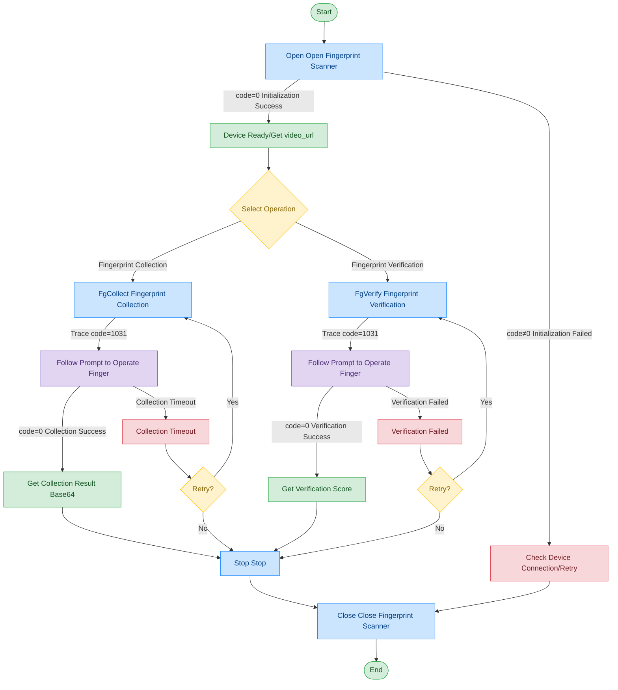

# Fingerprint Scanner - IDEMIA CB4

## Document Version

| Version | Date | Changes |
|------|------|----------|
| V1.0 | 2026-06-16 | Initial version, split from original document |
| V1.1 | 2026-06-17 | Optimized call flow diagram, added exception handling paths |

## Device Information

| Item | Content |
|------|------|
| Device Type | Fingerprint Scanner |
| Brand | IDEMIA |
| Model | CB4 |
| DIS Interface Prefix | DEV_FPrint |
| Data Transfer Mode | Base64 |

## Call Flow



> Open returns video_url, which can be used to obtain the fingerprint scanner preview video stream. For the process, please refer to [General Protocol Layer - Video Stream Acquisition](../00-Common-Protocol/04-Video-Stream.md)

## Differences from File Path Mode

The main differences between this device and the IB Kojak / Beijing EyeSol fingerprint scanners:
- **Data Transfer Method**: This device uses Base64 encoding to transfer fingerprint data and images, rather than file paths
- **Fingercode**: This device only supports a single finger position code; combined codes are not supported
- **FgVerify**: This device supports fingerprint verification functionality

## Finger Position Code Description

| Code | Meaning |
|------|------|
| 11 | Right thumb |
| 12 | Right index finger |
| 13 | Right middle finger |
| 14 | Right ring finger |
| 15 | Right little finger |
| 16 | Left thumb |
| 17 | Left index finger |
| 18 | Left middle finger |
| 19 | Left ring finger |
| 20 | Left little finger |

> IDEMIA CB4 only supports individual finger position codes; combined codes (such as "12+13+14+15") are not supported.

## Interface List

### 1. Open Fingerprint Scanner (Open)

Through this command, the upper-layer application opens the fingerprint scanner and obtains the video stream at the same time.

#### Request Parameters

Request Example:

```json
{
  "seq": "DEV_FPrint_Open_${uuid}",
  "cmd": "Open",
  "datetime": "20211201130101",
  "posidx": "00",
  "timeout": "30000",
  "async": "0"
}
```

Parameter Description:

| Parameter Name | Format | Required | Description |
|----------|------|----------|----------|
| seq | string | Yes | DEV_FPrint_Open_${uuid} |
| cmd | string | Yes | Fixed as "Open" |
| datetime | string | Yes | Command dispatch time, format: YYYYMMddHHmmss |
| posidx | string | Yes | Station number for multiple devices of the same type; "00"~"99" |
| timeout | string | Yes | Timeout (ms) |
| async | string | Yes | Async flag (default 0: synchronous); 0: synchronous; 1: asynchronous |

#### Return Parameters

Return Example:

```json
{
  "seq": "DEV_FPrint_Open_${uuid}",
  "cmd": "Open",
  "datetime": "20211201130102",
  "code": "0",
  "msg": "Success",
  "suggest": "",
  "posidx": "00",
  "DllVersion": "V6.24.703.1",
  "data": {
    "video_url": [
      {
        "00": "ws://127.0.0.1:62383/dis/hi_video"
      }
    ]
  }
}
```

Parameter Description:

| Parameter Name | Format | Required | Description |
|----------|------|----------|----------|
| seq | string | Yes | Same as the dispatched seq |
| cmd | string | Yes | Same as the dispatched cmd |
| datetime | string | Yes | Command dispatch time, format: YYYYMMddHHmmss |
| code | string | Yes | Refer to General Return Codes / Fingerprint Scanner Return Codes |
| msg | string | No | Prompt message |
| suggest | string | No | Suggestion |
| posidx | string | Yes | Station number for multiple devices of the same type; "00"~"99" |
| DllVersion | string | No | Peripheral library version number |
| data | object | No | Return data |
| ↳ video_url | array | Yes | Fingerprint scanner preview video stream address |

---

### 2. Fingerprint Collection (FgCollect)

Through this command, the upper-layer application can start collecting fingerprints using the fingerprint scanner and return the fingerprint collection result.

#### Request Parameters

Request Example:

```json
{
  "seq": "DEV_FPrint_FgCollect_${uuid}",
  "cmd": "FgCollect",
  "datetime": "20211201130101",
  "param": {
    "ScoreLimits": "60",
    "collection": [
      {
        "Fingercode": "11",
        "FingerPic": "base64-image-data",
        "ZWFile": "base64-file-data"
      }
    ]
  },
  "timeout": "50000",
  "posidx": "00",
  "async": "0"
}
```

Parameter Description:

| Parameter Name | Format | Required | Description |
|----------|------|----------|----------|
| seq | string | Yes | DEV_FPrint_FgCollect_${uuid} |
| cmd | string | Yes | Fixed as "FgCollect" |
| datetime | string | Yes | Command dispatch time, format: YYYYMMddHHmmss |
| posidx | string | Yes | Station number for multiple devices of the same type; "00"~"99" |
| timeout | string | Yes | Timeout (ms) |
| async | string | Yes | Async flag (default 0: synchronous); 0: synchronous; 1: asynchronous |
| param | object | Yes | Request parameters |
| ↳ ScoreLimits | string | No | Fingerprint collection score threshold |
| ↳ collection | array | Yes | Fingerprint collection request parameter array |
| ↳↳ Fingercode | string | Yes | Single finger position code (e.g. "11", "12", etc.) |
| ↳↳ FingerPic | string | No | Base64 data of fingerprint image |
| ↳↳ ZWFile | string | No | Base64 encoding of fingerprint feature data |

#### Return Parameters

Return Example:

```json
{
  "seq": "DEV_FPrint_FgCollect_${uuid}",
  "cmd": "FgCollect",
  "code": "0",
  "datetime": "20260413162832.101",
  "msg": "Success",
  "suggest": "",
  "posidx": "00",
  "DllVersion": "V6.24.703.1",
  "data": {
    "collection": [
      {
        "Score": "61",
        "FingerCode": "11",
        "FingerPic": "base64-image-data",
        "ZWFile": "base64-file-data"
      }
    ]
  }
}
```

Parameter Description:

| Parameter Name | Format | Required | Description |
|----------|------|----------|----------|
| seq | string | Yes | Same as the dispatched seq |
| cmd | string | Yes | Same as the dispatched cmd |
| datetime | string | Yes | Command dispatch time, format: YYYYMMddHHmmss |
| code | string | Yes | Refer to General Return Codes / Fingerprint Scanner Return Codes |
| msg | string | No | Prompt message |
| suggest | string | No | Suggestion |
| posidx | string | Yes | Station number for multiple devices of the same type; "00"~"99" |
| DllVersion | string | Yes | DLL version number |
| data | object | No | Return data |
| ↳ collection | array | Yes | Fingerprint collection result array |
| ↳↳ Score | string | Yes | Fingerprint score, 0~100 |
| ↳↳ FingerCode | string | Yes | Finger position code |
| ↳↳ FingerPic | string | Yes | Base64 data of fingerprint image |
| ↳↳ ZWFile | string | Yes | Base64 encoding of fingerprint feature data |

---

### 3. Fingerprint Verification (FgVerify)

Through this command, the upper-layer application can collect a fingerprint using the fingerprint scanner, then compare it with the original fingerprint feature data, and return the fingerprint verification result.

#### Request Parameters

Request Example:

```json
{
  "seq": "DEV_FPrint_FgVerify_${uuid}",
  "cmd": "FgVerify",
  "datetime": "20211201130101",
  "param": {
    "ZWFile": "base64-file-data"
  },
  "timeout": "50000",
  "posidx": "00",
  "async": "0"
}
```

Parameter Description:

| Parameter Name | Format | Required | Description |
|----------|------|----------|----------|
| seq | string | Yes | DEV_FPrint_FgVerify_${uuid} |
| cmd | string | Yes | Fixed as "FgVerify" |
| datetime | string | Yes | Command dispatch time, format: YYYYMMddHHmmss |
| posidx | string | Yes | Station number for multiple devices of the same type; "00"~"99" |
| timeout | string | Yes | Timeout (ms) |
| async | string | Yes | Async flag (default 0: synchronous); 0: synchronous; 1: asynchronous |
| param | object | Yes | Request parameters |
| ↳ ZWFile | string | Yes | Base64 encoding of original fingerprint feature data |

#### Return Parameters

Return Example:

```json
{
  "seq": "DEV_FPrint_FgVerify_${uuid}",
  "cmd": "FgVerify",
  "code": "0",
  "datetime": "20260413162832.101",
  "msg": "Success",
  "suggest": "",
  "posidx": "00",
  "DllVersion": "V6.24.703.1",
  "data": {
    "Score": "22"
  }
}
```

Parameter Description:

| Parameter Name | Format | Required | Description |
|----------|------|----------|----------|
| seq | string | Yes | Same as the dispatched seq |
| cmd | string | Yes | Same as the dispatched cmd |
| datetime | string | Yes | Command dispatch time, format: YYYYMMddHHmmss |
| code | string | Yes | Refer to General Return Codes / Fingerprint Scanner Return Codes |
| msg | string | No | Prompt message |
| suggest | string | No | Suggestion |
| posidx | string | Yes | Station number for multiple devices of the same type; "00"~"99" |
| DllVersion | string | Yes | DLL version number |
| data | object | No | Return data |
| ↳ Score | string | Yes | Verification score |

---

### 4. Fingerprint Trace Messages

During fingerprint collection and verification, interactive Trace messages are returned to remind the user to perform corresponding operations.

Return Example:

```json
{
  "seq": "DEV_FPrint_FgVerify_${uuid}",
  "cmd": "FgVerify",
  "datetime": "20211201130102",
  "code": "1031",
  "msg": "trace message",
  "data": {
    "event_type": "2",
    "tip_code": "9",
    "tips": "Please place finger"
  }
}
```

Trace Message Parameter Description:

| Parameter Name | Format | Required | Description |
|----------|------|----------|----------|
| seq | string | Yes | Same as the seq of the currently executing command |
| cmd | string | Yes | Same as the cmd of the currently executing command |
| code | string | Yes | Fixed value: "1031" (Trace message) |
| msg | string | Yes | trace message |
| data | object | Yes | Trace data |
| ↳ event_type | string | Yes | Event type; "1": fingerprint score message; "2": fingerprint operation message; "3": real-time fingerprint image and score |
| ↳ tip_code | string | Yes | Tip code |
| ↳ tips | string | Yes | Tip message |

tip_code Description:

| tip_code | Meaning |
|---------|------|
| 0 | No finger pressed |
| 1 | Move finger up |
| 2 | Move finger down |
| 3 | Move finger left |
| 4 | Move finger right |
| 5 | Press harder |
| 6 | Remove finger |
| 7 | Collection complete |
| 8 | Finger detected |
| 9 | Finger position incorrect |
| 10 | Fingerprint collecting |

---

### 5. Stop Fingerprint Collection (Stop)

Through this command, the upper-layer application can terminate the ongoing fingerprint verification and collection tasks.

#### Request Parameters

Request Example:

```json
{
  "seq": "DEV_FPrint_Stop_${uuid}",
  "cmd": "Stop",
  "datetime": "20211201130101",
  "async": "1",
  "timeout": "30000",
  "posidx": "00"
}
```

Parameter Description:

| Parameter Name | Format | Required | Description |
|----------|------|----------|----------|
| seq | string | Yes | DEV_FPrint_Stop_${uuid} |
| cmd | string | Yes | Fixed as "Stop" |
| datetime | string | Yes | Command dispatch time, format: YYYYMMddHHmmss |
| posidx | string | Yes | Station number for multiple devices of the same type; "00"~"99" |
| timeout | string | Yes | Timeout (ms) |
| async | string | Yes | Async flag (recommended 1); 0: synchronous; 1: asynchronous |

#### Return Parameters

Return Example:

```json
{
  "seq": "DEV_FPrint_Stop_${uuid}",
  "cmd": "Stop",
  "datetime": "20211201130102",
  "code": "0",
  "msg": "Success",
  "suggest": "",
  "posidx": "00",
  "DllVersion": "V6.24.703.1"
}
```

Parameter Description:

| Parameter Name | Format | Required | Description |
|----------|------|----------|----------|
| seq | string | Yes | Same as the dispatched seq |
| cmd | string | Yes | Same as the dispatched cmd |
| datetime | string | Yes | Command dispatch time, format: YYYYMMddHHmmss |
| code | string | Yes | Refer to General Return Codes / Fingerprint Scanner Return Codes |
| msg | string | No | Prompt message |
| suggest | string | No | Suggestion |
| posidx | string | Yes | Station number for multiple devices of the same type; "00"~"99" |
| DllVersion | string | Yes | DLL version number |

---

### 6. Close Fingerprint Scanner (Close)

Through this command, the upper-layer application can close the fingerprint scanner peripheral.

#### Request Parameters

Request Example:

```json
{
  "seq": "DEV_FPrint_Close_${uuid}",
  "cmd": "Close",
  "datetime": "20211201130101",
  "posidx": "00",
  "async": "1",
  "timeout": "30000"
}
```

Parameter Description:

| Parameter Name | Format | Required | Description |
|----------|------|----------|----------|
| seq | string | Yes | DEV_FPrint_Close_${uuid} |
| cmd | string | Yes | Fixed as "Close" |
| datetime | string | Yes | Command dispatch time, format: YYYYMMddHHmmss |
| posidx | string | Yes | Station number for multiple devices of the same type; "00"~"99" |
| timeout | string | Yes | Timeout (ms) |
| async | string | Yes | Async flag (recommended 1); 0: synchronous; 1: asynchronous |

#### Return Parameters

Return Example:

```json
{
  "seq": "DEV_FPrint_Close_${uuid}",
  "cmd": "Close",
  "datetime": "20211201130102",
  "code": "0",
  "msg": "Success",
  "suggest": "",
  "posidx": "00",
  "DllVersion": "V6.24.703.1"
}
```

Parameter Description:

| Parameter Name | Format | Required | Description |
|----------|------|----------|----------|
| seq | string | Yes | Same as the dispatched seq |
| cmd | string | Yes | Same as the dispatched cmd |
| datetime | string | Yes | Command dispatch time, format: YYYYMMddHHmmss |
| code | string | Yes | Refer to General Return Codes / Fingerprint Scanner Return Codes |
| msg | string | No | Prompt message |
| suggest | string | No | Suggestion |
| posidx | string | Yes | Station number for multiple devices of the same type; "00"~"99" |
| DllVersion | string | Yes | DLL version number |

## Error Codes

| No. | Error Code | Meaning |
|------|--------|------|
| 1 | 15303001 | Unknown error |
| 2 | 15303002 | This specific function SDK is not enabled |
| 3 | 15303003 | This specific function SDK is not supported |
| 4 | 15303004 | SDK not initialized |
| 5 | 15303005 | SDK already initialized, no need to initialize again |
| 6 | 15303006 | SDK initialization error occurred |

> For general return codes (0~1037), please refer to [General Return Codes](../00-Common-Protocol/06-Common-Return-Codes.md)
