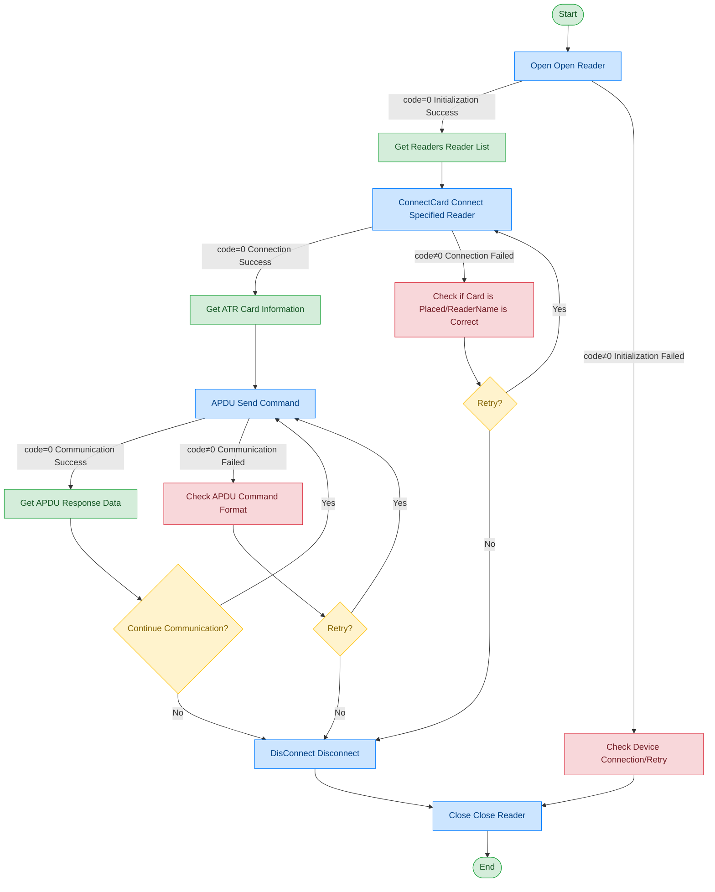

# PCSC Reader - HID Omnikey 3121

## Document Version

| Version | Date | Changes |
|------|------|----------|
| V1.0 | 2026-06-16 | Initial version, split from original document |
| V1.1 | 2026-06-17 | Optimized call flow diagram, added exception handling paths |

## Device Information

| Item | Content |
|------|------|
| Device Type | PCSC Reader |
| Brand | HID |
| Model | Omnikey 3121 |
| DIS Interface Prefix | DEV_PCSCReader |

## Overview

This module provides PC/SC standard-compliant device connection and APDU communication capabilities, implemented on Windows systems based on the WinSCard interface. Unlike the EMP5650C reader, this device provides lower-level APDU communication capabilities, supporting direct APDU command transmission for card interaction.

## Call Flow



## Interface List

### 1. Open Reader (Open)

#### Request Parameters

Request Example:

```json
{
  "seq": "DEV_PCSCReader_Open_${uuid}",
  "cmd": "Open",
  "datetime": "20211201130101",
  "posidx": "00",
  "timeout": "30000",
  "async": "0"
}
```

Parameter Description:

| Parameter Name | Format | Required | Description |
|----------|------|----------|----------|
| seq | string | Yes | DEV_PCSCReader_Open_${uuid} |
| cmd | string | Yes | Fixed as "Open" |
| datetime | string | Yes | Command dispatch time, format: YYYYMMddHHmmss |
| posidx | string | Yes | Station number for multiple devices of the same type; "00"~"99" |
| timeout | string | Yes | Timeout (ms) |
| async | string | Yes | Async flag (recommended 1); 0: synchronous; 1: asynchronous |

#### Return Parameters

Return Example:

```json
{
  "seq": "DEV_PCSCReader_Open_${uuid}",
  "cmd": "Open",
  "code": "0",
  "data": {
    "Readers": [
      "HID Global OMNIKEY 3121 0"
    ]
  },
  "datetime": "20260416165203.050",
  "msg": "Success",
  "suggest": "",
  "posidx": "10000",
  "DllVersion": "V6.24.703.1"
}
```

Parameter Description:

| Parameter Name | Format | Required | Description |
|----------|------|----------|----------|
| seq | string | Yes | Same as the dispatched seq |
| cmd | string | Yes | Same as the dispatched cmd |
| datetime | string | Yes | Command dispatch time, format: YYYYMMddHHmmss |
| code | string | Yes | Refer to General Return Codes / Reader Return Codes |
| msg | string | No | Prompt message |
| suggest | string | No | Suggestion |
| posidx | string | Yes | Station number for multiple devices of the same type |
| DllVersion | string | No | Peripheral library version number |
| data | object | No | Return data |
| ↳ Readers | array | Yes | Available reader name list |

---

### 2. Connect Reader (ConnectCard)

This command is used to connect to a specified PC/SC reader and establish a communication session.

#### Request Parameters

Request Example:

```json
{
  "seq": "DEV_PCSCReader_ConnectCard_${uuid}",
  "cmd": "ConnectCard",
  "datetime": "20211201130101",
  "posidx": "",
  "timeout": "30000",
  "async": "0",
  "param": {
    "ReaderName": "Identiv uTrust 4701 F CL Reader 1"
  }
}
```

Parameter Description:

| Parameter Name | Format | Required | Description |
|----------|------|----------|----------|
| seq | string | Yes | DEV_PCSCReader_ConnectCard_${uuid} |
| cmd | string | Yes | Fixed as "ConnectCard" |
| datetime | string | Yes | Command dispatch time, format: YYYYMMddHHmmss |
| posidx | string | Yes | Station number for multiple devices of the same type |
| timeout | string | Yes | Timeout (ms) |
| async | string | Yes | Async flag (recommended 1); 0: synchronous; 1: asynchronous |
| param | object | Yes | Parameter object |
| ↳ ReaderName | string | Yes | Reader name, obtained from the Readers list returned by Open |

#### Return Parameters

Return Example:

```json
{
  "seq": "DEV_PCSCReader_ConnectCard_${uuid}",
  "cmd": "ConnectCard",
  "code": "0",
  "data": {
    "ATR": "3B8580018073C821100E"
  },
  "datetime": "20260416170914.765",
  "msg": "Success",
  "suggest": "",
  "posidx": "00",
  "DllVersion": "V6.24.703.1"
}
```

Parameter Description:

| Parameter Name | Format | Required | Description |
|----------|------|----------|----------|
| seq | string | Yes | Same as the dispatched seq |
| cmd | string | Yes | Same as the dispatched cmd |
| datetime | string | Yes | Command dispatch time, format: YYYYMMddHHmmss |
| code | string | Yes | Refer to General Return Codes / Reader Return Codes |
| msg | string | No | Prompt message |
| suggest | string | No | Suggestion |
| posidx | string | Yes | Station number for multiple devices of the same type |
| DllVersion | string | No | Peripheral library version number |
| data | object | No | Return data |
| ↳ ATR | string | Yes | Card ATR (Answer To Reset) information |

---

### 3. APDU Communication (APDU)

#### Request Parameters

Request Example:

```json
{
  "seq": "DEV_PCSCReader_APDU_${uuid}",
  "cmd": "APDU",
  "datetime": "20211201130101",
  "posidx": "00",
  "timeout": "30000",
  "async": "0",
  "param": {
    "Send": "00 84 00 00 10"
  }
}
```

Parameter Description:

| Parameter Name | Format | Required | Description |
|----------|------|----------|----------|
| seq | string | Yes | DEV_PCSCReader_APDU_${uuid} |
| cmd | string | Yes | Fixed as "APDU" |
| datetime | string | Yes | Command dispatch time, format: YYYYMMddHHmmss |
| posidx | string | Yes | Station number for multiple devices of the same type |
| timeout | string | Yes | Timeout (ms) |
| async | string | Yes | Async flag (recommended 1); 0: synchronous; 1: asynchronous |
| param | object | Yes | Parameter object |
| ↳ Send | string | Yes | APDU command to send, hex string, space-separated |

#### Return Parameters

Return Example:

```json
{
  "seq": "DEV_PCSCReader_APDU_${uuid}",
  "cmd": "APDU",
  "code": "0",
  "data": {
    "apdu_code": "****",
    "Recv": "447BCD3189D94EBB9000"
  },
  "datetime": "20260416171543.868",
  "msg": "Success",
  "suggest": "",
  "posidx": "10000",
  "DllVersion": "V6.24.703.1"
}
```

Parameter Description:

| Parameter Name | Format | Required | Description |
|----------|------|----------|----------|
| seq | string | Yes | Same as the dispatched seq |
| cmd | string | Yes | Same as the dispatched cmd |
| datetime | string | Yes | Command dispatch time, format: YYYYMMddHHmmss |
| code | string | Yes | Refer to General Return Codes / Reader Return Codes |
| msg | string | No | Prompt message |
| suggest | string | No | Suggestion |
| posidx | string | Yes | Station number for multiple devices of the same type |
| DllVersion | string | No | Peripheral library version number |
| data | object | No | Return data |
| ↳ apdu_code | string | Yes | APDU status code |
| ↳ Recv | string | Yes | APDU response data, hex string |

---

### 4. Disconnect (DisConnect)

Disconnect the communication between the reader and the card.

#### Request Parameters

Request Example:

```json
{
  "seq": "DEV_PCSCReader_DisConnect_${uuid}",
  "cmd": "DisConnect",
  "datetime": "20211201130101",
  "posidx": "00",
  "timeout": "30000",
  "async": "0"
}
```

Parameter Description:

| Parameter Name | Format | Required | Description |
|----------|------|----------|----------|
| seq | string | Yes | DEV_PCSCReader_DisConnect_${uuid} |
| cmd | string | Yes | Fixed as "DisConnect" |
| datetime | string | Yes | Command dispatch time, format: YYYYMMddHHmmss |
| posidx | string | Yes | Station number for multiple devices of the same type |
| timeout | string | Yes | Timeout (ms) |
| async | string | Yes | Async flag (recommended 1); 0: synchronous; 1: asynchronous |

#### Return Parameters

Return Example:

```json
{
  "seq": "DEV_PCSCReader_DisConnect_${uuid}",
  "cmd": "DisConnect",
  "code": "0",
  "datetime": "20260416171543.868",
  "msg": "Success",
  "suggest": "",
  "posidx": "10000",
  "DllVersion": "V6.24.703.1"
}
```

Parameter Description:

| Parameter Name | Format | Required | Description |
|----------|------|----------|----------|
| seq | string | Yes | Same as the dispatched seq |
| cmd | string | Yes | Same as the dispatched cmd |
| datetime | string | Yes | Command dispatch time, format: YYYYMMddHHmmss |
| code | string | Yes | Refer to General Return Codes / Reader Return Codes |
| msg | string | No | Prompt message |
| suggest | string | No | Suggestion |
| posidx | string | Yes | Station number for multiple devices of the same type |
| DllVersion | string | No | Peripheral library version number |

## Error Codes

| No. | Error Code | Meaning |
|------|--------|------|
| 1 | 12666100 | BAC verification failed |
| 2 | 12667001 | Object is null |
| 3 | 12617001 | Parameter object is null |
| 4 | 12651203 | Failed to open file |
| 5 | 12651001 | Device not opened |
| 6 | 12662101 | Failed to select card or application |

> For general return codes (0~1037), please refer to [General Return Codes](../00-通用协议层/06-通用返回码.md)
