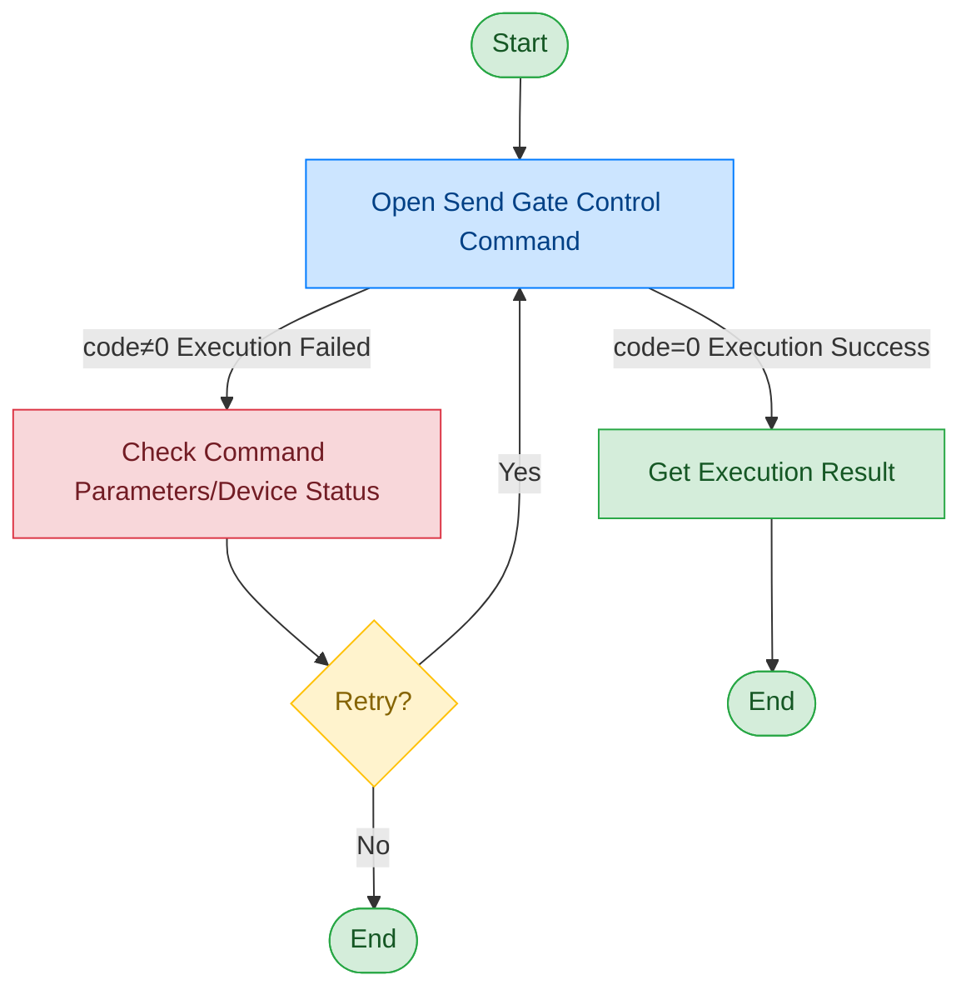

# Gate Control Board

## Document Version

| Version | Date | Changes |
|------|------|----------|
| V1.0 | 2026-06-16 | Initial version, split from original document |

## Device Information

| Item | Content |
|------|------|
| Device Type | Gate Control Board |
| DIS Interface Prefix | DEV_Gate |

## Call Flow



## cmd Command Description

The gate control board specifies different operation commands through the cmd field:

| cmd Value | Meaning |
|--------|------|
| InitPassageway | Initialize gate |
| Open | Open gate |
| PassengerEnter | Passenger enter (open front door and wait for passenger to enter) |
| PassengerLeave | Passenger leave (open rear door and wait for passenger to leave) |
| OpenRearDoor | Open rear door |
| CloseRearDoor | Close rear door |
| OpenFrontDoor | Open front door |
| CloseFrontDoor | Close front door |
| FirmwareVersion | Read firmware version |
| OpenFingerLamp | Turn on fingerprint fill light |
| CloseFingerLamp | Turn off fingerprint fill light |
| OpenAlarmHighLamp | Turn on high alarm light |
| OpenAlarmLowLamp | Turn on low alarm light |
| OpenAlarmBlueLamp | Turn on blue alarm light |
| OpenAlarmGreenLamp | Turn on green alarm light |
| CloseAlarmLamp | Turn off all alarm lights |
| Close | Close gate |

## Interface List

### 1. Gate Control (Open)

Through this command, the upper-layer application can control the gate to perform a specified operation. The specific operation is determined by the cmd field.

#### Request Parameters

Request Example:

```json
{
  "seq": "DEV_Gate_Open_${uuid}",
  "cmd": "Open",
  "datetime": "20211201130101",
  "posidx": "00",
  "Timeout": "30000",
  "ASYNC": "0"
}
```

Parameter Description:

| Parameter Name | Format | Required | Description |
|----------|------|----------|----------|
| seq | string | Yes | DEV_Gate_{cmd}_${uuid}, where {cmd} matches the cmd field |
| cmd | string | Yes | Gate operation command, see cmd command description table |
| datetime | string | Yes | Command dispatch time, format: YYYYMMddHHmmss |
| posidx | string | Yes | Station number for multiple devices of the same type; "00"~"99" |
| Timeout | string | Yes | Timeout (ms) |
| ASYNC | string | Yes | Async flag (default 0: synchronous); 0: synchronous; 1: asynchronous |

#### Return Parameters

Return Example:

```json
{
  "seq": "DEV_Gate_Open_${uuid}",
  "cmd": "Open",
  "datetime": "20211201130101",
  "code": "0",
  "msg": "success",
  "posidx": "00",
  "ASYNC": "0"
}
```

Parameter Description:

| Parameter Name | Format | Required | Description |
|----------|------|----------|----------|
| seq | string | Yes | Same as the dispatched seq |
| cmd | string | Yes | Same as the dispatched cmd |
| datetime | string | Yes | Command dispatch time, format: YYYYMMddHHmmss |
| code | string | Yes | Refer to General Return Codes / Control Board Return Codes |
| msg | string | No | Prompt message |
| posidx | string | Yes | Station number for multiple devices of the same type; "00"~"99" |

## Error Codes

| No. | Error Code | Meaning |
|------|--------|------|
| 1 | 17603301 | Dynamic library not initialized |
| 2 | 17603302 | API execution failed |
| 3 | 17603303 | SDK initialization failed |
| 4 | 17603308 | SDK call failed |
| 5 | 17603402 | Execution timeout |

> For general return codes (0~1037), please refer to [General Return Codes](../00-Common-Protocol/06-Common-Return-Codes.md)
