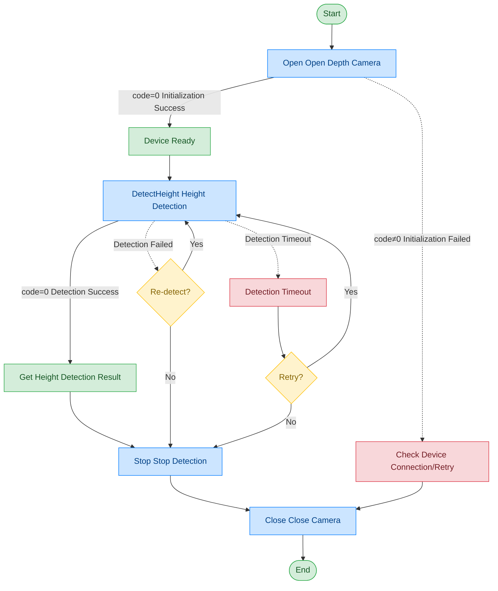

# Depth Camera - Intel D415

## Document Version

| Version | Date | Changes |
|------|------|----------|
| V1.0 | 2026-06-16 | Initial version, split from original document |

## Device Information

| Item | Content |
|------|------|
| Device Type | Depth Camera |
| Brand | Intel |
| Model | D415 |
| DIS Interface Prefix | DEV_Realsense |

## Call Flow



## Interface List

### 1. Open Depth Camera (Open)

Through this command, the upper-layer application can open the depth camera.

#### Request Parameters

Request Example:

```json
{
  "seq": "DEV_Realsense_Open_${uuid}",
  "cmd": "Open",
  "datetime": "20211201130101",
  "posidx": "00",
  "timeout": "30000",
  "async": "0"
}
```

Parameter Description:

| Parameter Name | Format | Required | Description |
|----------|------|----------|----------|
| seq | string | Yes | DEV_Realsense_Open_${uuid} |
| cmd | string | Yes | Fixed as "Open" |
| datetime | string | Yes | Command dispatch time, format: YYYYMMddHHmmss |
| posidx | string | Yes | Station number for multiple devices of the same type; "00"~"99" |
| timeout | string | Yes | Timeout (ms) |
| async | string | Yes | Async flag (default 0: synchronous); 0: synchronous; 1: asynchronous |

#### Return Parameters

Return Example:

```json
{
  "seq": "DEV_Realsense_Open_${uuid}",
  "cmd": "Open",
  "datetime": "20211201130102",
  "code": "0",
  "msg": "Success",
  "suggest": "",
  "posidx": "00"
}
```

Parameter Description:

| Parameter Name | Format | Required | Description |
|----------|------|----------|----------|
| seq | string | Yes | Same as the dispatched seq |
| cmd | string | Yes | Same as the dispatched cmd |
| datetime | string | Yes | Command dispatch time, format: YYYYMMddHHmmss |
| code | string | Yes | Refer to General Return Codes / Depth Camera Return Codes |
| msg | string | No | Prompt message |
| suggest | string | No | Suggestion |
| posidx | string | Yes | Station number for multiple devices of the same type; "00"~"99" |

---

### 2. Detect Height (DetectHeight)

Through this command, the upper-layer application can use the depth camera to detect human body height.

#### Request Parameters

Request Example:

```json
{
  "seq": "DEV_Realsense_DetectHeight_${uuid}",
  "cmd": "DetectHeight",
  "datetime": "20211201130101",
  "posidx": "00",
  "timeout": "30000",
  "async": "0"
}
```

Parameter Description:

| Parameter Name | Format | Required | Description |
|----------|------|----------|----------|
| seq | string | Yes | DEV_Realsense_DetectHeight_${uuid} |
| cmd | string | Yes | Fixed as "DetectHeight" |
| datetime | string | Yes | Command dispatch time, format: YYYYMMddHHmmss |
| posidx | string | Yes | Station number for multiple devices of the same type; "00"~"99" |
| timeout | string | Yes | Timeout (ms) |
| async | string | Yes | Async flag (default 0: synchronous); 0: synchronous; 1: asynchronous |

#### Return Parameters

Return Example:

```json
{
  "seq": "DEV_Realsense_DetectHeight_${uuid}",
  "cmd": "DetectHeight",
  "datetime": "20211201130102",
  "code": "0",
  "msg": "Success",
  "suggest": "",
  "posidx": "00",
  "data": {
    "CameraHeight_mm": "1650",
    "EyeHeight_mm": "1580",
    "Distance_mm": "800"
  }
}
```

Parameter Description:

| Parameter Name | Format | Required | Description |
|----------|------|----------|----------|
| seq | string | Yes | Same as the dispatched seq |
| cmd | string | Yes | Same as the dispatched cmd |
| datetime | string | Yes | Command dispatch time, format: YYYYMMddHHmmss |
| code | string | Yes | Refer to General Return Codes / Depth Camera Return Codes |
| msg | string | No | Prompt message |
| suggest | string | No | Suggestion |
| posidx | string | Yes | Station number for multiple devices of the same type; "00"~"99" |
| data | object | No | Return data |
| ↳ CameraHeight_mm | string | Yes | Camera installation height (unit: mm) |
| ↳ EyeHeight_mm | string | Yes | Detected eye height (unit: mm) |
| ↳ Distance_mm | string | Yes | Detected human body distance (unit: mm) |

---

### 3. Stop Detection (Stop)

Through this command, the upper-layer application can stop the depth camera detection.

#### Request Parameters

Request Example:

```json
{
  "seq": "DEV_Realsense_Stop_${uuid}",
  "cmd": "Stop",
  "datetime": "20211201130101",
  "posidx": "00",
  "timeout": "30000",
  "async": "1"
}
```

Parameter Description:

| Parameter Name | Format | Required | Description |
|----------|------|----------|----------|
| seq | string | Yes | DEV_Realsense_Stop_${uuid} |
| cmd | string | Yes | Fixed as "Stop" |
| datetime | string | Yes | Command dispatch time, format: YYYYMMddHHmmss |
| posidx | string | Yes | Station number for multiple devices of the same type; "00"~"99" |
| timeout | string | Yes | Timeout (ms) |
| async | string | Yes | Async flag (recommended 1); 0: synchronous; 1: asynchronous |

#### Return Parameters

Return Example:

```json
{
  "seq": "DEV_Realsense_Stop_${uuid}",
  "cmd": "Stop",
  "datetime": "20211201130102",
  "code": "0",
  "msg": "Success",
  "suggest": "",
  "posidx": "00"
}
```

Parameter Description:

| Parameter Name | Format | Required | Description |
|----------|------|----------|----------|
| seq | string | Yes | Same as the dispatched seq |
| cmd | string | Yes | Same as the dispatched cmd |
| datetime | string | Yes | Command dispatch time, format: YYYYMMddHHmmss |
| code | string | Yes | Refer to General Return Codes / Depth Camera Return Codes |
| msg | string | No | Prompt message |
| suggest | string | No | Suggestion |
| posidx | string | Yes | Station number for multiple devices of the same type; "00"~"99" |

---

### 4. Close Depth Camera (Close)

Through this command, the upper-layer application can close the depth camera.

#### Request Parameters

Request Example:

```json
{
  "seq": "DEV_Realsense_Close_${uuid}",
  "cmd": "Close",
  "datetime": "20211201130101",
  "posidx": "00",
  "timeout": "30000",
  "async": "0"
}
```

Parameter Description:

| Parameter Name | Format | Required | Description |
|----------|------|----------|----------|
| seq | string | Yes | DEV_Realsense_Close_${uuid} |
| cmd | string | Yes | Fixed as "Close" |
| datetime | string | Yes | Command dispatch time, format: YYYYMMddHHmmss |
| posidx | string | Yes | Station number for multiple devices of the same type; "00"~"99" |
| timeout | string | Yes | Timeout (ms) |
| async | string | Yes | Async flag (default 0: synchronous); 0: synchronous; 1: asynchronous |

#### Return Parameters

Return Example:

```json
{
  "seq": "DEV_Realsense_Close_${uuid}",
  "cmd": "Close",
  "datetime": "20211201130102",
  "code": "0",
  "msg": "Success",
  "suggest": "",
  "posidx": "00"
}
```

Parameter Description:

| Parameter Name | Format | Required | Description |
|----------|------|----------|----------|
| seq | string | Yes | Same as the dispatched seq |
| cmd | string | Yes | Same as the dispatched cmd |
| datetime | string | Yes | Command dispatch time, format: YYYYMMddHHmmss |
| code | string | Yes | Refer to General Return Codes / Depth Camera Return Codes |
| msg | string | No | Prompt message |
| suggest | string | No | Suggestion |
| posidx | string | Yes | Station number for multiple devices of the same type; "00"~"99" |

## Error Codes

| No. | Error Code | Meaning |
|------|--------|------|
| 1 | 19300001 | Timeout |
| 2 | 19300003 | Invalid pointer |
| 3 | 19300004 | This service function is not supported |
| 4 | 19300005 | Insufficient memory |
| 5 | 19300006 | Thread resume failed |
| 6 | 19300007 | Thread creation failed |
| 7 | 19300008 | Event creation failed |
| 8 | 19300009 | Command execution failed |
| 9 | 19300010 | Command execution timeout |
| 10 | 99999999 | Unknown error |
| 11 | 19300101 | Device not opened |
| 12 | 19300107 | Device busy |
| 13 | 19300109 | Device already opened, already initialized |
| 14 | 19300110 | Device does not exist |
| 15 | 19300113 | Device communication failed |

> For general return codes (0~1037), please refer to [General Return Codes](../00-通用协议层/06-通用返回码.md)
