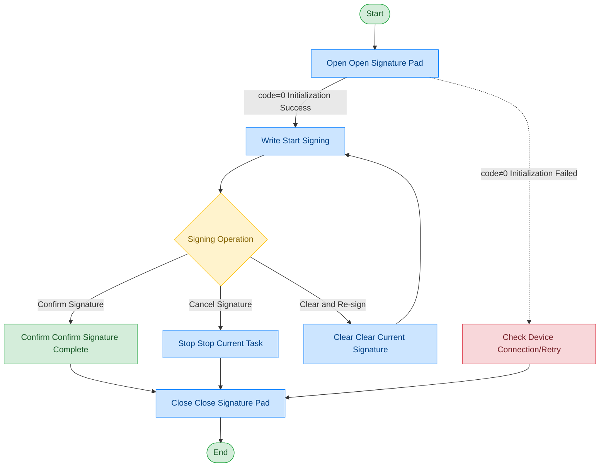

# Signature Pad

## Document Version

| Version | Date | Changes |
|------|------|----------|
| V1.0 | 2026-06-16 | Initial version, split from original document |
| V1.1 | 2026-06-17 | Optimized call flow diagram, added exception handling paths |

## Device Information

| Item | Content |
|------|------|
| Device Type | Signature Pad |
| DIS Interface Prefix | DEV_SignScreen |

## Call Flow



## Interface List

### 1. Open Signature Pad (Open)

This command is used to open and initialize the signature device. After a successful call, the device enters the ready state and signing operations can be performed.

#### Request Parameters

Request Example:

```json
{
  "seq": "DEV_SignScreen_Open_${uuid}",
  "cmd": "Open",
  "datetime": "20211201130101",
  "async": "0",
  "posidx": "00",
  "timeout": "30000"
}
```

Parameter Description:

| Parameter Name | Format | Required | Description |
|----------|------|----------|----------|
| seq | string | Yes | DEV_SignScreen_Open_${uuid} |
| cmd | string | Yes | Fixed as "Open" |
| datetime | string | Yes | Command dispatch time, format: YYYYMMddHHmmss |
| posidx | string | Yes | Station number for multiple devices of the same type; "00"~"99" |
| timeout | string | Yes | Timeout (ms) |
| async | string | Yes | Async flag (default 0: synchronous); 0: synchronous; 1: asynchronous |

#### Return Parameters

Return Example:

```json
{
  "seq": "DEV_SignScreen_Open_${uuid}",
  "cmd": "Open",
  "datetime": "20211201130102",
  "code": "0",
  "msg": "Success",
  "suggest": "",
  "posidx": "00"
}
```

Parameter Description:

| Parameter Name | Format | Required | Description |
|----------|------|----------|----------|
| seq | string | Yes | Same as the dispatched seq |
| cmd | string | Yes | Same as the dispatched cmd |
| datetime | string | Yes | Command dispatch time, format: YYYYMMddHHmmss |
| code | string | Yes | Refer to General Return Codes / Signature Pad Return Codes |
| msg | string | No | Prompt message |
| suggest | string | No | Suggestion |
| posidx | string | Yes | Station number for multiple devices of the same type; "00"~"99" |

---

### 2. Start Signing (Write)

This command is used to start the signing process. The device enters the signing state, waiting for the user to complete the signature on the signature pad. This is a blocking call; signature data will not be returned during this phase.

#### Request Parameters

Request Example:

```json
{
  "seq": "DEV_SignScreen_Write_${uuid}",
  "cmd": "Write",
  "datetime": "20211201130101",
  "param": {
    "posX": "0",
    "posY": "0",
    "posW": "360",
    "posH": "256"
  },
  "async": "0",
  "timeout": "50000",
  "posidx": "00"
}
```

Parameter Description:

| Parameter Name | Format | Required | Description |
|----------|------|----------|----------|
| seq | string | Yes | DEV_SignScreen_Write_${uuid} |
| cmd | string | Yes | Fixed as "Write" |
| datetime | string | Yes | Command dispatch time, format: YYYYMMddHHmmss |
| posidx | string | Yes | Station number for multiple devices of the same type; "00"~"99" |
| timeout | string | Yes | Timeout (ms) |
| async | string | Yes | Async flag (default 0: synchronous); 0: synchronous; 1: asynchronous |
| param | object | Yes | Parameter object |
| ↳ posX | string | Yes | Signature area X coordinate |
| ↳ posY | string | Yes | Signature area Y coordinate |
| ↳ posW | string | Yes | Signature area width |
| ↳ posH | string | Yes | Signature area height |

---

### 3. Confirm Signature Complete (Confirm)

This command is used to confirm that the user has completed the signing operation. After calling, the system will retrieve the current signature content and return the signature result.

#### Request Parameters

Request Example:

```json
{
  "seq": "DEV_SignScreen_Confirm_${uuid}",
  "cmd": "Confirm",
  "datetime": "20211201130101",
  "posidx": "00",
  "timeout": "30000",
  "async": "1"
}
```

Parameter Description:

| Parameter Name | Format | Required | Description |
|----------|------|----------|----------|
| seq | string | Yes | DEV_SignScreen_Confirm_${uuid} |
| cmd | string | Yes | Fixed as "Confirm" |
| datetime | string | Yes | Command dispatch time, format: YYYYMMddHHmmss |
| posidx | string | Yes | Station number for multiple devices of the same type; "00"~"99" |
| timeout | string | Yes | Timeout (ms) |
| async | string | Yes | Async flag (recommended 1); 0: synchronous; 1: asynchronous |

#### Return Parameters

Return Example:

```json
{
  "seq": "DEV_Signature_Confirm_${uuid}",
  "cmd": "GetStatus",
  "code": "0",
  "msg": "Success",
  "data": {
    "code": "0",
    "msg": "success",
    "pic": "pic-base64"
  }
}
```

Parameter Description:

| Parameter Name | Format | Required | Description |
|----------|------|----------|----------|
| seq | string | Yes | Same as the dispatched seq |
| cmd | string | Yes | Same as the dispatched cmd |
| code | string | Yes | Refer to General Return Codes / Signature Pad Return Codes |
| msg | string | No | Prompt message |
| data | object | No | Return data |
| ↳ code | string | Yes | Signature result code; "0": success |
| ↳ msg | string | No | Signature result message |
| ↳ pic | string | Yes | Base64 data of signature image |

---

### 4. Clear Current Signature State (Clear)

This command is used to clear the current signature content and reset the signature state. Typically used when the user needs to re-sign.

#### Request Parameters

Request Example:

```json
{
  "seq": "DEV_SignScreen_Clear_${uuid}",
  "cmd": "Clear",
  "datetime": "20211201130101",
  "posidx": "00",
  "timeout": "30000",
  "async": "1"
}
```

Parameter Description:

| Parameter Name | Format | Required | Description |
|----------|------|----------|----------|
| seq | string | Yes | DEV_SignScreen_Clear_${uuid} |
| cmd | string | Yes | Fixed as "Clear" |
| datetime | string | Yes | Command dispatch time, format: YYYYMMddHHmmss |
| posidx | string | Yes | Station number for multiple devices of the same type; "00"~"99" |
| timeout | string | Yes | Timeout (ms) |
| async | string | Yes | Async flag (recommended 1); 0: synchronous; 1: asynchronous |

#### Return Parameters

Return Example:

```json
{
  "seq": "DEV_SignScreen_Clear_${uuid}",
  "cmd": "Clear",
  "datetime": "20211201130101",
  "code": "0",
  "msg": "Success",
  "suggest": "",
  "posidx": "00"
}
```

Parameter Description:

| Parameter Name | Format | Required | Description |
|----------|------|----------|----------|
| seq | string | Yes | Same as the dispatched seq |
| cmd | string | Yes | Same as the dispatched cmd |
| datetime | string | Yes | Command dispatch time, format: YYYYMMddHHmmss |
| code | string | Yes | Refer to General Return Codes / Signature Pad Return Codes |
| msg | string | No | Prompt message |
| suggest | string | No | Suggestion |
| posidx | string | Yes | Station number for multiple devices of the same type; "00"~"99" |

---

### 5. Stop Current Task (Stop)

Through this command, the upper-layer application can stop the signing.

#### Request Parameters

Request Example:

```json
{
  "seq": "DEV_SignScreen_Stop_${uuid}",
  "cmd": "Stop",
  "datetime": "20211201130101",
  "posidx": "",
  "timeout": "30000",
  "async": "1"
}
```

Parameter Description:

| Parameter Name | Format | Required | Description |
|----------|------|----------|----------|
| seq | string | Yes | DEV_SignScreen_Stop_${uuid} |
| cmd | string | Yes | Fixed as "Stop" |
| datetime | string | Yes | Command dispatch time, format: YYYYMMddHHmmss |
| posidx | string | Yes | Station number for multiple devices of the same type |
| timeout | string | Yes | Timeout (ms) |
| async | string | Yes | Async flag (recommended 1); 0: synchronous; 1: asynchronous |

#### Return Parameters

Return Example:

```json
{
  "seq": "DEV_SignScreen_Stop_${uuid}",
  "cmd": "Stop",
  "datetime": "20211201130101",
  "code": "0",
  "msg": "Success",
  "posidx": "00",
  "suggest": ""
}
```

Parameter Description:

| Parameter Name | Format | Required | Description |
|----------|------|----------|----------|
| seq | string | Yes | Same as the dispatched seq |
| cmd | string | Yes | Same as the dispatched cmd |
| datetime | string | Yes | Command dispatch time, format: YYYYMMddHHmmss |
| code | string | Yes | Refer to General Return Codes / Signature Pad Return Codes |
| msg | string | No | Prompt message |
| suggest | string | No | Suggestion |
| posidx | string | Yes | Station number for multiple devices of the same type; "00"~"99" |

---

### 6. Close Signature Pad (Close)

This command is used to close the signature device and release related resources. After a successful call, the device stops working and signing operations can no longer be performed.

#### Request Parameters

Request Example:

```json
{
  "seq": "DEV_SignScreen_Close_${uuid}",
  "cmd": "Close",
  "datetime": "20211201130101",
  "posidx": "00",
  "timeout": "30000",
  "async": "0"
}
```

Parameter Description:

| Parameter Name | Format | Required | Description |
|----------|------|----------|----------|
| seq | string | Yes | DEV_SignScreen_Close_${uuid} |
| cmd | string | Yes | Fixed as "Close" |
| datetime | string | Yes | Command dispatch time, format: YYYYMMddHHmmss |
| posidx | string | Yes | Station number for multiple devices of the same type; "00"~"99" |
| timeout | string | Yes | Timeout (ms) |
| async | string | Yes | Async flag (default 0: synchronous); 0: synchronous; 1: asynchronous |

#### Return Parameters

Return Example:

```json
{
  "seq": "DEV_SignScreen_Close_${uuid}",
  "cmd": "Close",
  "datetime": "20211201130101",
  "posidx": "00",
  "code": "0",
  "msg": "success",
  "suggest": ""
}
```

Parameter Description:

| Parameter Name | Format | Required | Description |
|----------|------|----------|----------|
| seq | string | Yes | Same as the dispatched seq |
| cmd | string | Yes | Same as the dispatched cmd |
| datetime | string | Yes | Command dispatch time, format: YYYYMMddHHmmss |
| code | string | Yes | Refer to General Return Codes / Signature Pad Return Codes |
| msg | string | No | Prompt message |
| suggest | string | No | Suggestion |
| posidx | string | Yes | Station number for multiple devices of the same type; "00"~"99" |

## Error Codes

| No. | Error Code | Meaning |
|------|--------|------|
| 1 | 18403001 | Device not opened |
| 2 | 18403002 | Dispatched parameter error |
| 3 | 18403003 | Unsupported command |
| 4 | 18403004 | Device operation failed |
| 5 | 18403005 | Device not supported |

> For general return codes (0~1037), please refer to [General Return Codes](../00-Common-Protocol/06-Common-Return-Codes.md)
