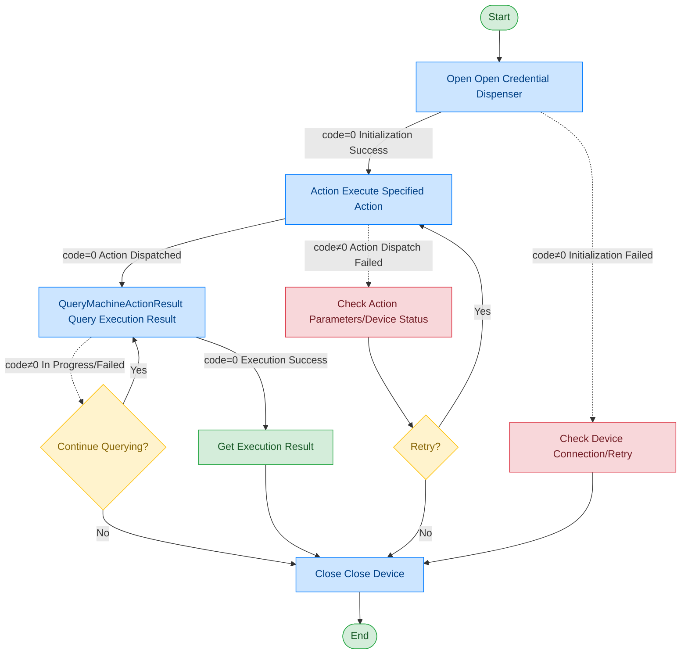

# Credential Dispenser

## Document Version

| Version | Date | Changes |
|------|------|----------|
| V1.0 | 2026-06-16 | Initial version, split from original document |

## Device Information

| Item | Content |
|------|------|
| Device Type | Credential Dispenser |
| DIS Interface Prefix | DEV_Fazheng |

## Overview

The credential dispenser module is used to control the mechanical movement and status management of self-service credential dispensing equipment, including credential platform lifting, OCR read position control, LED indicator light control, device power management, and other functions.

## Call Flow



## Action Command Description

The credential dispenser dispatches different operation commands through the Action command. The specific operation is specified by the act field:

| act Value | Meaning |
|--------|------|
| ResetDevice | Device reset |
| Op_MovePositionOCR | Move to OCR read position |
| Op_StopOCR | Stop OCR position movement |
| Op_MovePositionPlatform | Move credential platform to specified position |
| Op_StopPlatform | Stop credential platform movement |
| Op_PlatformUp | Credential platform up |
| Op_PlatformDown | Credential platform down |
| MachineSetLedStatue | Set LED light status |
| MachineGetDistanceValue | Get human body distance position |
| MachineGetPosition | Get OCR/platform position |
| SetPowerOn | Device power on |
| SetPowerOff | Device power off |

## Interface List

### 1. Open Credential Dispenser (Open)

#### Request Parameters

Request Example:

```json
{
  "seq": "DEV_Fazheng_Open_${uuid}",
  "cmd": "Open",
  "datetime": "20211201130101",
  "posidx": "00",
  "timeout": "30000",
  "async": "0"
}
```

Parameter Description:

| Parameter Name | Format | Required | Description |
|----------|------|----------|----------|
| seq | string | Yes | DEV_Fazheng_Open_${uuid} |
| cmd | string | Yes | Fixed as "Open" |
| datetime | string | Yes | Command dispatch time, format: YYYYMMddHHmmss |
| posidx | string | Yes | Station number for multiple devices of the same type; "00"~"99" |
| timeout | string | Yes | Timeout (ms) |
| async | string | Yes | Async flag (default 0: synchronous); 0: synchronous; 1: asynchronous |

#### Return Parameters

Return Example:

```json
{
  "seq": "DEV_Fazheng_Open_${uuid}",
  "cmd": "Open",
  "datetime": "20211201130102",
  "code": "0",
  "msg": "Success",
  "suggest": "",
  "posidx": "00"
}
```

Parameter Description:

| Parameter Name | Format | Required | Description |
|----------|------|----------|----------|
| seq | string | Yes | Same as the dispatched seq |
| cmd | string | Yes | Same as the dispatched cmd |
| datetime | string | Yes | Command dispatch time, format: YYYYMMddHHmmss |
| code | string | Yes | Refer to General Return Codes / Credential Dispenser Return Codes |
| msg | string | No | Prompt message |
| suggest | string | No | Suggestion |
| posidx | string | Yes | Station number for multiple devices of the same type; "00"~"99" |

---

### 2. Execute Action (Action)

Through this command, the upper-layer application can control the credential dispenser to execute a specified action. The specific operation is determined by the param.act field.

#### Request Parameters

Request Example:

```json
{
  "seq": "DEV_Fazheng_Action_${uuid}",
  "cmd": "Action",
  "datetime": "20211201130101",
  "posidx": "00",
  "timeout": "30000",
  "async": "0",
  "param": {
    "act": "Op_MovePositionOCR"
  }
}
```

Parameter Description:

| Parameter Name | Format | Required | Description |
|----------|------|----------|----------|
| seq | string | Yes | DEV_Fazheng_Action_${uuid} |
| cmd | string | Yes | Fixed as "Action" |
| datetime | string | Yes | Command dispatch time, format: YYYYMMddHHmmss |
| posidx | string | Yes | Station number for multiple devices of the same type; "00"~"99" |
| timeout | string | Yes | Timeout (ms) |
| async | string | Yes | Async flag (default 0: synchronous); 0: synchronous; 1: asynchronous |
| param | object | Yes | Parameter object |
| ↳ act | string | Yes | Operation command, see Action command description table |

#### LED Control Parameters

When act is "MachineSetLedStatue", param needs to include the following additional parameters:

| Parameter Name | Format | Required | Description |
|----------|------|----------|----------|
| IDLight | string | Yes | Light ID |
| LightBlinkTime | string | No | Light blink frequency |
| LightPwmCount | string | No | Light brightness level |

#### Return Parameters

Return Example:

```json
{
  "seq": "DEV_Fazheng_Action_${uuid}",
  "cmd": "Action",
  "datetime": "20211201130102",
  "code": "0",
  "msg": "Success",
  "suggest": "",
  "posidx": "00"
}
```

Parameter Description:

| Parameter Name | Format | Required | Description |
|----------|------|----------|----------|
| seq | string | Yes | Same as the dispatched seq |
| cmd | string | Yes | Same as the dispatched cmd |
| datetime | string | Yes | Command dispatch time, format: YYYYMMddHHmmss |
| code | string | Yes | Refer to General Return Codes / Credential Dispenser Return Codes |
| msg | string | No | Prompt message |
| suggest | string | No | Suggestion |
| posidx | string | Yes | Station number for multiple devices of the same type; "00"~"99" |

---

### 3. Query Action Execution Result (QueryMachineActionResult)

Through this command, the upper-layer application can query the credential dispenser action execution result.

#### Request Parameters

Request Example:

```json
{
  "seq": "DEV_Fazheng_QueryMachineActionResult_${uuid}",
  "cmd": "QueryMachineActionResult",
  "datetime": "20211201130101",
  "posidx": "00",
  "timeout": "30000",
  "async": "0"
}
```

Parameter Description:

| Parameter Name | Format | Required | Description |
|----------|------|----------|----------|
| seq | string | Yes | DEV_Fazheng_QueryMachineActionResult_${uuid} |
| cmd | string | Yes | Fixed as "QueryMachineActionResult" |
| datetime | string | Yes | Command dispatch time, format: YYYYMMddHHmmss |
| posidx | string | Yes | Station number for multiple devices of the same type; "00"~"99" |
| timeout | string | Yes | Timeout (ms) |
| async | string | Yes | Async flag (default 0: synchronous); 0: synchronous; 1: asynchronous |

#### Return Parameters

Return Example:

```json
{
  "seq": "DEV_Fazheng_QueryMachineActionResult_${uuid}",
  "cmd": "QueryMachineActionResult",
  "datetime": "20211201130102",
  "code": "0",
  "msg": "Success",
  "suggest": "",
  "posidx": "00",
  "data": {
    "OCRHeight": "0",
    "PlatformHeight": "0",
    "DistanceValue": "0"
  }
}
```

Parameter Description:

| Parameter Name | Format | Required | Description |
|----------|------|----------|----------|
| seq | string | Yes | Same as the dispatched seq |
| cmd | string | Yes | Same as the dispatched cmd |
| datetime | string | Yes | Command dispatch time, format: YYYYMMddHHmmss |
| code | string | Yes | Refer to General Return Codes / Credential Dispenser Return Codes |
| msg | string | No | Prompt message |
| suggest | string | No | Suggestion |
| posidx | string | Yes | Station number for multiple devices of the same type; "00"~"99" |
| data | object | No | Return data |
| ↳ OCRHeight | string | No | OCR position height |
| ↳ PlatformHeight | string | No | Platform position height |
| ↳ DistanceValue | string | No | Human body distance value |

---

### 4. Close Credential Dispenser (Close)

#### Request Parameters

Request Example:

```json
{
  "seq": "DEV_Fazheng_Close_${uuid}",
  "cmd": "Close",
  "datetime": "20211201130101",
  "posidx": "00",
  "timeout": "30000",
  "async": "0"
}
```

Parameter Description:

| Parameter Name | Format | Required | Description |
|----------|------|----------|----------|
| seq | string | Yes | DEV_Fazheng_Close_${uuid} |
| cmd | string | Yes | Fixed as "Close" |
| datetime | string | Yes | Command dispatch time, format: YYYYMMddHHmmss |
| posidx | string | Yes | Station number for multiple devices of the same type; "00"~"99" |
| timeout | string | Yes | Timeout (ms) |
| async | string | Yes | Async flag (default 0: synchronous); 0: synchronous; 1: asynchronous |

#### Return Parameters

Return Example:

```json
{
  "seq": "DEV_Fazheng_Close_${uuid}",
  "cmd": "Close",
  "datetime": "20211201130102",
  "code": "0",
  "msg": "Success",
  "suggest": "",
  "posidx": "00"
}
```

Parameter Description:

| Parameter Name | Format | Required | Description |
|----------|------|----------|----------|
| seq | string | Yes | Same as the dispatched seq |
| cmd | string | Yes | Same as the dispatched cmd |
| datetime | string | Yes | Command dispatch time, format: YYYYMMddHHmmss |
| code | string | Yes | Refer to General Return Codes / Credential Dispenser Return Codes |
| msg | string | No | Prompt message |
| suggest | string | No | Suggestion |
| posidx | string | Yes | Station number for multiple devices of the same type; "00"~"99" |

## Error Codes

| No. | Error Code | Meaning |
|------|--------|------|
| 1 | 17133001 | Device not opened |
| 2 | 17133002 | Dispatched parameter error |
| 3 | 17133003 | Unsupported command |
| 4 | 17133004 | Device operation failed |
| 5 | 17133005 | Lua script returned error code |
| 6 | 17133006 | Device not supported |
| 7 | 17133007 | Active cancellation |
| 8 | 17133008 | Timeout |

> For general return codes (0~1037), please refer to [General Return Codes](../00-通用协议层/06-通用返回码.md)
